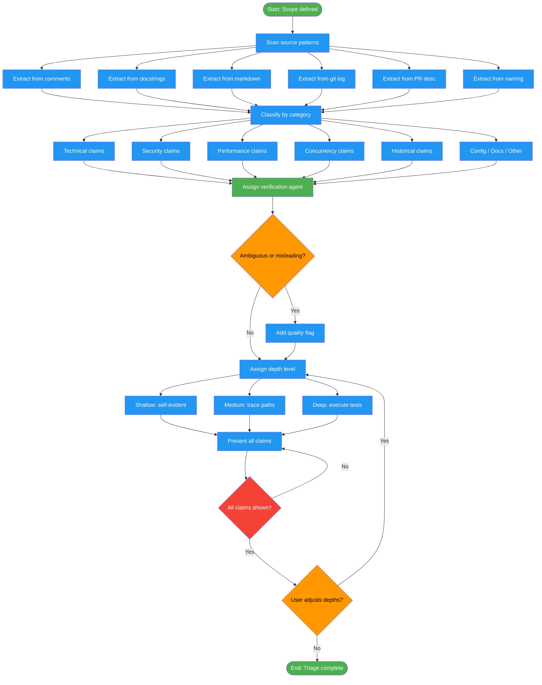

<!-- diagram-meta: {"source": "commands/fact-check-extract.md", "source_hash": "sha256:e77e599e01aa7e00a58060c00e4f4ebedbfb745a58f3418e41fbcb7b0cb539ce", "generated_at": "2026-02-19T00:00:00Z", "generator": "generate_diagrams.py"} -->
# Diagram: fact-check-extract

Extract all claims from code, comments, docstrings, commits, and naming conventions, then triage by category and verification depth before proceeding to verification.

## Legend

| Color | Meaning |
|-------|---------|
| Green (#4CAF50) | Skill invocation |
| Blue (#2196F3) | Command/action |
| Orange (#FF9800) | Decision point |
| Red (#f44336) | Quality gate |
