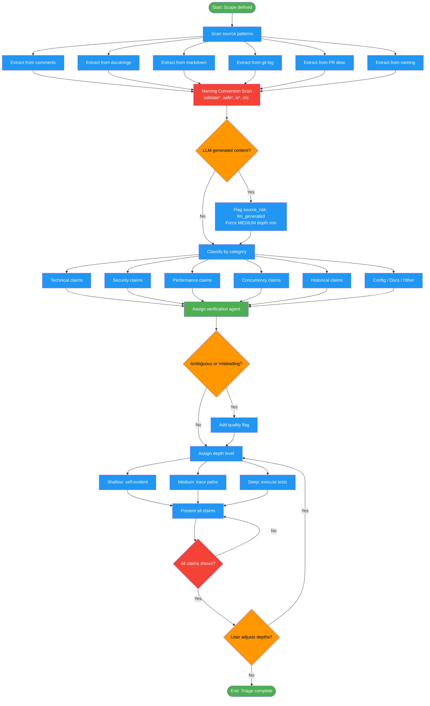

<!-- diagram-meta: {"source": "commands/fact-check-extract.md","source_hash": "sha256:25be795c8996a6a14b487c3bf092a60a93242d66ce880bf40c59614be1f2e70f","generated_at": "2026-03-09T00:00:00Z","generator": "generate_diagrams.py"} -->
# Diagram: fact-check-extract

Extract all claims from code, comments, docstrings, commits, and naming conventions (including mandatory naming convention scan and LLM-content escalation), then triage by category and verification depth before proceeding to verification.

```mermaid
flowchart TD
  Start([Start: Scope defined]) --> ScanSrc[Scan source patterns]

  style Start fill:#4CAF50,color:#fff

  ScanSrc --> Comments[Extract from comments]
  ScanSrc --> Docstrings[Extract from docstrings]
  ScanSrc --> Markdown[Extract from markdown]
  ScanSrc --> Commits[Extract from git log]
  ScanSrc --> PRDesc[Extract from PR desc]
  ScanSrc --> Naming[Extract from naming]

  style Comments fill:#2196F3,color:#fff
  style Docstrings fill:#2196F3,color:#fff
  style Markdown fill:#2196F3,color:#fff
  style Commits fill:#2196F3,color:#fff
  style PRDesc fill:#2196F3,color:#fff
  style Naming fill:#2196F3,color:#fff
  style ScanSrc fill:#2196F3,color:#fff

  Comments --> NamingScan
  Docstrings --> NamingScan
  Markdown --> NamingScan
  Commits --> NamingScan
  PRDesc --> NamingScan
  Naming --> NamingScan

  NamingScan[Naming Convention Scan<br>validate*, safe*, is*, etc.] --> LLMCheck{LLM-generated content?}

  style NamingScan fill:#f44336,color:#fff
  style LLMCheck fill:#FF9800,color:#000

  LLMCheck -->|Yes| LLMEscalate[Flag source_risk: llm_generated<br>Force MEDIUM depth min]
  LLMCheck -->|No| Classify

  style LLMEscalate fill:#2196F3,color:#fff

  LLMEscalate --> Classify

  Classify[Classify by category] --> CatTech[Technical claims]
  Classify --> CatSec[Security claims]
  Classify --> CatPerf[Performance claims]
  Classify --> CatConc[Concurrency claims]
  Classify --> CatHist[Historical claims]
  Classify --> CatOther[Config / Docs / Other]

  style Classify fill:#2196F3,color:#fff
  style CatTech fill:#2196F3,color:#fff
  style CatSec fill:#2196F3,color:#fff
  style CatPerf fill:#2196F3,color:#fff
  style CatConc fill:#2196F3,color:#fff
  style CatHist fill:#2196F3,color:#fff
  style CatOther fill:#2196F3,color:#fff

  CatTech --> AssignAgent[Assign verification agent]
  CatSec --> AssignAgent
  CatPerf --> AssignAgent
  CatConc --> AssignAgent
  CatHist --> AssignAgent
  CatOther --> AssignAgent

  style AssignAgent fill:#4CAF50,color:#fff

  AssignAgent --> FlagAmb{Ambiguous or misleading?}

  style FlagAmb fill:#FF9800,color:#000

  FlagAmb -->|Yes| AddFlag[Add quality flag]
  FlagAmb -->|No| AssignDepth

  style AddFlag fill:#2196F3,color:#fff

  AddFlag --> AssignDepth[Assign depth level]

  AssignDepth --> DepthShallow[Shallow: self-evident]
  AssignDepth --> DepthMedium[Medium: trace paths]
  AssignDepth --> DepthDeep[Deep: execute tests]

  style AssignDepth fill:#2196F3,color:#fff
  style DepthShallow fill:#2196F3,color:#fff
  style DepthMedium fill:#2196F3,color:#fff
  style DepthDeep fill:#2196F3,color:#fff

  DepthShallow --> Present[Present all claims]
  DepthMedium --> Present
  DepthDeep --> Present

  style Present fill:#2196F3,color:#fff

  Present --> ShowAll{All claims shown?}

  style ShowAll fill:#f44336,color:#fff

  ShowAll -->|No| Present
  ShowAll -->|Yes| UserAdj{User adjusts depths?}

  style UserAdj fill:#FF9800,color:#000

  UserAdj -->|Yes| AssignDepth
  UserAdj -->|No| End([End: Triage complete])

  style End fill:#4CAF50,color:#fff
```

## Legend

| Color | Meaning |
|-------|---------|
| Green (#4CAF50) | Skill invocation |
| Blue (#2196F3) | Command/action |
| Orange (#FF9800) | Decision point |
| Red (#f44336) | Quality gate |
