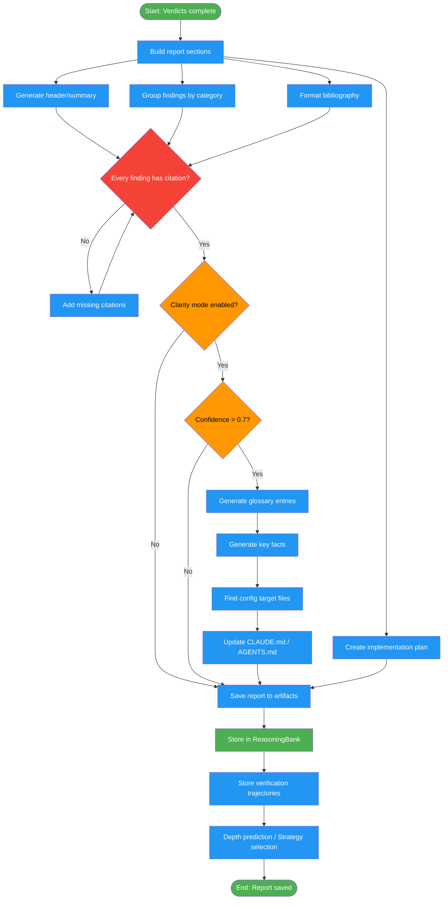

<!-- diagram-meta: {"source": "commands/fact-check-report.md", "source_hash": "sha256:f40e25dabf911ac18f0c0ec2c05cd564c186200e7d92f2241b74227b6ea6081c", "generated_at": "2026-02-19T00:00:00Z", "generator": "generate_diagrams.py"} -->
# Diagram: fact-check-report

Generate a fact-checking report with traceable bibliography, actionable findings, optional clarity-mode glossary injection, and learning trajectory persistence for future sessions.

## Legend

| Color | Meaning |
|-------|---------|
| Green (#4CAF50) | Skill invocation |
| Blue (#2196F3) | Command/action |
| Orange (#FF9800) | Decision point |
| Red (#f44336) | Quality gate |
