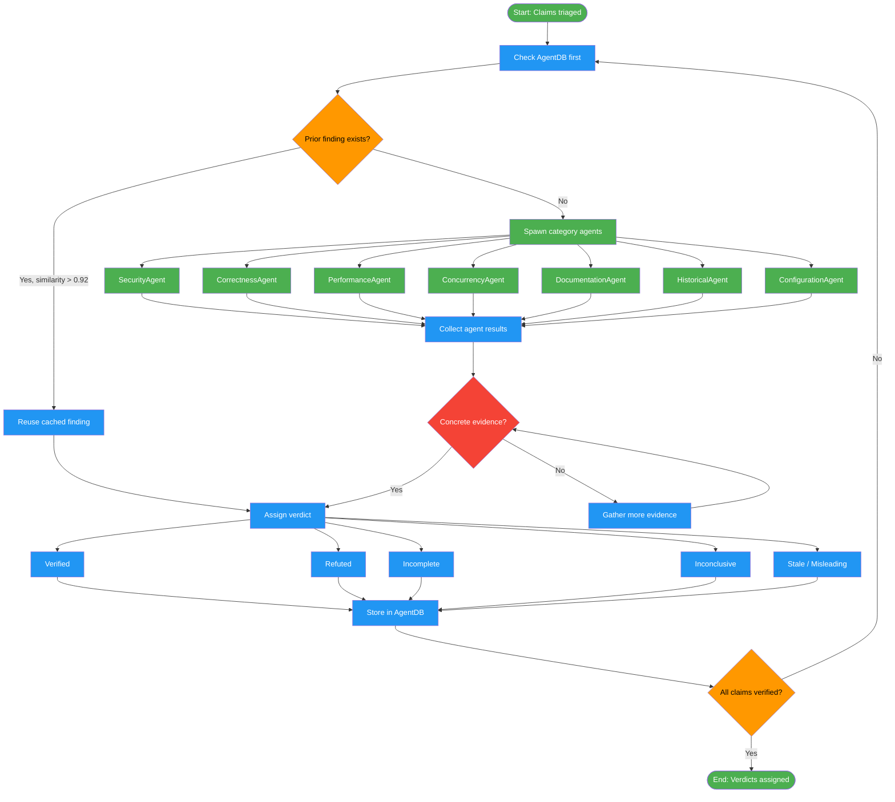

<!-- diagram-meta: {"source": "commands/fact-check-verify.md", "source_hash": "sha256:0a77e83f6092f80fe004c88385e8e16778fc48f06b02c63bf69318b5c49d5045", "generated_at": "2026-02-19T00:00:00Z", "generator": "generate_diagrams.py"} -->
# Diagram: fact-check-verify

Perform parallel verification of extracted claims using specialized agents, check AgentDB for prior findings, produce evidence-backed verdicts, and store results for future sessions.

## Legend

| Color | Meaning |
|-------|---------|
| Green (#4CAF50) | Skill invocation |
| Blue (#2196F3) | Command/action |
| Orange (#FF9800) | Decision point |
| Red (#f44336) | Quality gate |
