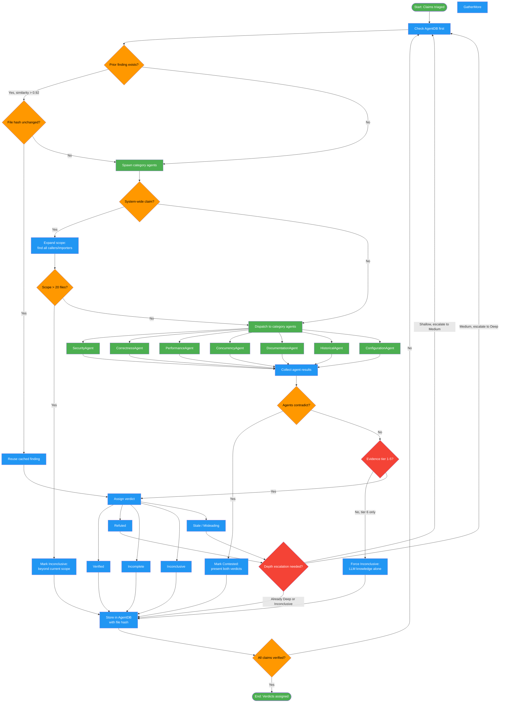

<!-- diagram-meta: {"source": "commands/fact-check-verify.md", "source_hash": "sha256:ab1bb3db1de0c21295a88d3d34c9b2bb5d2833f6c865685e3f9b1de83190f330", "generated_at": "2026-03-09T00:00:00Z", "generator": "generate_diagrams.py"} -->
# Diagram: fact-check-verify

Perform parallel verification of extracted claims using specialized agents, check AgentDB for prior findings (with cache invalidation), produce evidence-backed verdicts using a 6-tier evidence hierarchy, escalate depth for negative verdicts, resolve cross-agent conflicts, and store results for future sessions.

```mermaid
flowchart TD
  Start([Start: Claims triaged]) --> CheckDB[Check AgentDB first]

  style Start fill:#4CAF50,color:#fff
  style CheckDB fill:#2196F3,color:#fff

  CheckDB --> DBHit{Prior finding exists?}

  style DBHit fill:#FF9800,color:#000

  DBHit -->|Yes, similarity > 0.92| CacheValid{File hash unchanged?}
  DBHit -->|No| SpawnAgents[Spawn category agents]

  style CacheValid fill:#FF9800,color:#000

  CacheValid -->|Yes| Reuse[Reuse cached finding]
  CacheValid -->|No| SpawnAgents

  style Reuse fill:#2196F3,color:#fff
  style SpawnAgents fill:#4CAF50,color:#fff

  SpawnAgents --> ScopeCheck{System-wide claim?}

  style ScopeCheck fill:#FF9800,color:#000

  ScopeCheck -->|Yes| ExpandScope[Expand scope:<br>find all callers/importers]
  ScopeCheck -->|No| AgentDispatch

  style ExpandScope fill:#2196F3,color:#fff

  ExpandScope --> ScopeSize{Scope > 20 files?}

  style ScopeSize fill:#FF9800,color:#000

  ScopeSize -->|Yes| ForceInconclusive[Mark Inconclusive:<br>beyond current scope]
  ScopeSize -->|No| AgentDispatch

  style ForceInconclusive fill:#2196F3,color:#fff

  ForceInconclusive --> StoreDB

  AgentDispatch[Dispatch to category agents] --> SecAgent[SecurityAgent]
  AgentDispatch --> CorAgent[CorrectnessAgent]
  AgentDispatch --> PerfAgent[PerformanceAgent]
  AgentDispatch --> ConcAgent[ConcurrencyAgent]
  AgentDispatch --> DocAgent[DocumentationAgent]
  AgentDispatch --> HistAgent[HistoricalAgent]
  AgentDispatch --> ConfAgent[ConfigurationAgent]

  style AgentDispatch fill:#4CAF50,color:#fff
  style SecAgent fill:#4CAF50,color:#fff
  style CorAgent fill:#4CAF50,color:#fff
  style PerfAgent fill:#4CAF50,color:#fff
  style ConcAgent fill:#4CAF50,color:#fff
  style DocAgent fill:#4CAF50,color:#fff
  style HistAgent fill:#4CAF50,color:#fff
  style ConfAgent fill:#4CAF50,color:#fff

  SecAgent --> Collect[Collect agent results]
  CorAgent --> Collect
  PerfAgent --> Collect
  ConcAgent --> Collect
  DocAgent --> Collect
  HistAgent --> Collect
  ConfAgent --> Collect

  style Collect fill:#2196F3,color:#fff

  Reuse --> AssignVerdict

  Collect --> ConflictCheck{Agents contradict?}

  style ConflictCheck fill:#FF9800,color:#000

  ConflictCheck -->|Yes| SurfaceConflict[Mark Contested:<br>present both verdicts]
  ConflictCheck -->|No| EvidenceGate

  style SurfaceConflict fill:#2196F3,color:#fff

  SurfaceConflict --> StoreDB

  EvidenceGate{Evidence tier 1-5?}

  style EvidenceGate fill:#f44336,color:#fff

  EvidenceGate -->|No, tier 6 only| MandatoryInconclusive[Force Inconclusive:<br>LLM knowledge alone]
  EvidenceGate -->|Yes| AssignVerdict[Assign verdict]

  style MandatoryInconclusive fill:#2196F3,color:#fff
  style GatherMore fill:#2196F3,color:#fff

  MandatoryInconclusive --> StoreDB

  AssignVerdict --> Verified[Verified]
  AssignVerdict --> Refuted[Refuted]
  AssignVerdict --> Incomplete[Incomplete]
  AssignVerdict --> Inconclusive[Inconclusive]
  AssignVerdict --> Stale[Stale / Misleading]

  style AssignVerdict fill:#2196F3,color:#fff
  style Verified fill:#2196F3,color:#fff
  style Refuted fill:#2196F3,color:#fff
  style Incomplete fill:#2196F3,color:#fff
  style Inconclusive fill:#2196F3,color:#fff
  style Stale fill:#2196F3,color:#fff

  Refuted --> DepthEscalate{Depth escalation needed?}
  Stale --> DepthEscalate

  style DepthEscalate fill:#f44336,color:#fff

  DepthEscalate -->|Shallow, escalate to Medium| CheckDB
  DepthEscalate -->|Medium, escalate to Deep| CheckDB
  DepthEscalate -->|Already Deep or Inconclusive| StoreDB

  Verified --> StoreDB[Store in AgentDB<br>with file hash]
  Incomplete --> StoreDB
  Inconclusive --> StoreDB

  style StoreDB fill:#2196F3,color:#fff

  StoreDB --> AllDone{All claims verified?}

  style AllDone fill:#FF9800,color:#000

  AllDone -->|No| CheckDB
  AllDone -->|Yes| End([End: Verdicts assigned])

  style End fill:#4CAF50,color:#fff
```

## Legend

| Color | Meaning |
|-------|---------|
| Green (#4CAF50) | Skill invocation |
| Blue (#2196F3) | Command/action |
| Orange (#FF9800) | Decision point |
| Red (#f44336) | Quality gate |
