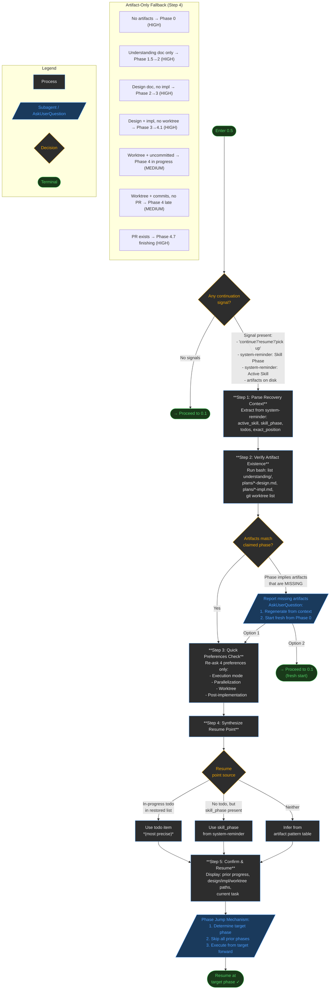
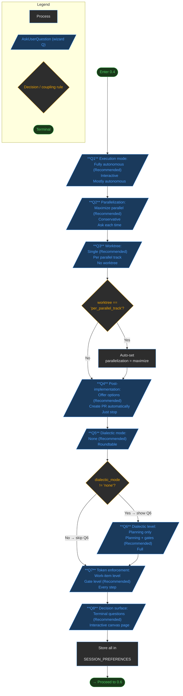
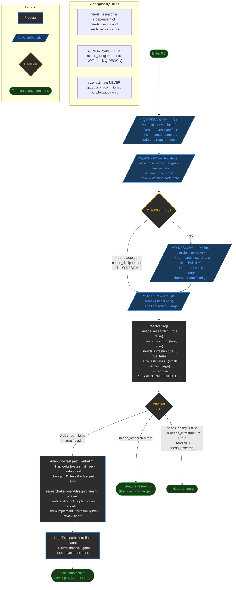

<!-- diagram-meta: {"source": "commands/feature-config.md", "source_hash": "sha256:5974bb698b681dff0849a5fa316a434f2c6aae0c572691eb721af5bf433ed1d9", "generated_at": "2026-06-06T21:50:31Z", "generator": "generate_diagrams.py"} -->
# Diagram: feature-config

## Overview: feature-config (Phase 0 of develop)

High-level flow showing the two primary paths (continuation vs. fresh wizard) and all major sections.

```mermaid
flowchart TD
    START(["`**START**
    feature-config`"]):::terminal --> S05

    S05["**0.5** Continuation Detection
    *(executes FIRST)*"]:::process --> CSig

    CSig{Continuation
    signals?}:::decision

    CSig -->|Yes| RESUME["Resume Flow
    Steps 1–5"]:::process
    CSig -->|No| S01

    RESUME --> PJUMP[/"Phase Jump Mechanism"/]:::subagent
    PJUMP --> DONE_RESUME(["Target Phase
    *(skip completed phases)*"]):::success

    S01["**0.1** Detect Escape Hatches"]:::process --> EH

    EH{"Escape hatch
    in message?"}:::decision

    EH -->|"'using design doc'
    'using impl plan'
    'just implement'"| ASK_EH[/"AskUserQuestion:
    How to handle
    existing doc?"/]:::subagent
    EH -->|None| S02

    ASK_EH --> EH_ROUTE{"Route by
    choice"}:::decision
    EH_ROUTE -->|"Review first
    (design doc)"| SKIP_21["Skip 2.1 →
    load doc → 2.2"]:::process
    EH_ROUTE -->|"Treat as ready
    (design doc)"| SKIP_P2["Skip Phase 2 →
    start Phase 3"]:::process
    EH_ROUTE -->|"Review first
    (impl plan)"| SKIP_313["Skip 2.1–3.1 →
    load doc → 3.2"]:::process
    EH_ROUTE -->|"Treat as ready
    (impl plan)"| SKIP_P23["Skip Phases 2–3 →
    start Phase 4"]:::process

    SKIP_21 --> S02
    SKIP_P2 --> S04
    SKIP_313 --> S02
    SKIP_P23 --> S04

    S02["**0.2** Clarify Motivation (WHY)"]:::process --> MOT

    MOT{"Motivation
    clear?"}:::decision
    MOT -->|No| ASK_MOT[/"AskUserQuestion:
    WHY?"/]:::subagent
    MOT -->|Yes| S03
    ASK_MOT --> S03

    S03["**0.3** Clarify Feature (WHAT)"]:::process
    S03 --> |"AskUserQuestion:
    core purpose + resources"| S04

    S04["**0.4** Collect Workflow Preferences
    *(8-question wizard)*"]:::process --> S06

    S06["**0.6** Detect Refactoring Mode
    *(keyword scan)*"]:::process --> S07

    S07["**0.7** Need-Flag Classification
    *(4 questions)*"]:::process --> FLAGS

    FLAGS{"Flags
    resolved"}:::decision
    FLAGS -->|"Zero flags
    (fast path)"| FAST[/"Announce fast path
    inline plan ≤5 steps
    develop stays resident"/]:::subagent
    FLAGS -->|"Any flag set"| GATED[/"Flag-gated phases
    full review floor"/]:::subagent

    FAST --> CHECKLIST
    GATED --> CHECKLIST

    CHECKLIST{"**Phase 0
    Complete
    Checklist**
    *(all 9 items)*"}:::gate
    CHECKLIST -->|"All checked ✓"| NEXT(["Next Phase
    (research / design / fast-impl)"]):::success
    CHECKLIST -->|"Unchecked items"| BACK["Complete
    Phase 0"]:::process
    BACK --> CHECKLIST

    classDef terminal fill:#2d2d2d,stroke:#888,color:#e8e8ea,rx:20
    classDef process fill:#2d2d2d,stroke:#4a9eff,color:#e8e8ea
    classDef decision fill:#2d2d2d,stroke:#f0a500,color:#f0a500
    classDef subagent fill:#1a3a5c,stroke:#4a9eff,color:#4a9eff
    classDef gate fill:#3a1a1a,stroke:#ff6b6b,color:#ff6b6b
    classDef success fill:#1a3a1a,stroke:#51cf66,color:#51cf66

    subgraph legend["Legend"]
        L1["Process"]:::process
        L2[/"Subagent Dispatch / AskUserQuestion"/]:::subagent
        L3{"Decision"}:::decision
        L4{"Quality Gate"}:::gate
        L5(["Terminal"]):::success
    end
```

---

## Detail: Section 0.5 — Continuation Detection

---

## Detail: Section 0.4 — Configuration Wizard

---

## Detail: Section 0.7 — Need-Flag Classification & Routing

---

## Cross-Reference: Overview → Detail Diagrams

| Overview Section | Detail Diagram | Key Logic |
|---|---|---|
| **0.5** Continuation Detection | Detail: Section 0.5 | 5-step resume flow; artifact verification table; phase jump mechanism |
| **0.1** Escape Hatches | Overview (inline) | 3 patterns × 2 handling choices → phase skip routing |
| **0.2** Clarify Motivation | Overview (inline) | Ask only when intent ambiguous; 6 motivation categories |
| **0.3** Clarify Feature | Overview (inline) | Core purpose + resources; stored in SESSION_CONTEXT |
| **0.4** Wizard | Detail: Section 0.4 | 8 questions (Q6 conditional); coupling rule: per-track → maximize |
| **0.6** Refactoring Mode | Overview (inline) | Keyword scan only; no user interaction |
| **0.7** Need-Flags | Detail: Section 0.7 | 4 questions; Q-INFRA auto-sets needs_design; zero-flag fast path |
