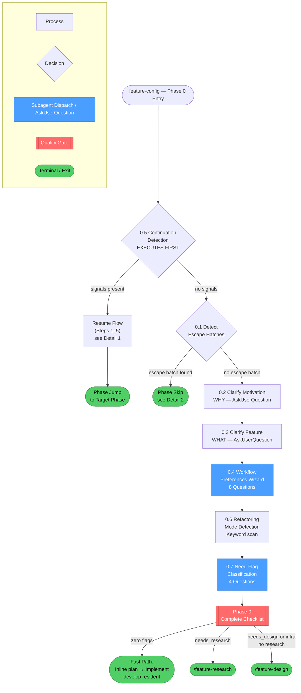
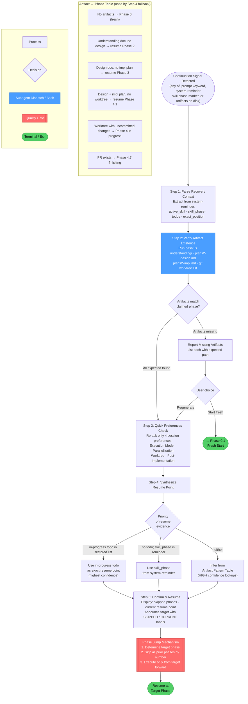

<!-- diagram-meta: {"source": "commands/feature-config.md", "source_hash": "sha256:19c09442f508a16902de49ff8e91aa713e712b0a58f2d9ee3fbfb3f5949001fc", "generated_at": "2026-06-05T07:37:14Z", "generator": "generate_diagrams.py"} -->
# Diagram: feature-config

## Overview: `feature-config` (Phase 0)

High-level flow showing all sections and how they connect.

---

## Detail 1: Section 0.5 — Continuation Detection

---

## Detail 2: Sections 0.1–0.7 — Fresh Start Wizard

```mermaid
flowchart TD
    classDef dispatch fill:#4a9eff,stroke:#2d7de0,color:#fff
    classDef gate fill:#ff6b6b,stroke:#cc4444,color:#fff
    classDef terminal fill:#51cf66,stroke:#3a9449,color:#000

    ENTRY(["No Continuation Signals\nFresh Start Entry"])

    ENTRY --> EH{"0.1 Detect Escape Hatches\nParse initial user message"}

    EH -->|"'using design doc path'"| EH_DD{"Document\nHandling?"}
    EH -->|"'using impl plan path'"| EH_IP{"Document\nHandling?"}
    EH -->|"'just implement no docs'"| SKIP4(["Skip to Phase 4"])
    EH -->|"No escape hatch"| MOT

    EH_DD -->|"Review first"| SKIP22(["Skip 2.1 → Phase 2.2\n(load + review design)"])
    EH_DD -->|"Treat as ready"| SKIP3(["Skip Phase 2 → Phase 3"])
    EH_IP -->|"Review first"| SKIP32(["Skip 2.1-3.1 → Phase 3.2"])
    EH_IP -->|"Treat as ready"| SKIP23(["Skip Phases 2-3 → Phase 4"])

    MOT["0.2 Clarify Motivation WHY\nAskUserQuestion\nSuggest 6 categories\nStore → SESSION_CONTEXT.motivation"]

    MOT --> FEAT["0.3 Clarify Feature WHAT\nAskUserQuestion\n• Core purpose 1-2 sentences\n• Resources / links for research\nStore → SESSION_CONTEXT.feature_essence"]

    FEAT --> WIZ_ENTRY["0.4 Workflow Preferences Wizard\nAll 8 questions in single AskUserQuestion call"]

    WIZ_ENTRY --> Q1["Q1 — Execution Mode\nFully autonomous · Interactive\nMostly autonomous"]
    Q1 --> Q2["Q2 — Parallelization\nMaximize · Conservative · Ask each time"]
    Q2 --> Q3["Q3 — Worktree Strategy\nSingle · Per parallel track · None"]
    Q3 --> Q4["Q4 — Post-Implementation\nOffer options · Auto PR · Just stop"]
    Q4 --> Q5{"Q5 — Dialectic Mode\nNone · Roundtable"}
    Q5 -->|"none"| Q7
    Q5 -->|"roundtable"| Q6["Q6 — Dialectic Level\nPlanning only\nPlanning + gates\nFull — conditional on Q5 != none"]
    Q6 --> Q7["Q7 — Token Enforcement\nWork-item · Gate level · Every step"]
    Q7 --> Q8["Q8 — Decision Surface\nTerminal questions\nInteractive canvas page\nStore → SESSION_PREFERENCES.decision_surface"]
    Q8 --> COUPLE["Coupling Rule\nworktree=per_parallel_track\n→ auto-set parallelization=maximize"]

    COUPLE --> REF{"0.6 Refactoring Mode\nKeyword scan on request text"}
    REF -->|"refactor / reorganize / extract\nmigrate / split / consolidate"| SET_REF["Set SESSION_PREFERENCES\n.refactoring_mode = true"]
    REF -->|"no keywords"| NF_ENTRY
    SET_REF --> NF_ENTRY

    NF_ENTRY["0.7 Need-Flag Classification\n4 self-contained AskUserQuestion items"]

    NF_ENTRY --> QR["Q-RESEARCH\nUnfamiliar code OR fuzzy requirements?\nYes → enables Research + Discovery phases\nneeds_research boolean"]
    QR --> QINFRA["Q-INFRA\nNew deps / infra / schema changes?\nYes → auto-sets needs_design=true"]
    QINFRA --> INFRA_CHK{"Q-INFRA\nanswer?"}
    INFRA_CHK -->|"yes → auto-set needs_design=true"| SKIP_QD["Skip Q-DESIGN\nneeds_design forced true"]
    INFRA_CHK -->|"no"| QD["Q-DESIGN\nReal architectural decision?\nYes → enables Design phase\nneeds_design boolean"]
    QD --> QS
    SKIP_QD --> QS["Q-SIZE\nSmall · Medium · Large\nSignal only — tunes parallelization\nnever gates phases"]

    QS --> STORE["Store in SESSION_PREFERENCES\nneeds_research · needs_design\nneeds_infrastructure · size_estimate"]

    STORE --> ROUTE[["Flag Routing\n(quality gate before exit)"]]

    ROUTE -->|"all flags false"| ANNOUNCE["Announce Fast Path\n(verbatim script required)"]
    ANNOUNCE --> FAST(["Fast Path:\nShort inline plan confirmed\n→ Implement under lighter floor\ndevelop stays resident"])

    ROUTE -->|"needs_research = true"| RPHASE(["/feature-research"])
    ROUTE -->|"needs_design or infra\nno research"| DPHASE(["/feature-design"])

    class WIZ_ENTRY,MOT,FEAT,NF_ENTRY dispatch
    class ROUTE gate
    class SKIP22,SKIP3,SKIP32,SKIP23,SKIP4,FAST,RPHASE,DPHASE terminal

    subgraph MOTIVATION_CATS ["Motivation Categories → Key Questions (stored, used in later phases)"]
        MC1["User Pain → current journey + failure mode"]
        MC2["Performance → current metrics + target"]
        MC3["Technical Debt → what breaks when touched"]
        MC4["Business Need → deadline + priority"]
        MC5["Security/Compliance → threat model + requirement"]
        MC6["Developer Experience → frequency + workaround"]
    end

    subgraph LEGEND [" "]
        L1["Process"]
        L2{Decision}
        L3["AskUserQuestion / Dispatch"]:::dispatch
        L4[["Quality Gate"]]:::gate
        L5(["Terminal / Exit"]):::terminal
    end
```

---

## Cross-Reference Table

| Overview Node | Detail Diagram | Section |
|---|---|---|
| `Resume Flow (Steps 1–5)` | Detail 1 | 0.5 Continuation Detection |
| `Phase Skip` (escape hatches) | Detail 2, top | 0.1 Escape Hatch Detection |
| `0.4 Workflow Preferences Wizard` | Detail 2, wizard block | Q1–Q8 including conditional Q6 |
| `0.7 Need-Flag Classification` | Detail 2, bottom | Q-RESEARCH, Q-DESIGN, Q-INFRA, Q-SIZE |
| `Phase 0 Complete Checklist` | Detail 2 | Flag Routing → ROUTE gate |
