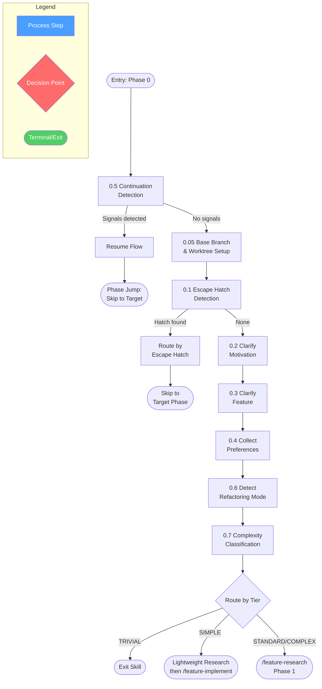
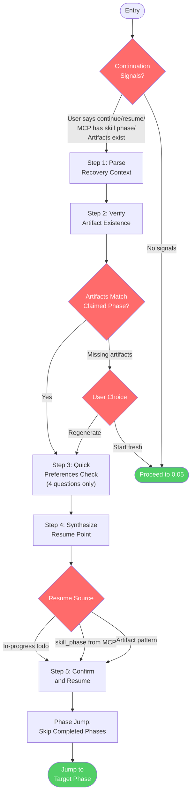
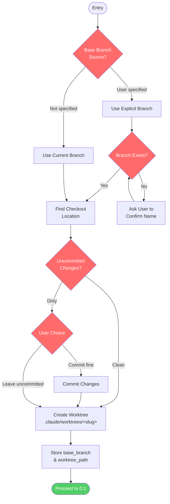
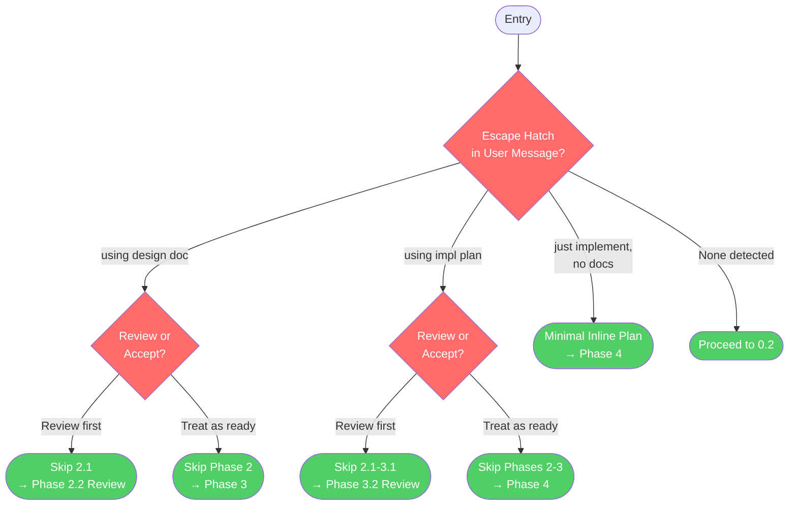
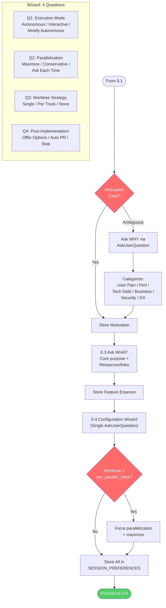
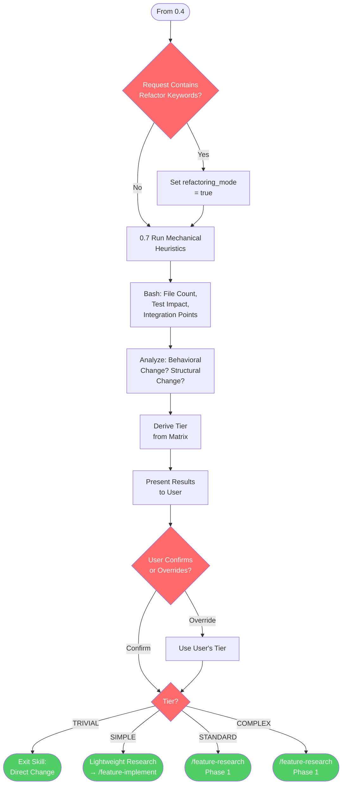
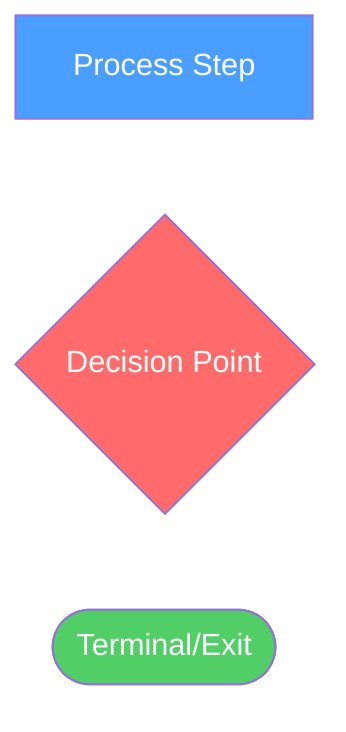

<!-- diagram-meta: {"source": "commands/feature-config.md", "source_hash": "sha256:83c81a603fa55c0fc81e0c4d44ee00f21ed2c70bc4c507813a5e6b0e5654b395", "generated_at": "2026-03-10T06:27:43Z", "generator": "generate_diagrams.py"} -->
# Diagram: feature-config

## Overview

## 0.5 Continuation Detection

## 0.05 Base Branch & Worktree Setup

## 0.1 Escape Hatch Detection

## 0.2-0.4 Motivation, Feature, Preferences

## 0.6-0.7 Refactoring & Complexity

## Cross-Reference

| Overview Node | Detail Section | Source |
|---|---|---|
| 0.5 Continuation Detection | 0.5 Continuation Detection | `commands/feature-config.md:25-172` |
| 0.05 Base Branch & Worktree Setup | 0.05 Base Branch & Worktree Setup | `commands/feature-config.md:175-203` |
| 0.1 Escape Hatch Detection | 0.1 Escape Hatch Detection | `commands/feature-config.md:205-235` |
| 0.2 Clarify Motivation | 0.2-0.4 Motivation, Feature, Preferences | `commands/feature-config.md:237-276` |
| 0.3 Clarify Feature | 0.2-0.4 Motivation, Feature, Preferences | `commands/feature-config.md:278-287` |
| 0.4 Collect Preferences | 0.2-0.4 Motivation, Feature, Preferences | `commands/feature-config.md:289-338` |
| 0.6 Detect Refactoring Mode | 0.6-0.7 Refactoring & Complexity | `commands/feature-config.md:340-351` |
| 0.7 Complexity Classification | 0.6-0.7 Refactoring & Complexity | `commands/feature-config.md:353-431` |
| Route by Tier | 0.6-0.7 Refactoring & Complexity | `commands/feature-config.md:422-431` |

## Legend

