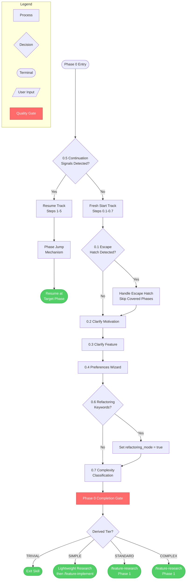
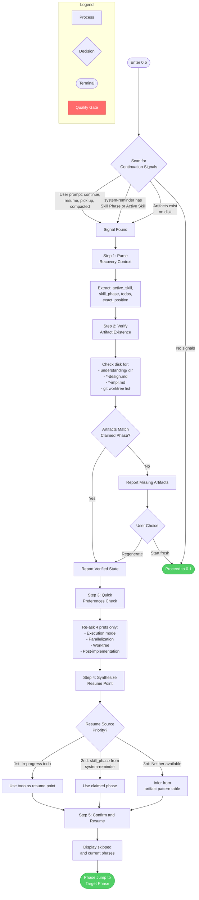
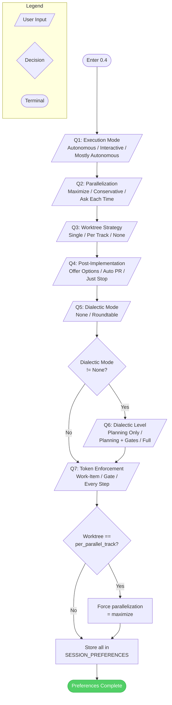

<!-- diagram-meta: {"source": "commands/feature-config.md","source_hash": "sha256:8f043ecc2122e81e9f6faf19fb59f73072d45ce4d357f0f0ae60070182246a3f","generator": "stamp"} -->
# Diagram: feature-config

Phase 0 of develop: Configuration wizard that collects preferences, detects escape hatches, clarifies motivation, classifies complexity, and routes to the appropriate next phase.

## Overview

High-level flow showing the two main tracks (continuation vs fresh start) and terminal routing by complexity tier.



## Cross-Reference Table

| Overview Node | Detail Diagram |
|---|---|
| 0.5 Continuation Signals Detected? | [Continuation Detection Detail](#continuation-detection-detail-section-05) |
| Resume Track Steps 1-5 | [Continuation Detection Detail](#continuation-detection-detail-section-05) |
| 0.1 Escape Hatch Detected? | [Escape Hatch Detail](#escape-hatch-detail-section-01) |
| 0.4 Preferences Wizard | [Preferences Wizard Detail](#preferences-wizard-detail-section-04) |
| 0.7 Complexity Classification | [Complexity Classification Detail](#complexity-classification-detail-section-07) |

---

## Continuation Detection Detail (Section 0.5)

Executes FIRST before any wizard questions. Detects prior session state, verifies artifacts on disk, re-collects volatile preferences, and jumps to the appropriate resume point.



### Artifact-to-Phase Inference Table

Used by Step 4 when no todo or skill_phase is available.

| Artifact Pattern | Inferred Phase | Confidence |
|---|---|---|
| No artifacts | Phase 0 (fresh start) | HIGH |
| Understanding doc only | Phase 1.5 complete, resume Phase 2 | HIGH |
| Design doc, no impl plan | Phase 2 complete, resume Phase 3 | HIGH |
| Design + impl plan, no worktree | Phase 3 complete, resume Phase 4.1 | HIGH |
| Worktree with uncommitted changes | Phase 4 in progress | MEDIUM |
| Worktree with commits, no PR | Phase 4 late stages | MEDIUM |
| PR exists for feature branch | Phase 4.7 (finishing) | HIGH |

---

## Escape Hatch Detail (Section 0.1)

Parses user's initial message for patterns that skip phases by providing pre-existing documents.

```mermaid
flowchart TD
    subgraph Legend
        L1[Process]
        L2{Decision}
        L3([Terminal])
        L4[/"User Input"/]
    end

    START([Enter 0.1]) --> PARSE[Parse User Message<br>for Escape Patterns]

    PARSE --> PATTERN{Pattern Detected?}

    PATTERN -->|"'using design doc path'"| DESIGN_ESC[Design Doc Escape]
    PATTERN -->|"'using impl plan path'"| IMPL_ESC[Impl Plan Escape]
    PATTERN -->|"'just implement, no docs'"| NODOCS_ESC[No-Docs Escape]
    PATTERN -->|No pattern| NO_ESCAPE([No Escape Hatch<br>Proceed to 0.2]):::success

    DESIGN_ESC --> ASK_HANDLE{/"How to handle<br>existing doc?"/}
    IMPL_ESC --> ASK_HANDLE

    ASK_HANDLE -->|Review first| REVIEW_CHOICE{Doc Type?}
    ASK_HANDLE -->|Treat as ready| READY_CHOICE{Doc Type?}

    REVIEW_CHOICE -->|Design doc| SKIP_21([Skip to Phase 2.2<br>Review Design]):::success
    REVIEW_CHOICE -->|Impl plan| SKIP_32([Skip to Phase 3.2<br>Review Plan]):::success

    READY_CHOICE -->|Design doc| SKIP_P2([Skip Phase 2<br>Start Phase 3]):::success
    READY_CHOICE -->|Impl plan| SKIP_P23([Skip Phases 2-3<br>Start Phase 4]):::success

    NODOCS_ESC --> SKIP_INLINE([Skip Phases 2-3<br>Minimal Inline Plan<br>Start Phase 4]):::success

    classDef success fill:#51cf66,stroke:#37b24d,color:#fff
```

---

## Preferences Wizard Detail (Section 0.4)

Collects all workflow preferences in a single wizard interaction. Questions 6-7 are conditional.



---

## Complexity Classification Detail (Section 0.7)

Derives complexity tier from mechanical heuristics. The executor cannot override the matrix; only the user can confirm or change the tier.

```mermaid
flowchart TD
    subgraph Legend
        L1[Process]
        L2{Decision}
        L3([Terminal])
        L4[/"User Input"/]
        L5[Quality Gate]:::gate
    end

    START([Enter 0.7]) --> HEURISTICS[Step 1: Run<br>Mechanical Heuristics]

    HEURISTICS --> H1["H1: File Count<br>grep -rl pattern | wc -l"]
    HEURISTICS --> H2["H2: Behavioral Change?<br>New endpoints, UI, API?"]
    HEURISTICS --> H3["H3: Test Impact<br>grep -rl module tests/ | wc -l"]
    HEURISTICS --> H4["H4: Structural Change?<br>New files, schemas, migrations?"]
    HEURISTICS --> H5["H5: Integration Points<br>grep -rl import module | wc -l"]

    H1 --> MATRIX[Step 2: Derive Tier<br>from Matrix]
    H2 --> MATRIX
    H3 --> MATRIX
    H4 --> MATRIX
    H5 --> MATRIX

    MATRIX --> TRIVIAL_CHECK{All Trivial<br>Conditions Met?}:::gate

    TRIVIAL_CHECK -->|"Only literal values AND<br>no structure change AND<br>zero behavior impact AND<br>zero test changes"| TIER_TRIVIAL[Tier: TRIVIAL]
    TRIVIAL_CHECK -->|Any condition unmet| TIER_HIGHER{Classify by<br>Heuristic Ranges}

    TIER_HIGHER -->|"1-5 files, minor behavior,<br>less than 3 tests, 0-2 integrations"| TIER_SIMPLE[Tier: SIMPLE]
    TIER_HIGHER -->|"3-15 files, behavior change,<br>3+ tests, new interfaces"| TIER_STANDARD[Tier: STANDARD]
    TIER_HIGHER -->|"10+ files, significant change,<br>new suites, 5+ integrations"| TIER_COMPLEX[Tier: COMPLEX]

    TIER_TRIVIAL --> PRESENT[Step 3: Present<br>Heuristic Results Table]
    TIER_SIMPLE --> PRESENT
    TIER_STANDARD --> PRESENT
    TIER_COMPLEX --> PRESENT

    PRESENT --> CONFIRM{/"User: Confirm<br>or Override?"/}

    CONFIRM -->|Confirm| STORE[Store in<br>SESSION_PREFERENCES]
    CONFIRM -->|Override with reason| STORE

    STORE --> ROUTE{Step 4: Route<br>by Tier}

    ROUTE -->|TRIVIAL| EXIT(["Exit Skill<br>(direct change)"]):::success
    ROUTE -->|SIMPLE| SIMPLE([Lightweight Research<br>then /feature-implement]):::success
    ROUTE -->|STANDARD| RESEARCH([/feature-research<br>Phase 1]):::success
    ROUTE -->|COMPLEX| RESEARCH

    classDef gate fill:#ff6b6b,stroke:#d63031,color:#fff
    classDef success fill:#51cf66,stroke:#37b24d,color:#fff
```

### Tier Classification Matrix

| Tier | File Count | Behavioral Change | Test Impact | Structural Change | Integration Points |
|---|---|---|---|---|---|
| TRIVIAL | 1-2 | None | 0 test files | None (values only) | 0 |
| SIMPLE | 1-5 | Minor or none | < 3 test files | None or minimal | 0-2 |
| STANDARD | 3-15 | Yes | 3+ test files | Some new files/interfaces | 2-5 |
| COMPLEX | 10+ | Significant | New test suites needed | New modules/schemas | 5+ |

Tie-breaking rule: classify UP when heuristics span tiers.
