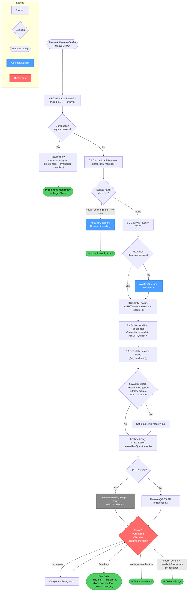
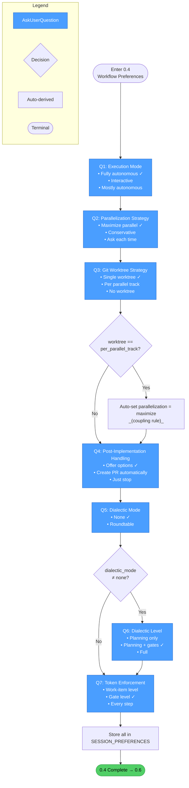
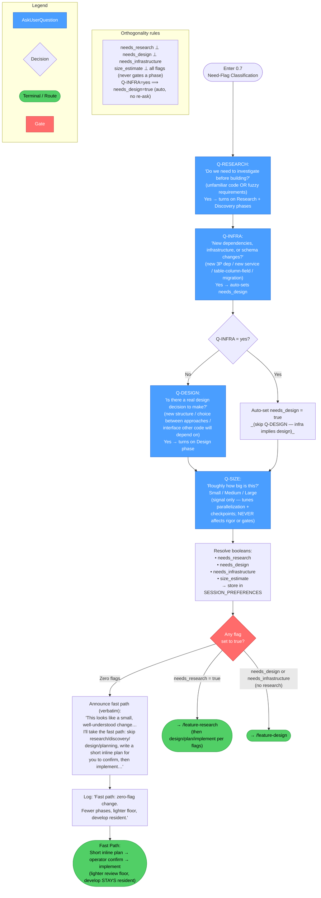

<!-- diagram-meta: {"source": "commands/feature-config.md", "source_hash": "sha256:602c637b42da36a06e68e7df31eb1f58b839a52e41ddbe55dfd9b4160ba64433", "generated_at": "2026-05-25T01:35:25Z", "generator": "generate_diagrams.py"} -->
# Diagram: feature-config

## Overview: Feature Configuration (Phase 0)

High-level flow through all seven sub-phases of the configuration wizard, showing decision branches and terminal routes.

---

## Detail: Continuation Detection (Phase 0.5)

Five-step resume flow executed before any wizard interaction.

```mermaid
flowchart TD
    START(["Enter 0.5\nContinuation Detection"]) --> SIG_CHECK

    SIG_CHECK{"Any continuation signal?\n① prompt: continue/resume/pick up/\nwhere we left off/compacted\n② system-reminder: Skill Phase with develop phase\n③ system-reminder: Active Skill = develop\n④ artifacts exist on disk"}

    SIG_CHECK -- None --> NO_CONT(["No signals → proceed to 0.1"])

    SIG_CHECK -- "Signal detected" --> STEP1

    STEP1["Step 1: Parse Recovery Context\n(from system-reminder)\n• active_skill\n• skill_phase\n• todos\n• exact_position"]
    STEP1 --> STEP2

    STEP2["Step 2: Verify Artifact Existence\n(bash: ls ~/.local/spellbook/docs/…\ngit worktree list)"]
    STEP2 --> ART_CHECK{Artifacts match\nclaimed phase?}

    ART_CHECK -- "Artifacts present & match" --> STEP3
    ART_CHECK -- "Artifacts MISSING\n(but phase implies they should exist)" --> MISSING_REPORT["Report missing artifacts:\n① Regenerate from context\n② Start fresh from Phase 0"]:::gate
    MISSING_REPORT --> USER_CHOICE{User chooses}
    USER_CHOICE -- "Regenerate" --> STEP3
    USER_CHOICE -- "Fresh start" --> FRESH(["Exit resume → Phase 0.1"])

    STEP3["Step 3: Quick Preferences Check\n(AskUserQuestion — 4 prefs only)\n• Execution mode\n• Parallelization\n• Worktree\n• Post-implementation"]:::askq
    STEP3 --> STEP4

    STEP4["Step 4: Synthesize Resume Point\n(priority order)\n① In-progress todo from restored todos\n② skill_phase from system-reminder\n③ Artifact-pattern fallback table"]
    STEP4 --> ART_TABLE{Artifact pattern\nfallback needed?}

    ART_TABLE -- No --> STEP5
    ART_TABLE -- Yes --> FALLBACK["Fallback table lookup:\n• No artifacts → Phase 0\n• Understanding doc only → Phase 2\n• Design doc, no impl → Phase 3\n• Design + impl, no worktree → Phase 4.1\n• Worktree uncommitted → Phase 4\n• Worktree + commits, no PR → Phase 4 late\n• PR exists → Phase 4.7"]
    FALLBACK --> STEP5

    STEP5["Step 5: Confirm and Resume\n(display prior progress + current task)"]
    STEP5 --> JUMP["Phase Jump Mechanism:\n① determine target from skill_phase + artifacts\n② skip all prior phases\n③ execute from target forward\n(display SKIPPED / CURRENT summary)"]
    JUMP --> TARGET(["Jump to Target Phase"])

    subgraph legend["Legend"]
        L1["Process"]
        L2{Decision}
        L3(["Terminal"])
        L4["AskUserQuestion"]:::askq
        L5["Gate / Error state"]:::gate
    end

    classDef askq fill:#4a9eff,color:#fff,stroke:#2266cc
    classDef gate fill:#ff6b6b,color:#fff,stroke:#cc3333
    classDef success fill:#51cf66,color:#000,stroke:#2f9e44

    class STEP3 askq
    class MISSING_REPORT gate
    class NO_CONT,FRESH,TARGET success
```

---

## Detail: Workflow Preferences Wizard (Phase 0.4)

Seven-question wizard with conditional Q6 and a coupling rule.

---

## Detail: Need-Flag Classification (Phase 0.7)

Four-question classification that routes the entire develop session into fast path or flag-gated phases.

---

## Cross-Reference: Overview Nodes → Detail Diagrams

| Overview Node | Detail Diagram |
|---|---|
| `0.5 Continuation Detection` | Detail: Continuation Detection (Phase 0.5) |
| `0.4 Collect Workflow Preferences` | Detail: Workflow Preferences Wizard (Phase 0.4) |
| `0.7 Need-Flag Classification` | Detail: Need-Flag Classification (Phase 0.7) |
| `0.1 Escape Hatch Detection` | Covered inline in Overview (three patterns, two user choices each) |
| `0.2 / 0.3 Motivation + WHAT` | Covered inline in Overview (single AskUserQuestion per step) |
| `0.6 Refactoring Mode` | Covered inline in Overview (keyword scan, boolean set) |
