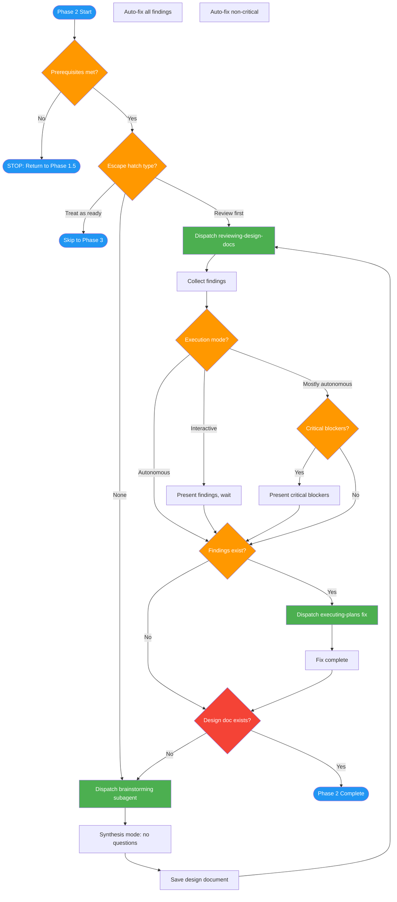

<!-- diagram-meta: {"source": "commands/feature-design.md", "source_hash": "sha256:12a9d7d21516261af772ff183088cb9729f7e58479181ce440f6ce4123199617", "generated_at": "2026-02-19T00:00:00Z", "generator": "generate_diagrams.py"} -->
# Diagram: feature-design

Phase 2 of implementing-features: Create design document via brainstorming skill in synthesis mode, review via reviewing-design-docs, handle approval gate by execution mode, and fix findings.

## Legend

| Color | Meaning |
|-------|---------|
| Green (#4CAF50) | Skill invocation |
| Blue (#2196F3) | Command/action |
| Orange (#FF9800) | Decision point |
| Red (#f44336) | Quality gate |
