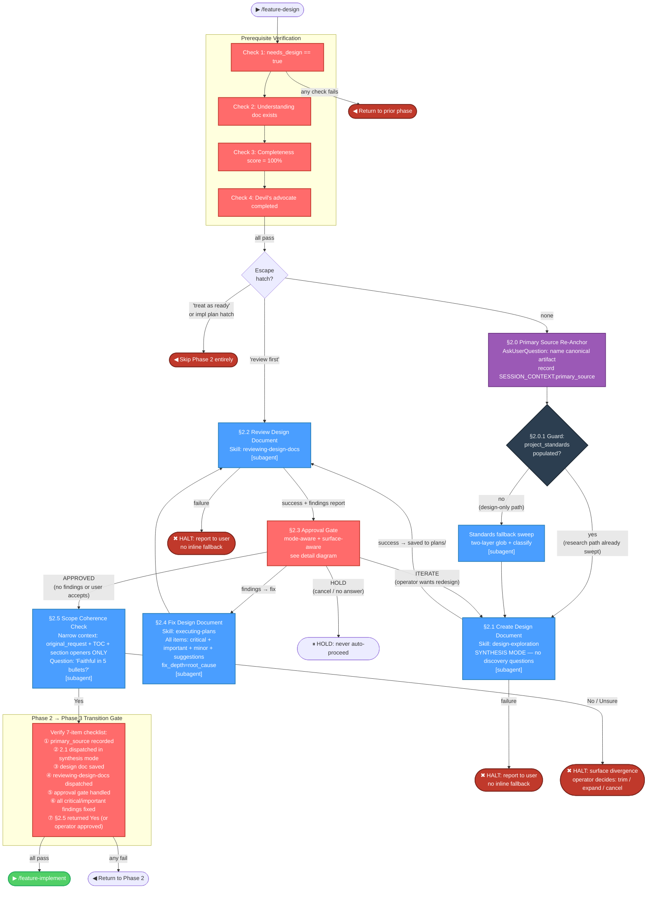
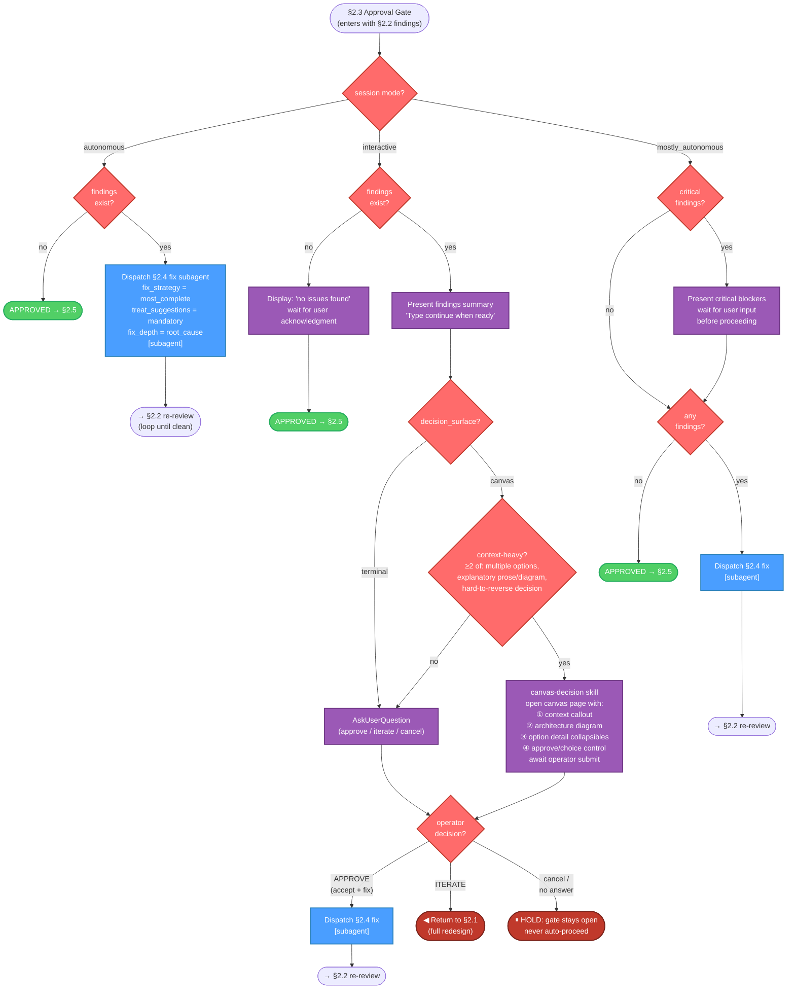
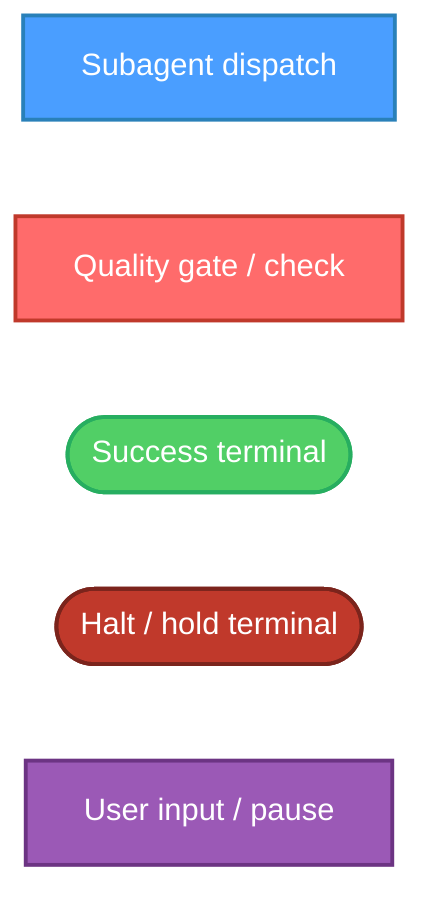

<!-- diagram-meta: {"source": "commands/feature-design.md", "source_hash": "sha256:dc229ce2de60303b22929e28c928ecb8262be7af1987a9dc29fb073daf41bf74", "generated_at": "2026-06-11T00:47:53Z", "generator": "generate_diagrams.py"} -->
# Diagram: feature-design

## `feature-design` — Overview

```mermaid
flowchart TD
    classDef subagentNode fill:#4a9eff,color:#fff,stroke:#2980b9,stroke-width:2px
    classDef gateNode fill:#ff6b6b,color:#fff,stroke:#c0392b,stroke-width:2px
    classDef successNode fill:#51cf66,color:#fff,stroke:#27ae60,stroke-width:2px
    classDef haltNode fill:#c0392b,color:#fff,stroke:#7b241c,stroke-width:2px
    classDef userInputNode fill:#9b59b6,color:#fff,stroke:#6c3483,stroke-width:2px
    classDef phaseNode fill:#2c3e50,color:#ecf0f1,stroke:#1a252f,stroke-width:2px

    START(["▶ /feature-design"]) --> PREREQ

    subgraph PREREQ_GRP["Prerequisite Verification"]
        PREREQ["Check 1: needs_design == true"]
        PREREQ --> C2["Check 2: Understanding doc exists"]
        C2 --> C3["Check 3: Completeness score = 100%"]
        C3 --> C4["Check 4: Devil's advocate completed"]
    end

    PREREQ -- "any check fails" --> PREREQ_FAIL(["◀ Return to prior phase"])
    C4 -- all pass --> ESCAPE

    ESCAPE{"Escape\nhatch?"}
    ESCAPE -- "'treat as ready'\nor impl plan hatch" --> PHASE2_SKIP(["◀ Skip Phase 2 entirely"])
    ESCAPE -- "'review first'" --> P22
    ESCAPE -- none --> P20

    P20["§2.0 Primary Source Re-Anchor\nAskUserQuestion: name canonical artifact\nrecord SESSION_CONTEXT.primary_source"]
    P20 --> P201

    P201{"§2.0.1 Guard:\nproject_standards\npopulated?"}
    P201 -- "yes\n(research path already swept)" --> P21
    P201 -- "no\n(design-only path)" --> P201_SWEEP["Standards fallback sweep\ntwo-layer glob + classify\n[subagent]"]
    P201_SWEEP --> P21

    P21["§2.1 Create Design Document\nSkill: design-exploration\nSYNTHESIS MODE — no discovery questions\n[subagent]"]
    P21 -- failure --> HALT1(["✖ HALT: report to user\nno inline fallback"])
    P21 -- success → saved to plans/ --> P22

    P22["§2.2 Review Design Document\nSkill: reviewing-design-docs\n[subagent]"]
    P22 -- failure --> HALT2(["✖ HALT: report to user\nno inline fallback"])
    P22 -- success + findings report --> P23

    P23["§2.3 Approval Gate\nmode-aware + surface-aware\nsee detail diagram"]
    P23 -- "findings → fix" --> P24
    P23 -- "ITERATE\n(operator wants redesign)" --> P21
    P23 -- "HOLD\n(cancel / no answer)" --> HOLD(["⏸ HOLD: never auto-proceed"])
    P23 -- "APPROVED\n(no findings or user accepts)" --> P25

    P24["§2.4 Fix Design Document\nSkill: executing-plans\nAll items: critical + important + minor + suggestions\nfix_depth=root_cause\n[subagent]"]
    P24 --> P22

    P25["§2.5 Scope Coherence Check\nNarrow context: original_request + TOC + section openers ONLY\nQuestion: 'Faithful in 5 bullets?'\n[subagent]"]
    P25 -- "Yes" --> TRANS
    P25 -- "No / Unsure" --> HALT3(["✖ HALT: surface divergence\noperator decides: trim / expand / cancel"])

    subgraph TRANS_GRP["Phase 2 → Phase 3 Transition Gate"]
        TRANS["Verify 7-item checklist:\n① primary_source recorded\n② 2.1 dispatched in synthesis mode\n③ design doc saved\n④ reviewing-design-docs dispatched\n⑤ approval gate handled\n⑥ all critical/important findings fixed\n⑦ §2.5 returned Yes (or operator approved)"]
    end
    TRANS -- all pass --> NEXT(["▶ /feature-implement"])
    TRANS -- any fail --> BACK(["◀ Return to Phase 2"])

    class P201_SWEEP,P21,P22,P24,P25 subagentNode
    class PREREQ,C2,C3,C4,P23,TRANS gateNode
    class NEXT successNode
    class HALT1,HALT2,HALT3,PREREQ_FAIL,PHASE2_SKIP haltNode
    class P20 userInputNode
    class P201 phaseNode
```

---

## `feature-design` — §2.3 Approval Gate Detail

```mermaid
flowchart TD
    classDef subagentNode fill:#4a9eff,color:#fff,stroke:#2980b9,stroke-width:2px
    classDef gateNode fill:#ff6b6b,color:#fff,stroke:#c0392b,stroke-width:2px
    classDef successNode fill:#51cf66,color:#fff,stroke:#27ae60,stroke-width:2px
    classDef haltNode fill:#c0392b,color:#fff,stroke:#7b241c,stroke-width:2px
    classDef userInputNode fill:#9b59b6,color:#fff,stroke:#6c3483,stroke-width:2px

    ENTRY(["§2.3 Approval Gate\n(enters with §2.2 findings)"]) --> MODE

    MODE{"session mode?"}

    %% ─── AUTONOMOUS ──────────────────────────────────────────────
    MODE -- autonomous --> A_FIND{"findings\nexist?"}
    A_FIND -- no --> A_PASS(["APPROVED → §2.5"])
    A_FIND -- yes --> A_FIX["Dispatch §2.4 fix subagent\nfix_strategy = most_complete\ntreat_suggestions = mandatory\nfix_depth = root_cause\n[subagent]"]
    A_FIX --> A_LOOP(["→ §2.2 re-review\n(loop until clean)"])

    %% ─── INTERACTIVE ─────────────────────────────────────────────
    MODE -- interactive --> I_FIND{"findings\nexist?"}
    I_FIND -- no --> I_ACK["Display: 'no issues found'\nwait for user acknowledgment"]
    I_ACK --> I_PASS(["APPROVED → §2.5"])

    I_FIND -- yes --> I_PRESENT["Present findings summary\n'Type continue when ready'"]
    I_PRESENT --> I_SURFACE

    I_SURFACE{"decision_surface?"}
    I_SURFACE -- terminal --> I_ASK["AskUserQuestion\n(approve / iterate / cancel)"]
    I_SURFACE -- canvas --> I_HEAVY{"context-heavy?\n≥2 of: multiple options,\nexplanatory prose/diagram,\nhard-to-reverse decision"}
    I_HEAVY -- yes --> I_CANVAS["canvas-decision skill\nopen canvas page with:\n① context callout\n② architecture diagram\n③ option detail collapsibles\n④ approve/choice control\nawait operator submit"]
    I_HEAVY -- no --> I_ASK
    I_ASK --> I_OUTCOME
    I_CANVAS --> I_OUTCOME

    I_OUTCOME{"operator\ndecision?"}
    I_OUTCOME -- "APPROVE\n(accept + fix)" --> I_FIX["Dispatch §2.4 fix\n[subagent]"]
    I_FIX --> I_LOOP(["→ §2.2 re-review"])
    I_OUTCOME -- ITERATE --> I_ITER(["◀ Return to §2.1\n(full redesign)"])
    I_OUTCOME -- "cancel /\nno answer" --> I_HOLD(["⏸ HOLD: gate stays open\nnever auto-proceed"])

    %% ─── MOSTLY AUTONOMOUS ───────────────────────────────────────
    MODE -- mostly_autonomous --> MA_CRIT{"critical\nfindings?"}
    MA_CRIT -- yes --> MA_BLOCK["Present critical blockers\nwait for user input\nbefore proceeding"]
    MA_CRIT -- no --> MA_ANY
    MA_BLOCK --> MA_ANY

    MA_ANY{"any\nfindings?"}
    MA_ANY -- yes --> MA_FIX["Dispatch §2.4 fix\n[subagent]"]
    MA_FIX --> MA_LOOP(["→ §2.2 re-review"])
    MA_ANY -- no --> MA_PASS(["APPROVED → §2.5"])

    class A_FIX,I_FIX,MA_FIX subagentNode
    class MODE,I_SURFACE,I_HEAVY,I_OUTCOME,A_FIND,I_FIND,MA_CRIT,MA_ANY gateNode
    class A_PASS,I_PASS,MA_PASS successNode
    class I_HOLD,I_ITER haltNode
    class I_ASK,I_ACK,I_CANVAS,MA_BLOCK,I_PRESENT userInputNode
```

---

## Cross-Reference

| Overview node | Detail diagram |
|---|---|
| §2.3 Approval Gate | §2.3 Approval Gate Detail (above) |
| §2.1 Create Design Doc | `design-exploration` skill — synthesis mode: skip discovery/questions, directly present design, run `/design-assessment` (completeness/clarity/accuracy ≥ 3, no CRITICAL/HIGH, verdict = READY) |
| §2.2 Review Design Doc | `reviewing-design-docs` skill — phases: document inventory → completeness checklist → optional deep audit → interface verification → findings report with P1/P2/P3 remediation plan |
| §2.4 Fix Design Doc | `executing-plans` skill — ALL items addressed (critical + important + minor + suggestions), root-cause fixes, consistency maintained |

## Legend

```mermaid
flowchart LR
    classDef subagentNode fill:#4a9eff,color:#fff,stroke:#2980b9,stroke-width:2px
    classDef gateNode fill:#ff6b6b,color:#fff,stroke:#c0392b,stroke-width:2px
    classDef successNode fill:#51cf66,color:#fff,stroke:#27ae60,stroke-width:2px
    classDef haltNode fill:#c0392b,color:#fff,stroke:#7b241c,stroke-width:2px
    classDef userInputNode fill:#9b59b6,color:#fff,stroke:#6c3483,stroke-width:2px

    SA["Subagent dispatch"]
    QG["Quality gate / check"]
    ST(["Success terminal"])
    HT(["Halt / hold terminal"])
    UI["User input / pause"]

    class SA subagentNode
    class QG gateNode
    class ST successNode
    class HT haltNode
    class UI userInputNode
```
