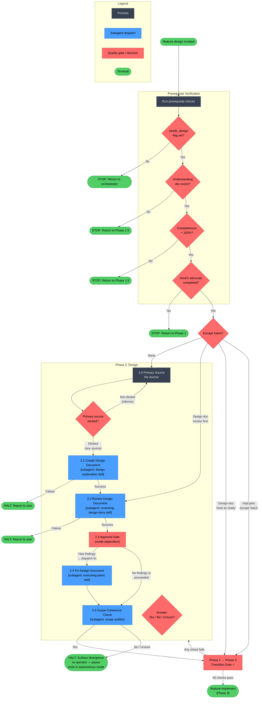
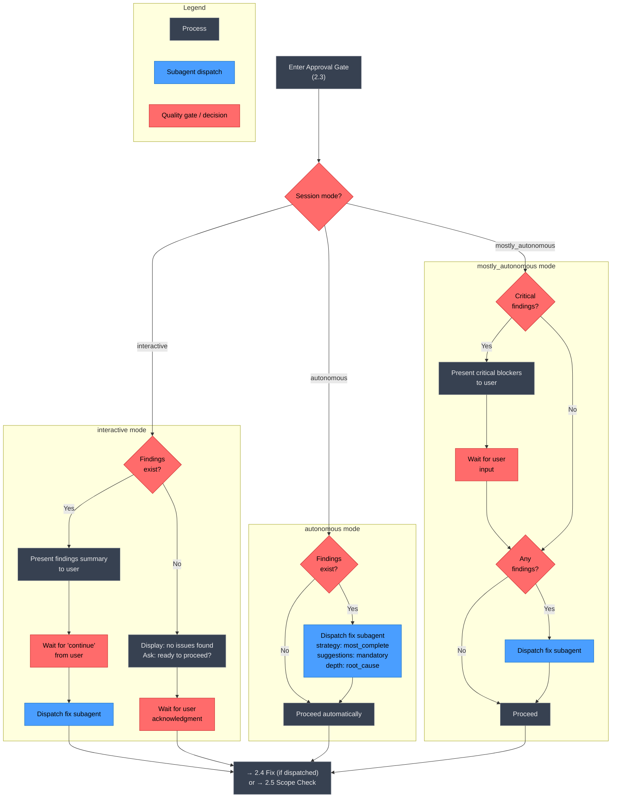

<!-- diagram-meta: {"source": "commands/feature-design.md", "source_hash": "sha256:62dba6815cdef81cf81163d16493c28cca63afa0a80a958cf6c9016f29edb20c", "generated_at": "2026-05-25T01:36:10Z", "generator": "generate_diagrams.py"} -->
# Diagram: feature-design

## Overview: `/feature-design` Command Flow

```mermaid
flowchart TD
    START(["/feature-design invoked"]):::terminal --> PREREQ

    subgraph PREREQ_CHECK["Prerequisite Verification"]
        PREREQ["Run prerequisite checks"]:::process
        C1{"needs_design\nflag set?"}:::gate
        C2{"Understanding\ndoc exists?"}:::gate
        C3{"Completeness\n= 100%?"}:::gate
        C4{"Devil's advocate\ncompleted?"}:::gate
    end

    PREREQ --> C1
    C1 -->|"No"| STOP1(["STOP: Return to orchestrator"]):::terminal
    C1 -->|"Yes"| C2
    C2 -->|"No"| STOP2(["STOP: Return to Phase 1.5"]):::terminal
    C2 -->|"Yes"| C3
    C3 -->|"No"| STOP3(["STOP: Return to Phase 1.5"]):::terminal
    C3 -->|"Yes"| C4
    C4 -->|"No"| STOP4(["STOP: Return to Phase 1"]):::terminal
    C4 -->|"Yes"| ESCAPE

    ESCAPE{"Escape hatch?"}:::gate
    ESCAPE -->|"None"| P20
    ESCAPE -->|"Design doc\n'review first'"| P22
    ESCAPE -->|"Design doc\n'treat as ready'"| TRANS
    ESCAPE -->|"Impl plan\nescape hatch"| TRANS

    subgraph PHASE2["Phase 2: Design"]
        P20["2.0 Primary Source\nRe-Anchor"]:::process
        P20_Q{"Primary source\nelicited?"}:::gate
        P21["2.1 Create Design Document\n[subagent: design-exploration skill]"]:::subagent
        P22["2.2 Review Design Document\n[subagent: reviewing-design-docs skill]"]:::subagent
        P23["2.3 Approval Gate\n(mode-dependent)"]:::gate
        P24["2.4 Fix Design Document\n[subagent: executing-plans skill]"]:::subagent
        P25["2.5 Scope Coherence Check\n[subagent: scope auditor]"]:::subagent
        P25_Q{"Answer:\nYes / No / Unsure?"}:::gate
    end

    P20 --> P20_Q
    P20_Q -->|"Not elicited\n(silence)"| P20
    P20_Q -->|"Elicited\n(any source)"| P21
    P21 -->|"Failure"| HALT1(["HALT: Report to user"]):::terminal
    P21 -->|"Success"| P22
    P22 -->|"Failure"| HALT2(["HALT: Report to user"]):::terminal
    P22 -->|"Success"| P23
    P23 -->|"Has findings\n→ dispatch fix"| P24
    P23 -->|"No findings or\nproceeded"| P25
    P24 --> P25
    P25 -->|"Yes"| TRANS
    P25 -->|"No / Unsure"| SCOPE_HALT(["HALT: Surface divergence\nto operator — pause\neven in autonomous mode"]):::terminal

    TRANS["Phase 2 → Phase 3\nTransition Gate ✓"]:::gate
    TRANS -->|"All checks pass"| NEXT(["/feature-implement\n(Phase 3)"]):::terminal
    TRANS -->|"Any check fails"| PHASE2

    classDef terminal fill:#51cf66,color:#000,stroke:#2f9e44
    classDef gate fill:#ff6b6b,color:#000,stroke:#c92a2a
    classDef subagent fill:#4a9eff,color:#000,stroke:#1971c2
    classDef process fill:#374151,color:#e8e8ea,stroke:#6b7280

    subgraph LEGEND["Legend"]
        L1["Process"]:::process
        L2["Subagent dispatch"]:::subagent
        L3["Quality gate / decision"]:::gate
        L4(["Terminal"]):::terminal
    end
```

---

## Detail: Phase 2.3 Approval Gate (Mode-Dependent)

```mermaid
flowchart TD
    ENTER["Enter Approval Gate\n(2.3)"]:::process
    MODE{"Session mode?"}:::gate

    ENTER --> MODE

    subgraph AUTONOMOUS["autonomous mode"]
        A_FIND{"Findings\nexist?"}:::gate
        A_FIX["Dispatch fix subagent\nstrategy: most_complete\nsuggestions: mandatory\ndepth: root_cause"]:::subagent
        A_PROC["Proceed automatically"]:::process
    end

    subgraph INTERACTIVE["interactive mode"]
        I_FIND{"Findings\nexist?"}:::gate
        I_PRESENT["Present findings summary\nto user"]:::process
        I_WAIT1["Wait for 'continue'\nfrom user"]:::gate
        I_FIX["Dispatch fix subagent"]:::subagent
        I_OK["Display: no issues found\nAsk: ready to proceed?"]:::process
        I_WAIT2["Wait for user\nacknowledgment"]:::gate
    end

    subgraph MOSTLY["mostly_autonomous mode"]
        M_CRIT{"Critical\nfindings?"}:::gate
        M_PRESENT["Present critical blockers\nto user"]:::process
        M_WAIT["Wait for user\ninput"]:::gate
        M_FIND{"Any\nfindings?"}:::gate
        M_FIX["Dispatch fix subagent"]:::subagent
        M_PROC["Proceed"]:::process
    end

    MODE -->|"autonomous"| A_FIND
    A_FIND -->|"Yes"| A_FIX
    A_FIND -->|"No"| A_PROC
    A_FIX --> A_PROC

    MODE -->|"interactive"| I_FIND
    I_FIND -->|"Yes"| I_PRESENT
    I_PRESENT --> I_WAIT1
    I_WAIT1 --> I_FIX
    I_FIX --> DONE
    I_FIND -->|"No"| I_OK
    I_OK --> I_WAIT2
    I_WAIT2 --> DONE

    MODE -->|"mostly_autonomous"| M_CRIT
    M_CRIT -->|"Yes"| M_PRESENT
    M_PRESENT --> M_WAIT
    M_WAIT --> M_FIND
    M_CRIT -->|"No"| M_FIND
    M_FIND -->|"Yes"| M_FIX
    M_FIND -->|"No"| M_PROC
    M_FIX --> M_PROC

    A_PROC --> DONE
    M_PROC --> DONE

    DONE["→ 2.4 Fix (if dispatched)\nor → 2.5 Scope Check"]:::process

    classDef gate fill:#ff6b6b,color:#000,stroke:#c92a2a
    classDef subagent fill:#4a9eff,color:#000,stroke:#1971c2
    classDef process fill:#374151,color:#e8e8ea,stroke:#6b7280

    subgraph LEGEND["Legend"]
        L1["Process"]:::process
        L2["Subagent dispatch"]:::subagent
        L3["Quality gate / decision"]:::gate
    end
```

---

## Cross-Reference: Overview Nodes → Detail Diagrams

| Overview Node | Detail Diagram | Notes |
|---|---|---|
| **2.3 Approval Gate** | Detail diagram above | Three-branch mode dispatch: autonomous / interactive / mostly_autonomous |
| **2.1 Create Design Document** | See `design-exploration` skill | Synthesis mode: skip understanding/exploring phases, go directly to presenting |
| **2.2 Review Design Document** | See `reviewing-design-docs` skill | Returns complete findings report + remediation plan |
| **2.4 Fix Design Document** | See `executing-plans` skill | Must use `most_complete` strategy in autonomous mode |
| **2.5 Scope Coherence Check** | Inline in overview | Narrow-scoped subagent: only original request + TOC + section openers |
