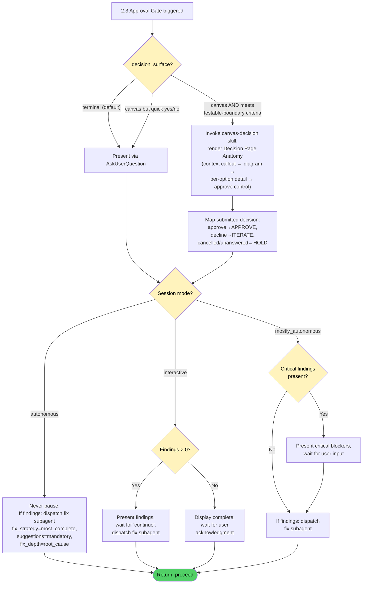
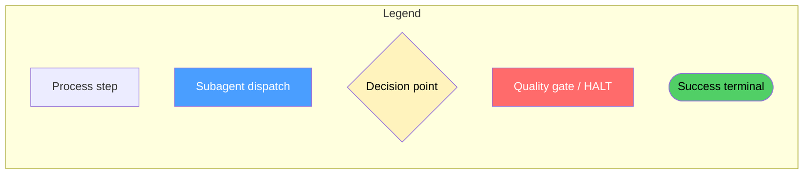

<!-- diagram-meta: {"source": "commands/feature-design.md", "source_hash": "sha256:d87bdb553920e2b0cb37fbe1188358a65efae3ad72e88e7909af21d4e0376c04", "generated_at": "2026-08-05T19:20:56Z", "generator": "generate_diagrams.py"} -->
# Diagram: feature-design

Now generating the diagrams based on the full traversal of this file.

## Overview: /feature-design (Phase 2 of develop)

```mermaid
flowchart TD
    classDef subagent fill:#4a9eff,color:#fff
    classDef gate fill:#ff6b6b,color:#fff
    classDef success fill:#51cf66,color:#000
    classDef decision fill:#fff3bd,color:#000

    Start([Enter /feature-design]) --> Prereq{Prerequisite<br/>checks pass?}
    Prereq -- "No" --> HaltPrereq([HALT: return to<br/>appropriate phase]):::gate
    Prereq -- "Yes" --> Escape{Escape hatch<br/>set?}

    Escape -- "None" --> P20
    Escape -- "review first" --> P22note[Skip 2.1, start at 2.2]
    Escape -- "treat as ready" --> SkipAll([Skip entire Phase 2]):::success
    Escape -- "impl plan hatch" --> SkipAll

    P22note --> P22

    subgraph PH2["Phase 2: Design (see Detail Diagram A)"]
        direction TB
        P20["2.0 Primary Source<br/>Re-Anchor"]:::gate --> P201{2.0.1 Fallback sweep<br/>guard fires?}
        P201 -- "Yes" --> P201run["Run project-standards<br/>fallback sweep"]
        P201 -- "No (no-op)" --> P21
        P201run --> P21
        P21["2.1 Create Design Doc"]:::subagent --> P215["2.1.5 Checkability Pass"]:::subagent
        P215 --> P22["2.2 Review Design Doc"]:::subagent
        P22 --> P23{2.3 Approval Gate<br/>(see Detail Diagram B)}:::decision
        P23 -- "findings / ITERATE" --> P24["2.4 Fix Design Doc"]:::subagent
        P24 -- "Round N+1 review" --> P22
        P23 -- "no findings / APPROVE" --> P25["2.5 Scope Coherence<br/>Check"]:::subagent
    end

    P25 --> ScopeQ{"Could design be<br/>described in 5 bullets<br/>matching original ask?"}:::decision
    ScopeQ -- "No / Unsure" --> HaltScope([HALT Phase 2:<br/>surface divergence to operator]):::gate
    ScopeQ -- "Yes" --> Transition{"STOP AND VERIFY<br/>Phase 2→3 checklist<br/>all checked?"}:::gate
    Transition -- "Any unchecked" --> PH2
    Transition -- "All checked" --> Next([Invoke /feature-implement<br/>same turn if autonomous]):::success
```

## Detail Diagram A: Phase 2.0–2.4 core design loop

```mermaid
flowchart TD
    classDef subagent fill:#4a9eff,color:#fff
    classDef gate fill:#ff6b6b,color:#fff
    classDef success fill:#51cf66,color:#000
    classDef decision fill:#fff3bd,color:#000
    classDef forbidden fill:#3a1f1f,color:#ff8888,stroke:#ff6b6b

    A0[Enter Phase 2] --> A1{"Primary source<br/>named by operator?"}:::decision
    A1 -- "No — must AskUserQuestion" --> A1ask[Elicit primary source<br/>via AskUserQuestion]
    A1ask --> A1rec
    A1 -- "Yes" --> A1rec["Record<br/>SESSION_CONTEXT.primary_source"]
    A1rec --> AForbid1["FORBIDDEN: dispatch 2.1<br/>without primary_source set"]:::forbidden

    A1rec --> A01{"2.0.1 Guard:<br/>project_standards empty<br/>AND needs_design=true?"}:::decision
    A01 -- "Yes" --> A01sweep["Dispatch identical<br/>two-layer sweep<br/>(Layer 1 glob + Layer 2<br/>content classification)"]:::subagent
    A01sweep --> A01none{"none_found?"}:::decision
    A01none -- "true" --> A01flag["Flag REQUIRED operator<br/>cross-check"]
    A01none -- "false" --> A01write["Write project_standards<br/>to design_context"]
    A01 -- "No (already populated<br/>from research §1.2.5)" --> A21
    A01flag --> A21
    A01write --> A21

    A21["2.1 Dispatch: design-exploration<br/>skill in SYNTHESIS MODE<br/>(no questions, primary source +<br/>design_context + binding_rules)"]:::subagent
    A21 --> A21fail{"Subagent<br/>fails?"}:::decision
    A21fail -- "Yes" --> A21halt([HALT, report to user]):::gate
    A21fail -- "No" --> A215

    A215["2.1.5 Checkability Pass:<br/>find machine-decidable claims,<br/>build+run checks, repair"]:::subagent
    A215 --> A215none{"No decidable<br/>claims?"}:::decision
    A215none -- "Yes" --> A215log[Record one-line note]
    A215none -- "No" --> A22
    A215log --> A22

    A22["2.2 Dispatch: reviewing-design-docs<br/>skill on design doc"]:::subagent
    A22 --> A22fail{"Subagent<br/>fails?"}:::decision
    A22fail -- "Yes" --> A22halt([HALT, report to user]):::gate
    A22fail -- "No" --> A23

    A23{"2.3 Approval Gate<br/>(see Detail Diagram B)"}:::gate
    A23 -- "findings exist" --> A24
    A23 -- "no findings" --> A25done([Proceed to 2.5]):::success

    A24["2.4 Dispatch: executing-plans skill<br/>fix ALL findings —<br/>most_complete, mandatory,<br/>root_cause (autonomous mode)"]:::subagent
    A24 --> A24round["Round discipline check:<br/>count blocking findings,<br/>caused-by-repair findings"]
    A24round --> A24maj{"Majority of round's<br/>findings caused by<br/>prior repairs?"}:::decision
    A24maj -- "Yes" --> A24mech["STOP reviewing loop;<br/>mechanize that finding class,<br/>repair against check,<br/>run ONE more review round"]
    A24mech --> A22
    A24maj -- "No" --> A22
```

## Detail Diagram B: 2.3 Approval Gate logic

```mermaid
flowchart TD
    classDef gate fill:#ff6b6b,color:#fff
    classDef decision fill:#fff3bd,color:#000
    classDef success fill:#51cf66,color:#000

    B0[2.3 Approval Gate triggered] --> BSurface{"decision_surface?"}:::decision
    BSurface -- "terminal (default)" --> BTerm["Present via AskUserQuestion"]
    BSurface -- "canvas AND meets<br/>testable-boundary criteria" --> BCanvas["Invoke canvas-decision skill:<br/>render Decision Page Anatomy<br/>(context callout → diagram →<br/>per-option detail → approve control)"]
    BSurface -- "canvas but quick yes/no" --> BTerm

    BTerm --> BMode
    BCanvas --> BMap["Map submitted decision:<br/>approve→APPROVE,<br/>decline→ITERATE,<br/>cancelled/unanswered→HOLD"]
    BMap --> BMode

    BMode{"Session mode?"}:::decision
    BMode -- "autonomous" --> BAuto["Never pause.<br/>If findings: dispatch fix subagent<br/>fix_strategy=most_complete,<br/>suggestions=mandatory,<br/>fix_depth=root_cause"]
    BMode -- "interactive" --> BInt{"Findings > 0?"}:::decision
    BMode -- "mostly_autonomous" --> BMost{"Critical findings<br/>present?"}:::decision

    BInt -- "Yes" --> BIntFix["Present findings,<br/>wait for 'continue',<br/>dispatch fix subagent"]
    BInt -- "No" --> BIntAck["Display complete,<br/>wait for user<br/>acknowledgment"]

    BMost -- "Yes" --> BMostPause["Present critical blockers,<br/>wait for user input"]
    BMost -- "No" --> BMostFix
    BMostPause --> BMostFix["If findings: dispatch<br/>fix subagent"]

    BAuto --> BProceed([Return: proceed]):::success
    BIntFix --> BProceed
    BIntAck --> BProceed
    BMostFix --> BProceed
```

## Legend

```mermaid
flowchart LR
    subgraph Legend
        L1[Process step]
        L2["Subagent dispatch"]:::subagent
        L3{"Decision point"}:::decision
        L4["Quality gate / HALT"]:::gate
        L5(["Success terminal"]):::success
    end
    classDef subagent fill:#4a9eff,color:#fff
    classDef gate fill:#ff6b6b,color:#fff
    classDef success fill:#51cf66,color:#000
    classDef decision fill:#fff3bd,color:#000
```

## Cross-Reference Table

| Overview Node | Detail Diagram | Notes |
|---|---|---|
| `Prereq` | — | 4-check prerequisite verification block (needs_design, understanding doc, completeness=100%, devil's advocate) |
| `PH2` subgraph (2.0–2.5) | Detail Diagram A | Full 2.0 → 2.4 loop with round discipline |
| `P23` / Approval Gate | Detail Diagram B | decision_surface routing + mode-based handling (autonomous/interactive/mostly_autonomous) |
| `ScopeQ` (2.5) | — | Scope auditor subagent receives ONLY original_request + design doc TOC/openers |
| `Transition` | — | 8-item Phase 2→3 checklist; any unchecked item loops back to `PH2` |
| `Next` | — | Same-turn invocation of `/feature-implement` in autonomous mode; confirms first in interactive mode |
