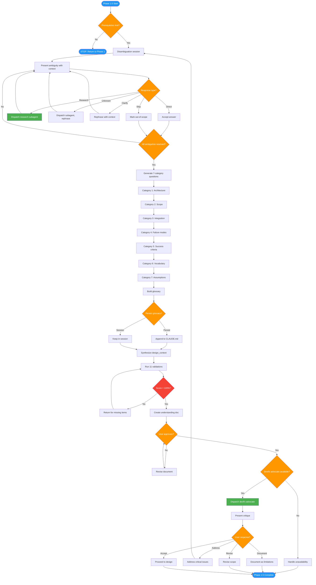

<!-- diagram-meta: {"source": "commands/feature-discover.md", "source_hash": "sha256:bd3cd9316c69ec4b4a86edc188604efbf6f6e153656a81e30b0f213fc95c0da7", "generated_at": "2026-02-19T00:00:00Z", "generator": "generate_diagrams.py"} -->
# Diagram: feature-discover

Phase 1.5 of implementing-features: Informed discovery using research findings, disambiguation, 7-category question wizard with ARH pattern, understanding document creation, and devil's advocate review.

## Legend

| Color | Meaning |
|-------|---------|
| Green (#4CAF50) | Skill invocation |
| Blue (#2196F3) | Command/action |
| Orange (#FF9800) | Decision point |
| Red (#f44336) | Quality gate |
