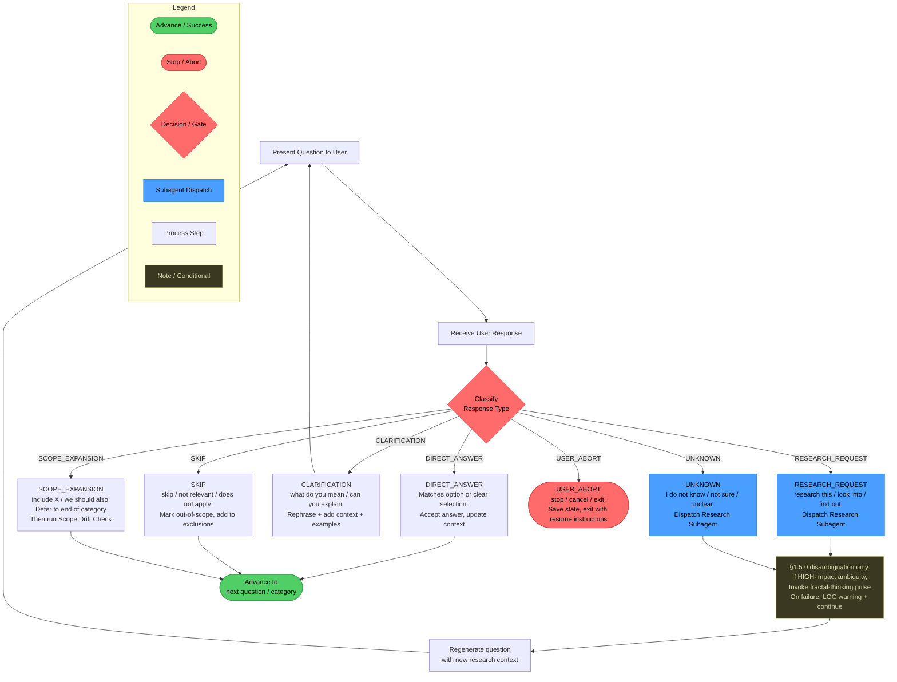
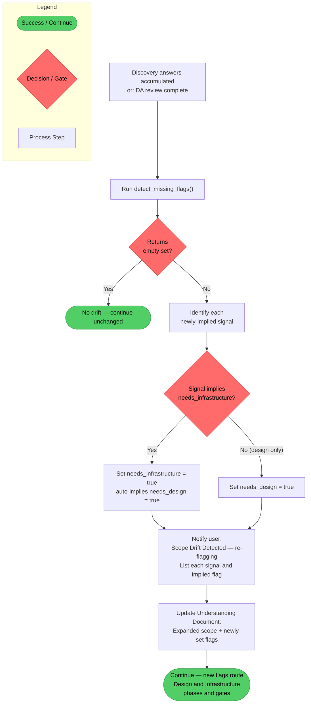
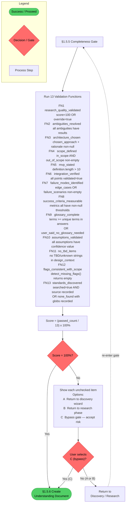
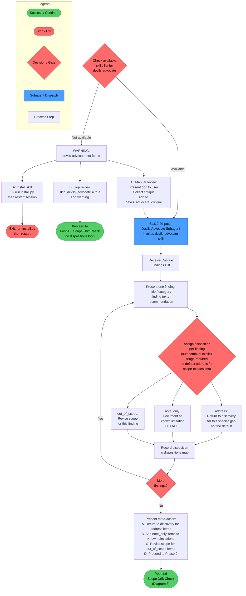

<!-- diagram-meta: {"source": "commands/feature-discover.md", "source_hash": "sha256:e574ba39a04ec1119b5cc30fdd3110bbb243171654d01962f8d43bf0707f2998", "generated_at": "2026-06-11T01:48:52Z", "generator": "generate_diagrams.py"} -->
# Diagram: feature-discover

Now generating the diagrams. Reading is complete — producing Phase 3 (generation) and Phase 4 (verification) output now.

---

## Diagram 1: Phase 1.5 Overview

End-to-end flow from prerequisite check through all sub-phases to Phase 2 handoff. Decision diamonds (red) are quality gates; the devil's advocate dispatch (blue) is the only subagent in the top-level flow. See cross-reference table for detail diagrams.

```mermaid
flowchart TD
    START(["Phase 1.5 Entry"])
    PRECHECK{"needs_research=true\nPhase 1 complete?"}
    STOP1(["STOP: Return to Phase 1"])

    DISAMB["§1.5.0 Disambiguation\nSession — ARH"]
    GEN["§1.5.1 Generate\n7-Category Questions"]
    WIZARD["§1.5.2 Discovery Wizard\n7 categories × ARH"]
    DRIFT1{"§1.5.2.5\nScope Drift?"}
    REFLAG1["Re-flag need-flags\n& Continue"]
    STANDARDS["§1.5.2.6 Project-\nStandards Cross-Check"]
    GLOSSARY["§1.5.3 Build Glossary\n& Persistence Option"]
    SYNTH["§1.5.4 Synthesize\ndesign_context"]
    GATE_C{"§1.5.5 Completeness\n13/13 or bypass?"}
    REWORK["Return to\ndiscovery / research"]
    UNDOC["§1.5.6 Create\nUnderstanding Document"]
    APPROVE{"User approves\nUnderstanding Doc?"}
    REVISE["Revise / Return\nto Discovery"]
    DA_CHECK{"devils-advocate\nskill available?"}
    DA_FALLBACK["Fallback:\nInstall / Skip / Manual\n(see Diagram 5)"]
    DA_SUB["§1.6.2 Dispatch\nDevils Advocate\nSubagent"]
    DISPOSITIONS["Per-finding Dispositions\naddress / note_only / out_of_scope"]
    META["Meta-action A/B/C/D"]
    DRIFT2{"Post-1.6\nScope Drift?"}
    REFLAG2["Re-flag\n& Continue"]
    PHASE2(["Phase 2: /feature-design"])

    START --> PRECHECK
    PRECHECK -- "No" --> STOP1
    PRECHECK -- "Yes" --> DISAMB
    DISAMB --> GEN --> WIZARD --> DRIFT1
    DRIFT1 -- "Yes" --> REFLAG1 --> STANDARDS
    DRIFT1 -- "No" --> STANDARDS
    STANDARDS --> GLOSSARY --> SYNTH --> GATE_C
    GATE_C -- "Pass" --> UNDOC
    GATE_C -- "Fail" --> REWORK --> WIZARD
    UNDOC --> APPROVE
    APPROVE -- "A: Approve" --> DA_CHECK
    APPROVE -- "B/C: Revise" --> REVISE --> UNDOC
    DA_CHECK -- "Yes" --> DA_SUB
    DA_CHECK -- "No" --> DA_FALLBACK --> DA_SUB
    DA_SUB --> DISPOSITIONS --> META --> DRIFT2
    DRIFT2 -- "Yes" --> REFLAG2 --> PHASE2
    DRIFT2 -- "No" --> PHASE2

    classDef terminal fill:#51cf66,stroke:#3a9e50,color:#000
    classDef stop fill:#ff6b6b,stroke:#cc4444,color:#000
    classDef gate fill:#ff6b6b,stroke:#cc4444,color:#000
    classDef subagent fill:#4a9eff,stroke:#2275cc,color:#000

    class START,PHASE2 terminal
    class STOP1 stop
    class PRECHECK,DRIFT1,GATE_C,APPROVE,DA_CHECK,DRIFT2 gate
    class DA_SUB subagent

    subgraph LEGEND ["Legend"]
        direction LR
        LT(["Success terminal"])
        LS(["Stop terminal"])
        LG{"Decision / Gate"}
        LA["Subagent Dispatch"]
        LP["Process Step"]
    end
    class LT terminal
    class LS stop
    class LG gate
    class LA subagent
```

---

## Diagram 2: Adaptive Response Handler (ARH) Pattern

Applies to all discovery questions in §1.5.0 (disambiguation) and §1.5.2 (discovery wizard). Classifies 7 response types and routes to appropriate action. RESEARCH_REQUEST and UNKNOWN trigger subagent dispatch; CLARIFICATION loops the same question; DIRECT_ANSWER, SKIP, and SCOPE_EXPANSION advance the wizard. The fractal-thinking path is conditional on §1.5.0 disambiguation only.

```mermaid
flowchart TD
    QUESTION["Present Question to User"]
    RECV["Receive User Response"]
    CLASSIFY{"Classify\nResponse Type"}

    DA_ACT["DIRECT_ANSWER\nMatches option or clear selection:\nAccept answer, update context"]
    RR_ACT["RESEARCH_REQUEST\nresearch this / look into / find out:\nDispatch Research Subagent"]
    UNK_ACT["UNKNOWN\nI do not know / not sure / unclear:\nDispatch Research Subagent"]
    CLAR_ACT["CLARIFICATION\nwhat do you mean / can you explain:\nRephrase + add context + examples"]
    SKIP_ACT["SKIP\nskip / not relevant / does not apply:\nMark out-of-scope, add to exclusions"]
    ABORT_ACT(["USER_ABORT\nstop / cancel / exit:\nSave state, exit with resume instructions"])
    EXP_ACT["SCOPE_EXPANSION\ninclude X / we should also:\nDefer to end of category\nThen run Scope Drift Check"]

    FRACTAL["§1.5.0 disambiguation only:\nIf HIGH-impact ambiguity,\nInvoke fractal-thinking pulse\nOn failure: LOG warning + continue"]
    REGEN["Regenerate question\nwith new research context"]
    NEXT_Q(["Advance to\nnext question / category"])

    QUESTION --> RECV --> CLASSIFY
    CLASSIFY -- "DIRECT_ANSWER" --> DA_ACT --> NEXT_Q
    CLASSIFY -- "RESEARCH_REQUEST" --> RR_ACT --> FRACTAL --> REGEN --> QUESTION
    CLASSIFY -- "UNKNOWN" --> UNK_ACT --> FRACTAL
    CLASSIFY -- "CLARIFICATION" --> CLAR_ACT --> QUESTION
    CLASSIFY -- "SKIP" --> SKIP_ACT --> NEXT_Q
    CLASSIFY -- "USER_ABORT" --> ABORT_ACT
    CLASSIFY -- "SCOPE_EXPANSION" --> EXP_ACT --> NEXT_Q

    classDef terminal fill:#51cf66,stroke:#3a9e50,color:#000
    classDef stop fill:#ff6b6b,stroke:#cc4444,color:#000
    classDef gate fill:#ff6b6b,stroke:#cc4444,color:#000
    classDef subagent fill:#4a9eff,stroke:#2275cc,color:#000
    classDef note fill:#3a3820,stroke:#888840,color:#d8d8b0

    class NEXT_Q terminal
    class ABORT_ACT stop
    class CLASSIFY gate
    class RR_ACT,UNK_ACT subagent
    class FRACTAL note

    subgraph LEGEND ["Legend"]
        direction LR
        LT(["Advance / Success"])
        LS(["Stop / Abort"])
        LG{"Decision / Gate"}
        LA["Subagent Dispatch"]
        LP["Process Step"]
        LN["Note / Conditional"]
    end
    class LT terminal
    class LS stop
    class LG gate
    class LA subagent
    class LN note
```

---

## Diagram 3: Scope Drift Check

Runs at §1.5.2.5 (post-discovery) and post-§1.6 (post-devil's-advocate). Calls `detect_missing_flags()` — returns any newly-implied `needs_design` / `needs_infrastructure` flags not yet set in Phase 0. Response is always re-flag-and-continue, never stop.

```mermaid
flowchart TD
    ENTRY["Discovery answers accumulated\nor: DA review complete"]
    RUN["Run detect_missing_flags()"]
    EMPTY{"Returns\nempty set?"}
    NO_DRIFT(["No drift — continue unchanged"])
    SIGNALS["Identify each\nnewly-implied signal"]
    INFRA{"Signal implies\nneeds_infrastructure?"}
    SET_INFRA["Set needs_infrastructure = true\nauto-implies needs_design = true"]
    SET_DESIGN["Set needs_design = true"]
    NOTIFY["Notify user:\nScope Drift Detected — re-flagging\nList each signal and implied flag"]
    UPDATE["Update Understanding Document:\nExpanded scope + newly-set flags"]
    CONTINUE(["Continue — new flags route\nDesign and Infrastructure\nphases and gates"])

    ENTRY --> RUN --> EMPTY
    EMPTY -- "Yes" --> NO_DRIFT
    EMPTY -- "No" --> SIGNALS --> INFRA
    INFRA -- "Yes" --> SET_INFRA --> NOTIFY
    INFRA -- "No (design only)" --> SET_DESIGN --> NOTIFY
    NOTIFY --> UPDATE --> CONTINUE

    classDef terminal fill:#51cf66,stroke:#3a9e50,color:#000
    classDef gate fill:#ff6b6b,stroke:#cc4444,color:#000

    class NO_DRIFT,CONTINUE terminal
    class EMPTY,INFRA gate

    subgraph LEGEND ["Legend"]
        direction LR
        LT(["Success / Continue"])
        LG{"Decision / Gate"}
        LP["Process Step"]
    end
    class LT terminal
    class LG gate
```

---

## Diagram 4: Completeness Gate (13 Validation Functions)

§1.5.5 — all 13 functions must pass (score = 100%) to proceed. Below 100% the user chooses: rework, return to research, or explicit bypass accepting the risk. A dashed loop re-enters the gate after rework.

```mermaid
flowchart TD
    ENTRY["§1.5.5 Completeness Gate"]
    FUNCTIONS["Run 13 Validation Functions\n\nFN1   research_quality_validated\n         score=100 OR override=true\nFN2   ambiguities_resolved\n         all ambiguities have results\nFN3   architecture_chosen\n         chosen_approach + rationale non-null\nFN4   scope_defined\n         in_scope AND out_of_scope non-empty\nFN5   mvp_stated\n         definition.length > 10\nFN6   integration_verified\n         all points validated=true\nFN7   failure_modes_identified\n         edge_cases OR failure_scenarios non-empty\nFN8   success_criteria_measurable\n         metrics all have non-null thresholds\nFN9   glossary_complete\n         terms >= unique terms in answers\n         OR user_said_no_glossary_needed\nFN10  assumptions_validated\n         all assumptions have confidence value\nFN11  no_tbd_items\n         no TBD/unknown strings in design_context\nFN12  flags_consistent_with_scope\n         detect_missing_flags() returns empty\nFN13  standards_discovered\n         searched=true AND source recorded\n         OR none_found with globs recorded"]
    CALC["Score = (passed_count / 13) x 100%"]
    THRESHOLD{"Score = 100%?"}
    FAIL_OPTS["Show each unchecked item\nOptions:\nA  Return to discovery wizard\nB  Return to research phase\nC  Bypass gate — accept risk"]
    BYPASS{"User selects\nC (bypass)?"}
    REWORK["Return to\nDiscovery / Research"]
    PROCEED(["§1.5.6 Create\nUnderstanding Document"])

    ENTRY --> FUNCTIONS --> CALC --> THRESHOLD
    THRESHOLD -- "Yes" --> PROCEED
    THRESHOLD -- "No" --> FAIL_OPTS --> BYPASS
    BYPASS -- "Yes (C)" --> PROCEED
    BYPASS -- "No (A or B)" --> REWORK
    REWORK -.->|"re-enter gate" | ENTRY

    classDef terminal fill:#51cf66,stroke:#3a9e50,color:#000
    classDef gate fill:#ff6b6b,stroke:#cc4444,color:#000

    class PROCEED terminal
    class THRESHOLD,BYPASS gate

    subgraph LEGEND ["Legend"]
        direction LR
        LT(["Success / Proceed"])
        LG{"Decision / Gate"}
        LP["Process Step"]
    end
    class LT terminal
    class LG gate
```

---

## Diagram 5: Devil's Advocate Flow (§1.6)

Availability check with 3-way fallback, subagent dispatch, per-finding disposition loop (default = `note_only`), meta-action choice, then post-1.6 scope drift recheck. In autonomous mode, scope-expanding findings must NOT be triaged as `address` without operator confirmation.

```mermaid
flowchart TD
    AVAIL{"Check available\nskills list for\ndevils-advocate"}

    NOT_AVAIL["WARNING:\ndevils-advocate not found"]
    OPT_A["A: Install skill\nuv run install.py\nthen restart session"]
    OPT_B["B: Skip review\nskip_devils_advocate = true\nLog warning"]
    OPT_C["C: Manual review\nPresent doc to user\nCollect critique\nAdd to devils_advocate_critique"]
    EXIT_INST(["Exit: run install.py\nthen restart"])
    SKIP_TO(["Proceed to\nPost-1.6 Scope Drift Check\nno dispositions loop"])

    DISPATCH["§1.6.2 Dispatch\nDevils Advocate Subagent\ninvokes devils-advocate skill"]
    CRITIQUE["Receive Critique\nFindings List"]

    FINDING["Present one finding:\ntitle / category\nfinding text / recommendation"]
    DISP_Q{"Assign disposition\nper finding\n(autonomous: explicit triage required\nno default address for scope-expansions)"}
    ADDR["address:\nReturn to discovery\nfor this specific gap\nnot the default"]
    NOTE["note_only:\nDocument as\nknown limitation\nDEFAULT"]
    OOS["out_of_scope:\nRevise scope\nfor this finding"]
    RECORD["Record disposition\nin dispositions map"]
    MORE{"More\nfindings?"}

    META_Q["Present meta-action:\nA  Return to discovery for address items\nB  Add note_only items to Known Limitations\nC  Revise scope for out_of_scope items\nD  Proceed to Phase 2"]
    DRIFT_CHECK(["Post-1.6\nScope Drift Check\n(Diagram 3)"])

    AVAIL -- "Available" --> DISPATCH
    AVAIL -- "Not available" --> NOT_AVAIL
    NOT_AVAIL --> OPT_A
    NOT_AVAIL --> OPT_B
    NOT_AVAIL --> OPT_C
    OPT_A --> EXIT_INST
    OPT_B --> SKIP_TO
    OPT_C --> DISPATCH

    DISPATCH --> CRITIQUE --> FINDING --> DISP_Q
    DISP_Q --> ADDR --> RECORD
    DISP_Q --> NOTE --> RECORD
    DISP_Q --> OOS --> RECORD
    RECORD --> MORE
    MORE -- "Yes" --> FINDING
    MORE -- "No" --> META_Q --> DRIFT_CHECK

    classDef terminal fill:#51cf66,stroke:#3a9e50,color:#000
    classDef stop fill:#ff6b6b,stroke:#cc4444,color:#000
    classDef gate fill:#ff6b6b,stroke:#cc4444,color:#000
    classDef subagent fill:#4a9eff,stroke:#2275cc,color:#000

    class DRIFT_CHECK,SKIP_TO terminal
    class EXIT_INST stop
    class AVAIL,DISP_Q,MORE gate
    class DISPATCH subagent

    subgraph LEGEND ["Legend"]
        direction LR
        LT(["Success / Continue"])
        LS(["Stop / Exit"])
        LG{"Decision / Gate"}
        LA["Subagent Dispatch"]
        LP["Process Step"]
    end
    class LT terminal
    class LS stop
    class LG gate
    class LA subagent
```

---

## Cross-Reference Table

| Diagram | Title | Overview node(s) |
|---------|-------|-----------------|
| Diagram 1 | Phase 1.5 Overview | — |
| Diagram 2 | ARH Pattern | `DISAMB` (§1.5.0), `WIZARD` (§1.5.2), `EXP_ACT` → Scope Drift |
| Diagram 3 | Scope Drift Check | `DRIFT1` (§1.5.2.5), `DRIFT2` (Post-1.6); also ARH `EXP_ACT` |
| Diagram 4 | Completeness Gate | `GATE_C` (§1.5.5) |
| Diagram 5 | Devil's Advocate Flow | `DA_CHECK`, `DA_FALLBACK`, `DA_SUB`, `DISPOSITIONS`, `META` |
