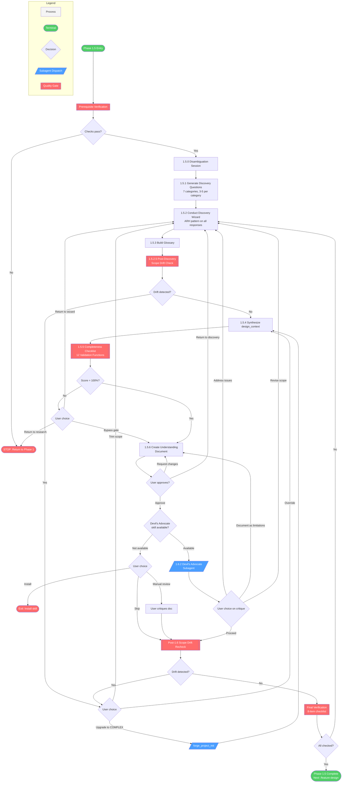
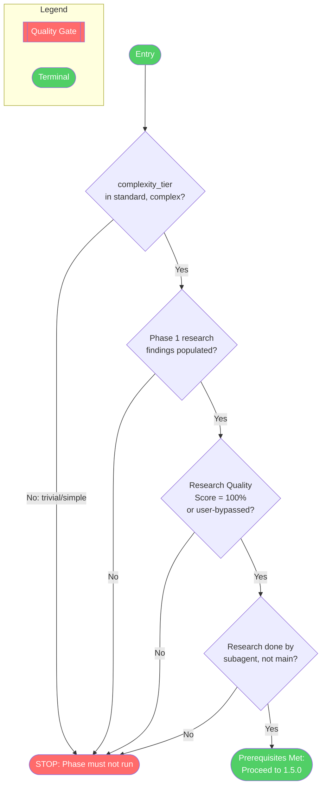
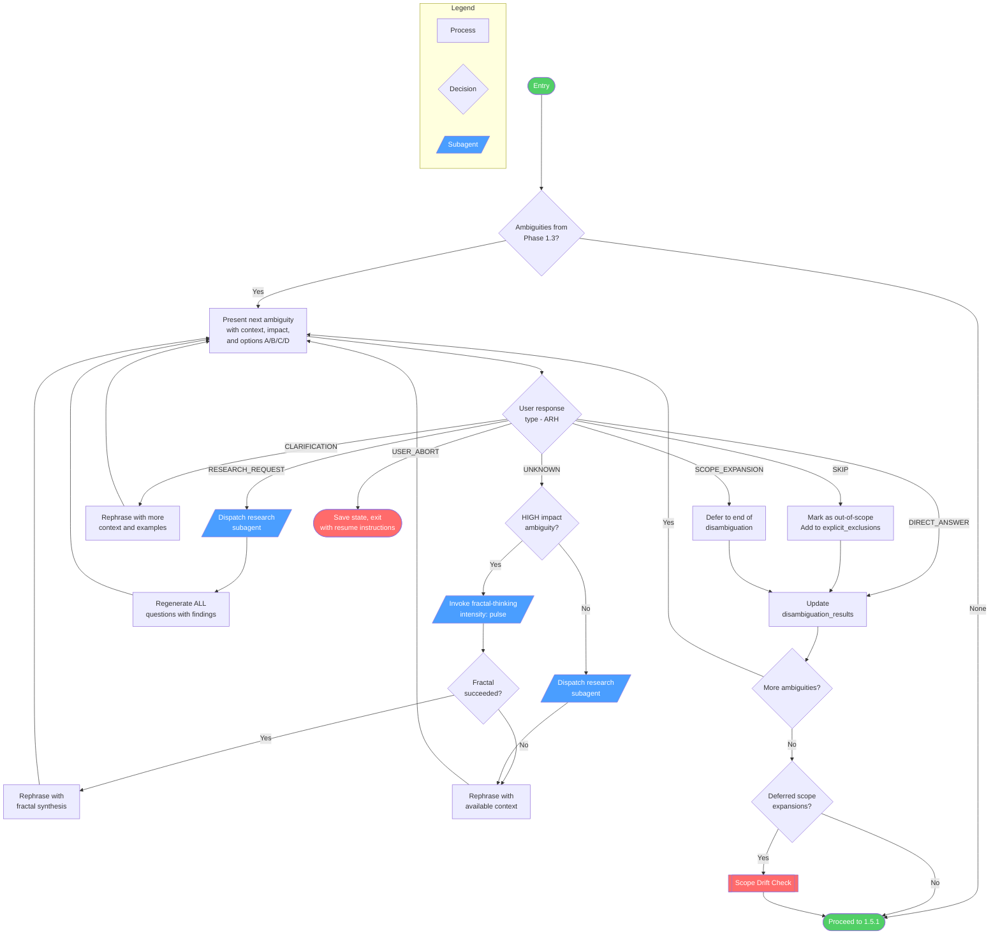
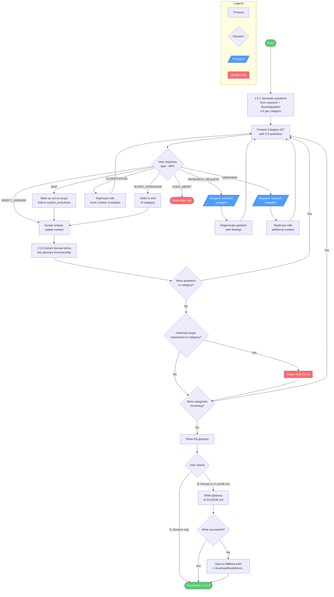
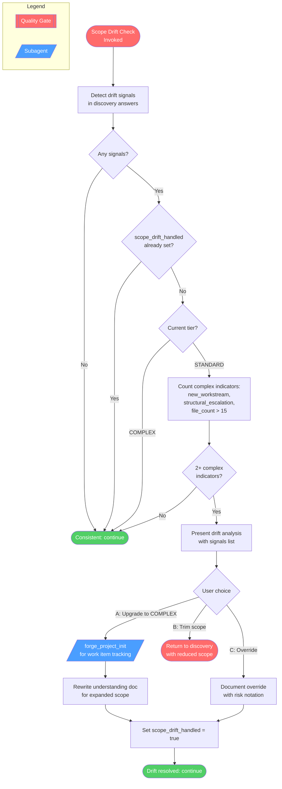
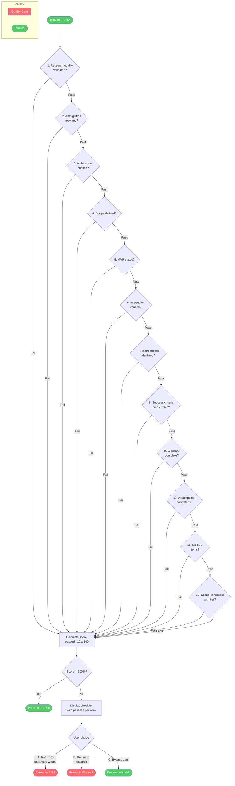
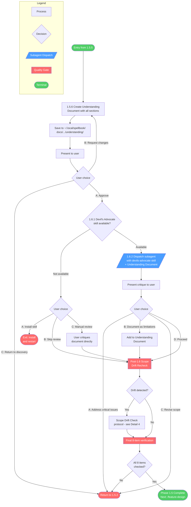

<!-- diagram-meta: {"source": "commands/feature-discover.md","source_hash": "sha256:b169a8834e2cad04d50cf58b7b0bde8499e31a901af58d1214d9e986469dac44","generator": "stamp"} -->
# Feature Discovery (Phase 1.5) - Diagrams

## Overview

Feature Discovery is Phase 1.5 of the `develop` skill. It resolves ambiguities, conducts a 7-category discovery wizard with ARH pattern, builds a glossary, validates completeness via 12 checks, creates an Understanding Document, and gates on a Devil's Advocate review before handing off to design.

## Cross-Reference Table

| Overview Node | Detail Diagram |
|---|---|
| Prerequisites | [Detail 1: Prerequisite Verification](#detail-1-prerequisite-verification) |
| Disambiguation | [Detail 2: Disambiguation Session](#detail-2-disambiguation-session-150) |
| Discovery Wizard | [Detail 3: Discovery Wizard](#detail-3-discovery-wizard-151152) |
| Scope Drift Check | [Detail 4: Scope Drift Check](#detail-4-scope-drift-check) |
| Completeness Gate | [Detail 5: Completeness Gate](#detail-5-completeness-gate-155) |
| Understanding Doc | [Detail 6: Understanding Document & Devil's Advocate](#detail-6-understanding-document--devils-advocate-156-16) |

---

## Overview Diagram

```mermaid
flowchart TD
    subgraph Legend
        L1[Process]
        L2([Terminal])
        L3{Decision}
        L4[/"Subagent Dispatch"/]
        L5[[Quality Gate]]
    end

    style L4 fill:#4a9eff,color:#fff
    style L5 fill:#ff6b6b,color:#fff
    style L1 fill:#f5f5f5
    style L2 fill:#51cf66,color:#fff

    START([Phase 1.5 Entry]) --> PREREQ[[Prerequisite Verification]]
    PREREQ --> PREREQ_OK{Checks pass?}
    PREREQ_OK -- No --> STOP_P1([STOP: Return to Phase 1])
    PREREQ_OK -- Yes --> DISAMBIG[1.5.0 Disambiguation Session]
    DISAMBIG --> GEN_Q[1.5.1 Generate Discovery Questions<br>7 categories, 3-5 per category]
    GEN_Q --> WIZARD[1.5.2 Conduct Discovery Wizard<br>ARH pattern on all responses]
    WIZARD --> GLOSSARY[1.5.3 Build Glossary]
    GLOSSARY --> DRIFT1[[1.5.2.5 Post-Discovery<br>Scope Drift Check]]
    DRIFT1 --> DRIFT1_OK{Drift detected?}
    DRIFT1_OK -- No --> SYNTH[1.5.4 Synthesize design_context]
    DRIFT1_OK -- Yes --> DRIFT_HANDLE{User choice}
    DRIFT_HANDLE -- Upgrade to COMPLEX --> FORGE[/"forge_project_init"/]
    FORGE --> SYNTH
    DRIFT_HANDLE -- Trim scope --> WIZARD
    DRIFT_HANDLE -- Override --> SYNTH
    SYNTH --> COMPLETE[[1.5.5 Completeness Checklist<br>12 Validation Functions]]
    COMPLETE --> GATE{Score = 100%?}
    GATE -- No --> GATE_OPT{User choice}
    GATE_OPT -- Return to wizard --> WIZARD
    GATE_OPT -- Return to research --> STOP_P1
    GATE_OPT -- Bypass gate --> UNDOC
    GATE -- Yes --> UNDOC[1.5.6 Create Understanding<br>Document]
    UNDOC --> UNDOC_REVIEW{User approves?}
    UNDOC_REVIEW -- Request changes --> UNDOC
    UNDOC_REVIEW -- Return to discovery --> WIZARD
    UNDOC_REVIEW -- Approve --> DA_CHECK{Devil's Advocate<br>skill available?}
    DA_CHECK -- Not available --> DA_FALLBACK{User choice}
    DA_FALLBACK -- Install --> STOP_INSTALL([Exit: Install skill])
    DA_FALLBACK -- Skip --> DRIFT3
    DA_FALLBACK -- Manual review --> DA_MANUAL[User critiques doc]
    DA_MANUAL --> DRIFT3
    DA_CHECK -- Available --> DA[/"1.6.2 Devil's Advocate<br>Subagent"/]
    DA --> DA_RESULT{User choice on critique}
    DA_RESULT -- Address issues --> WIZARD
    DA_RESULT -- Document as limitations --> UNDOC
    DA_RESULT -- Revise scope --> WIZARD
    DA_RESULT -- Proceed --> DRIFT3
    DRIFT3[[Post-1.6 Scope Drift Recheck]]
    DRIFT3 --> DRIFT3_OK{Drift detected?}
    DRIFT3_OK -- Yes --> DRIFT_HANDLE
    DRIFT3_OK -- No --> FINAL_CHECK[[Final Verification<br>8-item checklist]]
    FINAL_CHECK --> FINAL_OK{All checked?}
    FINAL_OK -- No --> WIZARD
    FINAL_OK -- Yes --> DONE([Phase 1.5 Complete<br>Next: /feature-design])

    style START fill:#51cf66,color:#fff
    style STOP_P1 fill:#ff6b6b,color:#fff
    style STOP_INSTALL fill:#ff6b6b,color:#fff
    style DONE fill:#51cf66,color:#fff
    style PREREQ fill:#ff6b6b,color:#fff
    style COMPLETE fill:#ff6b6b,color:#fff
    style DRIFT1 fill:#ff6b6b,color:#fff
    style DRIFT3 fill:#ff6b6b,color:#fff
    style FINAL_CHECK fill:#ff6b6b,color:#fff
    style DA fill:#4a9eff,color:#fff
    style FORGE fill:#4a9eff,color:#fff
```

---

## Detail 1: Prerequisite Verification

```mermaid
flowchart TD
    subgraph Legend
        L1[[Quality Gate]]
        L2([Terminal])
    end
    style L1 fill:#ff6b6b,color:#fff
    style L2 fill:#51cf66,color:#fff

    ENTRY([Entry]) --> CHK_TIER{complexity_tier<br>in standard, complex?}
    CHK_TIER -- "No: trivial/simple" --> STOP([STOP: Phase must not run])
    CHK_TIER -- Yes --> CHK_RESEARCH{Phase 1 research<br>findings populated?}
    CHK_RESEARCH -- No --> STOP
    CHK_RESEARCH -- Yes --> CHK_SCORE{Research Quality<br>Score = 100%<br>or user-bypassed?}
    CHK_SCORE -- No --> STOP
    CHK_SCORE -- Yes --> CHK_SUB{Research done by<br>subagent, not main?}
    CHK_SUB -- No --> STOP
    CHK_SUB -- Yes --> PASS([Prerequisites Met:<br>Proceed to 1.5.0])

    style ENTRY fill:#51cf66,color:#fff
    style STOP fill:#ff6b6b,color:#fff
    style PASS fill:#51cf66,color:#fff
```

---

## Detail 2: Disambiguation Session (1.5.0)

```mermaid
flowchart TD
    subgraph Legend
        L1[Process]
        L2{Decision}
        L3[/"Subagent"/]
    end
    style L3 fill:#4a9eff,color:#fff

    ENTRY([Entry]) --> HAS_AMB{Ambiguities from<br>Phase 1.3?}
    HAS_AMB -- None --> DONE([Proceed to 1.5.1])
    HAS_AMB -- Yes --> NEXT[Present next ambiguity<br>with context, impact,<br>and options A/B/C/D]
    NEXT --> RESP{User response<br>type - ARH}
    RESP -- DIRECT_ANSWER --> UPDATE[Update<br>disambiguation_results]
    RESP -- RESEARCH_REQUEST --> RESEARCH[/"Dispatch research<br>subagent"/]
    RESEARCH --> REGEN[Regenerate ALL<br>questions with findings]
    REGEN --> NEXT
    RESP -- UNKNOWN --> HIGH_IMPACT{HIGH impact<br>ambiguity?}
    HIGH_IMPACT -- Yes --> FRACTAL[/"Invoke fractal-thinking<br>intensity: pulse"/]
    FRACTAL --> FRACTAL_OK{Fractal<br>succeeded?}
    FRACTAL_OK -- Yes --> REPHRASE_F[Rephrase with<br>fractal synthesis]
    FRACTAL_OK -- No --> REPHRASE[Rephrase with<br>available context]
    HIGH_IMPACT -- No --> RESEARCH2[/"Dispatch research<br>subagent"/]
    RESEARCH2 --> REPHRASE
    REPHRASE_F --> NEXT
    REPHRASE --> NEXT
    RESP -- CLARIFICATION --> CLARIFY[Rephrase with more<br>context and examples]
    CLARIFY --> NEXT
    RESP -- SKIP --> EXCLUDE[Mark as out-of-scope<br>Add to explicit_exclusions]
    RESP -- USER_ABORT --> SAVE([Save state, exit<br>with resume instructions])
    RESP -- SCOPE_EXPANSION --> DEFER[Defer to end of<br>disambiguation]
    EXCLUDE --> UPDATE
    DEFER --> UPDATE
    UPDATE --> MORE{More ambiguities?}
    MORE -- Yes --> NEXT
    MORE -- No --> DEFERRED{Deferred scope<br>expansions?}
    DEFERRED -- Yes --> DRIFT[[Scope Drift Check]]
    DEFERRED -- No --> DONE
    DRIFT --> DONE

    style ENTRY fill:#51cf66,color:#fff
    style DONE fill:#51cf66,color:#fff
    style SAVE fill:#ff6b6b,color:#fff
    style RESEARCH fill:#4a9eff,color:#fff
    style RESEARCH2 fill:#4a9eff,color:#fff
    style FRACTAL fill:#4a9eff,color:#fff
    style DRIFT fill:#ff6b6b,color:#fff
```

---

## Detail 3: Discovery Wizard (1.5.1/1.5.2)

```mermaid
flowchart TD
    subgraph Legend
        L1[Process]
        L2{Decision}
        L3[/"Subagent"/]
        L4[[Quality Gate]]
    end
    style L3 fill:#4a9eff,color:#fff
    style L4 fill:#ff6b6b,color:#fff

    ENTRY([Entry]) --> GEN[1.5.1 Generate questions<br>from research + disambiguation<br>3-5 per category]
    GEN --> CAT[Present Category N/7<br>with 3-5 questions]

    CAT --> RESP{User response<br>type - ARH}

    RESP -- DIRECT_ANSWER --> ACCEPT[Accept answer,<br>update context]
    RESP -- RESEARCH_REQUEST --> RSUB[/"Dispatch research<br>subagent"/]
    RSUB --> REGEN[Regenerate question<br>with findings]
    REGEN --> CAT
    RESP -- UNKNOWN --> USUB[/"Dispatch research<br>subagent"/]
    USUB --> REPHRASE[Rephrase with<br>additional context]
    REPHRASE --> CAT
    RESP -- CLARIFICATION --> CLAR[Rephrase with<br>more context, examples]
    CLAR --> CAT
    RESP -- SKIP --> EXCL[Mark as out-of-scope<br>Add to explicit_exclusions]
    EXCL --> ACCEPT
    RESP -- USER_ABORT --> SAVE([Save state, exit])
    RESP -- SCOPE_EXPANSION --> DEFER_Q[Defer to end<br>of category]
    DEFER_Q --> ACCEPT

    ACCEPT --> GLOSS[1.5.3 Extract domain terms<br>into glossary incrementally]
    GLOSS --> MORE_Q{More questions<br>in category?}
    MORE_Q -- Yes --> CAT
    MORE_Q -- No --> DEFERRED_CAT{Deferred scope<br>expansions in category?}
    DEFERRED_CAT -- Yes --> DRIFT_CAT[[Scope Drift Check]]
    DEFERRED_CAT -- No --> MORE_CAT
    DRIFT_CAT --> MORE_CAT{More categories<br>remaining?}
    MORE_CAT -- Yes --> CAT
    MORE_CAT -- No --> SHOW_GLOSS[Show full glossary]

    SHOW_GLOSS --> GLOSS_PERSIST{User choice}
    GLOSS_PERSIST -- "A: Session only" --> DONE([Proceed to 1.5.2.5])
    GLOSS_PERSIST -- "B: Persist to CLAUDE.md" --> WRITE_GLOSS[Write glossary<br>to CLAUDE.md]
    WRITE_GLOSS --> WRITE_OK{Write succeeded?}
    WRITE_OK -- Yes --> DONE
    WRITE_OK -- No --> FALLBACK[Save to fallback path<br>~/.local/spellbook/docs/...]
    FALLBACK --> DONE

    style ENTRY fill:#51cf66,color:#fff
    style DONE fill:#51cf66,color:#fff
    style SAVE fill:#ff6b6b,color:#fff
    style RSUB fill:#4a9eff,color:#fff
    style USUB fill:#4a9eff,color:#fff
    style DRIFT_CAT fill:#ff6b6b,color:#fff
```

**7 Discovery Categories:**

| # | Category | Focus |
|---|---|---|
| 1 | Architecture & Approach | Integration patterns, approach selection, constraints |
| 2 | Scope & Boundaries | Similar features, exclusions, MVP definition |
| 3 | Integration & Constraints | Integration points, interfaces, dependencies |
| 4 | Failure Modes & Edge Cases | Edge cases, dependency failures, boundary conditions |
| 5 | Success Criteria & Observability | Thresholds, production verification, metrics |
| 6 | Vocabulary & Definitions | Term definitions, synonyms, glossary building |
| 7 | Assumption Audit | Research-based assumption validation |

---

## Detail 4: Scope Drift Check

This reusable mechanic is invoked at three points: inline during ARH (SCOPE_EXPANSION response), post-discovery (1.5.2.5), and post-devil's advocate (Post-1.6).

```mermaid
flowchart TD
    subgraph Legend
        L1[[Quality Gate]]
        L2[/"Subagent"/]
    end
    style L1 fill:#ff6b6b,color:#fff
    style L2 fill:#4a9eff,color:#fff

    ENTRY([Scope Drift Check<br>Invoked]) --> SIGNALS[Detect drift signals<br>in discovery answers]
    SIGNALS --> HAS_SIG{Any signals?}
    HAS_SIG -- No --> CONSISTENT([Consistent: continue])
    HAS_SIG -- Yes --> HANDLED{scope_drift_handled<br>already set?}
    HANDLED -- Yes --> CONSISTENT
    HANDLED -- No --> TIER{Current tier?}
    TIER -- COMPLEX --> CONSISTENT
    TIER -- STANDARD --> COUNT[Count complex indicators:<br>new_workstream,<br>structural_escalation,<br>file_count > 15]
    COUNT --> THRESH{2+ complex<br>indicators?}
    THRESH -- No --> CONSISTENT
    THRESH -- Yes --> PRESENT[Present drift analysis<br>with signals list]
    PRESENT --> CHOICE{User choice}
    CHOICE -- "A: Upgrade to COMPLEX" --> INIT[/"forge_project_init<br>for work item tracking"/]
    INIT --> REWRITE[Rewrite understanding doc<br>for expanded scope]
    REWRITE --> SET_HANDLED[Set scope_drift_handled = true]
    CHOICE -- "B: Trim scope" --> TRIM([Return to discovery<br>with reduced scope])
    CHOICE -- "C: Override" --> DOC_RISK[Document override<br>with risk notation]
    DOC_RISK --> SET_HANDLED
    SET_HANDLED --> RESOLVED([Drift resolved: continue])

    style ENTRY fill:#ff6b6b,color:#fff
    style CONSISTENT fill:#51cf66,color:#fff
    style RESOLVED fill:#51cf66,color:#fff
    style TRIM fill:#ff6b6b,color:#fff
    style INIT fill:#4a9eff,color:#fff
```

**Drift Signals:**

| Signal | Detection |
|---|---|
| Scope expansion answer | User adds new functionality not in original request |
| New workstream implied | Answer implies parallel track of work |
| Structural change escalation | Answers reveal new modules/schemas needed |
| File count escalation | Integration points exceed STANDARD threshold (>15 files) |

---

## Detail 5: Completeness Gate (1.5.5)

```mermaid
flowchart TD
    subgraph Legend
        L1[[Quality Gate]]
        L2([Terminal])
    end
    style L1 fill:#ff6b6b,color:#fff
    style L2 fill:#51cf66,color:#fff

    ENTRY([Entry from 1.5.4]) --> V1{1. Research quality<br>validated?}
    V1 -- Fail --> TALLY
    V1 -- Pass --> V2{2. Ambiguities<br>resolved?}
    V2 -- Fail --> TALLY
    V2 -- Pass --> V3{3. Architecture<br>chosen?}
    V3 -- Fail --> TALLY
    V3 -- Pass --> V4{4. Scope defined?}
    V4 -- Fail --> TALLY
    V4 -- Pass --> V5{5. MVP stated?}
    V5 -- Fail --> TALLY
    V5 -- Pass --> V6{6. Integration<br>verified?}
    V6 -- Fail --> TALLY
    V6 -- Pass --> V7{7. Failure modes<br>identified?}
    V7 -- Fail --> TALLY
    V7 -- Pass --> V8{8. Success criteria<br>measurable?}
    V8 -- Fail --> TALLY
    V8 -- Pass --> V9{9. Glossary<br>complete?}
    V9 -- Fail --> TALLY
    V9 -- Pass --> V10{10. Assumptions<br>validated?}
    V10 -- Fail --> TALLY
    V10 -- Pass --> V11{11. No TBD<br>items?}
    V11 -- Fail --> TALLY
    V11 -- Pass --> V12{12. Scope consistent<br>with tier?}
    V12 -- Fail --> TALLY
    V12 -- Pass --> TALLY

    TALLY[Calculate score:<br>passed / 12 x 100]
    TALLY --> SCORE{Score = 100%?}
    SCORE -- Yes --> PASS([Proceed to 1.5.6])
    SCORE -- No --> DISPLAY[Display checklist<br>with pass/fail per item]
    DISPLAY --> GATE{User choice}
    GATE -- "A: Return to<br>discovery wizard" --> WIZARD([Return to 1.5.2])
    GATE -- "B: Return to<br>research" --> RESEARCH([Return to Phase 1])
    GATE -- "C: Bypass gate" --> BYPASS([Proceed with risk])

    style ENTRY fill:#51cf66,color:#fff
    style PASS fill:#51cf66,color:#fff
    style WIZARD fill:#ff6b6b,color:#fff
    style RESEARCH fill:#ff6b6b,color:#fff
    style BYPASS fill:#51cf66,color:#fff
```

**12 Validation Functions:**

| # | Function | Checks |
|---|---|---|
| 1 | `research_quality_validated` | Score = 100% or override |
| 2 | `ambiguities_resolved` | All categorized ambiguities in results |
| 3 | `architecture_chosen` | Approach + rationale non-null |
| 4 | `scope_defined` | in_scope + out_of_scope non-empty |
| 5 | `mvp_stated` | MVP definition > 10 chars |
| 6 | `integration_verified` | All integration points validated |
| 7 | `failure_modes_identified` | Edge cases or failure scenarios present |
| 8 | `success_criteria_measurable` | Metrics with thresholds defined |
| 9 | `glossary_complete` | All unique terms covered or user declined |
| 10 | `assumptions_validated` | All assumptions have confidence rating |
| 11 | `no_tbd_items` | No TBD/unknown in design_context JSON |
| 12 | `scope_consistent_with_tier` | No unhandled drift signals |

---

## Detail 6: Understanding Document & Devil's Advocate (1.5.6, 1.6)

```mermaid
flowchart TD
    subgraph Legend
        L1[Process]
        L2{Decision}
        L3[/"Subagent Dispatch"/]
        L4[[Quality Gate]]
        L5([Terminal])
    end
    style L3 fill:#4a9eff,color:#fff
    style L4 fill:#ff6b6b,color:#fff
    style L5 fill:#51cf66,color:#fff

    ENTRY([Entry from 1.5.5]) --> CREATE[1.5.6 Create Understanding<br>Document with all sections]
    CREATE --> SAVE_FILE[Save to ~/.local/spellbook/<br>docs/.../understanding/]
    SAVE_FILE --> PRESENT[Present to user]
    PRESENT --> UD_CHOICE{User choice}
    UD_CHOICE -- "B: Request changes" --> CREATE
    UD_CHOICE -- "C: Return to discovery" --> BACK_DISC([Return to 1.5.2])
    UD_CHOICE -- "A: Approve" --> DA_CHECK{1.6.1 Devil's Advocate<br>skill available?}

    DA_CHECK -- Not available --> DA_FALLBACK{User choice}
    DA_FALLBACK -- "A: Install skill" --> EXIT_INSTALL([Exit: install<br>and restart])
    DA_FALLBACK -- "B: Skip review" --> POST_16
    DA_FALLBACK -- "C: Manual review" --> MANUAL[User critiques<br>document directly]
    MANUAL --> POST_16

    DA_CHECK -- Available --> DA_DISPATCH[/"1.6.2 Dispatch subagent<br>with devils-advocate skill<br>+ Understanding Document"/]
    DA_DISPATCH --> DA_PRESENT[Present critique to user]
    DA_PRESENT --> DA_CHOICE{User choice}
    DA_CHOICE -- "A: Address critical issues" --> BACK_DISC
    DA_CHOICE -- "B: Document as limitations" --> ADD_LIMITS[Add to Understanding<br>Document]
    ADD_LIMITS --> POST_16
    DA_CHOICE -- "C: Revise scope" --> BACK_DISC
    DA_CHOICE -- "D: Proceed" --> POST_16

    POST_16[[Post-1.6 Scope<br>Drift Recheck]]
    POST_16 --> DRIFT_OK{Drift detected?}
    DRIFT_OK -- Yes --> DRIFT_HANDLE[Scope Drift Check<br>protocol - see Detail 4]
    DRIFT_HANDLE --> FINAL
    DRIFT_OK -- No --> FINAL

    FINAL[[Final 8-item verification]]
    FINAL --> FINAL_OK{All 8 items<br>checked?}
    FINAL_OK -- No --> BACK_DISC
    FINAL_OK -- Yes --> COMPLETE([Phase 1.5 Complete<br>Next: /feature-design])

    style ENTRY fill:#51cf66,color:#fff
    style COMPLETE fill:#51cf66,color:#fff
    style EXIT_INSTALL fill:#ff6b6b,color:#fff
    style BACK_DISC fill:#ff6b6b,color:#fff
    style DA_DISPATCH fill:#4a9eff,color:#fff
    style POST_16 fill:#ff6b6b,color:#fff
    style FINAL fill:#ff6b6b,color:#fff
```

**Final 8-Item Verification Checklist:**

| # | Item |
|---|---|
| 1 | All ambiguities resolved (disambiguation session complete) |
| 2 | 7-category discovery questions generated and answered |
| 3 | Glossary built |
| 4 | design_context synthesized (no null values, no TBD) |
| 5 | Completeness Score = 100% (12/12 validation functions) |
| 6 | Understanding Document created and saved |
| 7 | Devil's advocate subagent DISPATCHED (not done in main context) |
| 8 | User approved Understanding Document |
