<!-- diagram-meta: {"source": "commands/feature-implement.md", "source_hash": "sha256:3cc8f081d12220f6a8e2d200590d4be4ea6b1d220eaa700e33ffde6fe9101ac8", "generated_at": "2026-02-19T00:00:00Z", "generator": "generate_diagrams.py"} -->
# Diagram: feature-implement

Phases 3-4 of implementing-features: Create and review implementation plan, analyze execution mode, then execute via TDD with per-task quality gates, comprehensive audit, and finishing workflow.

```mermaid
flowchart TD
    Start([Phase 3 Start])
    PrereqCheck{Prerequisites met?}
    PrereqFail([STOP: Return to Phase 2])

    TierCheck{Complexity tier?}
    SimpleEntry[Skip to Phase 4]

    EscapeP3{Escape hatch?}
    SkipP3([Skip to Phase 4])

    CreatePlan[Dispatch writing-plans]
    ReviewPlan[Dispatch reviewing-impl-plans]
    ApprovalP3{Approval gate}
    FixPlan[Dispatch fix subagent]

    AnalyzeMode[Analyze execution mode]
    ModeResult{Execution mode?}

    GenPackets[Generate work packets]
    SessionHandoff([Session handoff: EXIT])

    SetupWorktree{Worktree strategy?}
    SingleWT[Create single worktree]
    PerTrackWT[Setup skeleton, per-track WTs]
    NoWT[Work in current dir]

    ExecPlan{Parallelization?}
    ParallelExec[Dispatch parallel agents]
    SequentialExec[Dispatch sequential agent]

    TaskLoop[Execute task N via TDD]
    VerifyTask[Verify task completeness]
    TaskComplete{Task complete?}
    FixTask[Fix incomplete items]

    CodeReview[Dispatch code review]
    FactCheck[Dispatch fact-checking]
    NextTask{More tasks?}

    SmartMerge[Dispatch merging-worktrees]

    CompAudit[Comprehensive impl audit]
    AuditPass{Audit clean?}
    FixAudit[Fix blocking issues]

    RunTests[Run full test suite]
    TestPass{Tests pass?}
    DebugTests[Dispatch debugging]

    GreenMirage[Dispatch green mirage audit]
    MiragePass{Audit clean?}
    FixMirage[Fix test quality]

    FinalFactCheck[Comprehensive claim validation]
    PrePRCheck[Pre-PR claim validation]

    FinishGate{Post-impl preference?}
    OfferOptions[Dispatch finishing-branch]
    AutoPR[Create PR automatically]
    JustStop([Stop: manual PR])

    Done([Implementation Complete])

    Start --> PrereqCheck
    PrereqCheck -->|No| PrereqFail
    PrereqCheck -->|Yes| TierCheck

    TierCheck -->|SIMPLE| SimpleEntry
    SimpleEntry --> TaskLoop
    TierCheck -->|STANDARD/COMPLEX| EscapeP3

    EscapeP3 -->|"Treat as ready"| SkipP3
    SkipP3 --> AnalyzeMode
    EscapeP3 -->|"Review first"| ReviewPlan
    EscapeP3 -->|None| CreatePlan

    CreatePlan --> ReviewPlan
    ReviewPlan --> ApprovalP3
    ApprovalP3 --> FixPlan
    FixPlan --> AnalyzeMode

    AnalyzeMode --> ModeResult
    ModeResult -->|Swarmed| GenPackets
    GenPackets --> SessionHandoff
    ModeResult -->|Delegated/Direct| SetupWorktree

    SetupWorktree -->|Single| SingleWT
    SetupWorktree -->|Per-track| PerTrackWT
    SetupWorktree -->|None| NoWT
    SingleWT --> ExecPlan
    PerTrackWT --> ExecPlan
    NoWT --> ExecPlan

    ExecPlan -->|Maximize| ParallelExec
    ExecPlan -->|Conservative| SequentialExec
    ParallelExec --> TaskLoop
    SequentialExec --> TaskLoop

    TaskLoop --> VerifyTask
    VerifyTask --> TaskComplete
    TaskComplete -->|No| FixTask
    FixTask --> VerifyTask
    TaskComplete -->|Yes| CodeReview

    CodeReview --> FactCheck
    FactCheck --> NextTask
    NextTask -->|Yes| TaskLoop
    NextTask -->|No, per-track| SmartMerge
    NextTask -->|No| CompAudit
    SmartMerge --> CompAudit

    CompAudit --> AuditPass
    AuditPass -->|No| FixAudit
    FixAudit --> CompAudit
    AuditPass -->|Yes| RunTests

    RunTests --> TestPass
    TestPass -->|No| DebugTests
    DebugTests --> RunTests
    TestPass -->|Yes| GreenMirage

    GreenMirage --> MiragePass
    MiragePass -->|No| FixMirage
    FixMirage --> GreenMirage
    MiragePass -->|Yes| FinalFactCheck

    FinalFactCheck --> PrePRCheck
    PrePRCheck --> FinishGate

    FinishGate -->|Offer options| OfferOptions
    FinishGate -->|Auto PR| AutoPR
    FinishGate -->|Stop| JustStop
    OfferOptions --> Done
    AutoPR --> Done

    style Start fill:#2196F3,color:#fff
    style Done fill:#2196F3,color:#fff
    style PrereqFail fill:#2196F3,color:#fff
    style SessionHandoff fill:#2196F3,color:#fff
    style JustStop fill:#2196F3,color:#fff
    style SkipP3 fill:#2196F3,color:#fff
    style CreatePlan fill:#4CAF50,color:#fff
    style ReviewPlan fill:#4CAF50,color:#fff
    style TaskLoop fill:#4CAF50,color:#fff
    style CodeReview fill:#4CAF50,color:#fff
    style FactCheck fill:#4CAF50,color:#fff
    style GreenMirage fill:#4CAF50,color:#fff
    style SmartMerge fill:#4CAF50,color:#fff
    style DebugTests fill:#4CAF50,color:#fff
    style OfferOptions fill:#4CAF50,color:#fff
    style FinalFactCheck fill:#4CAF50,color:#fff
    style PrePRCheck fill:#4CAF50,color:#fff
    style PrereqCheck fill:#FF9800,color:#fff
    style TierCheck fill:#FF9800,color:#fff
    style EscapeP3 fill:#FF9800,color:#fff
    style ModeResult fill:#FF9800,color:#fff
    style SetupWorktree fill:#FF9800,color:#fff
    style ExecPlan fill:#FF9800,color:#fff
    style TaskComplete fill:#FF9800,color:#fff
    style NextTask fill:#FF9800,color:#fff
    style FinishGate fill:#FF9800,color:#fff
    style ApprovalP3 fill:#f44336,color:#fff
    style VerifyTask fill:#f44336,color:#fff
    style AuditPass fill:#f44336,color:#fff
    style TestPass fill:#f44336,color:#fff
    style MiragePass fill:#f44336,color:#fff
    style CompAudit fill:#f44336,color:#fff
```

## Legend

| Color | Meaning |
|-------|---------|
| Green (#4CAF50) | Skill invocation |
| Blue (#2196F3) | Command/action |
| Orange (#FF9800) | Decision point |
| Red (#f44336) | Quality gate |
