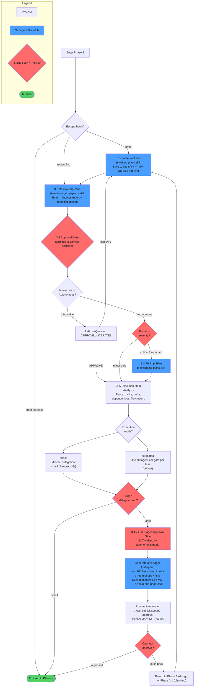
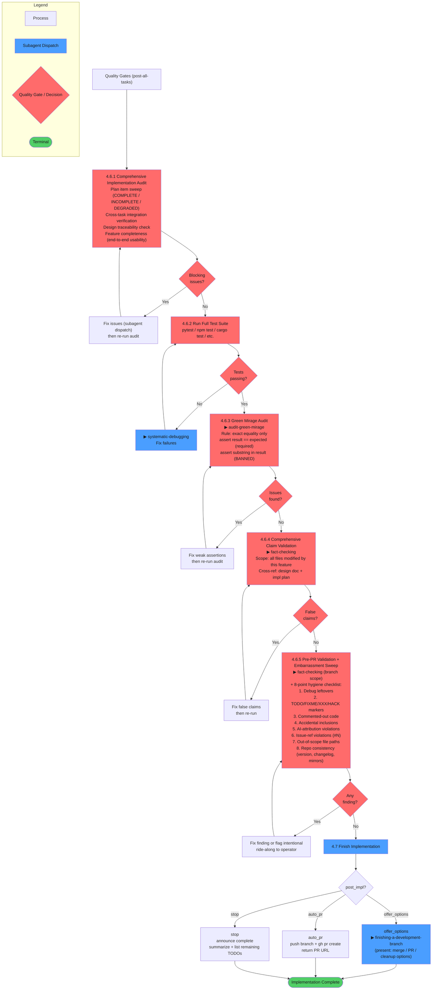

<!-- diagram-meta: {"source": "commands/feature-implement.md", "source_hash": "sha256:467d06c2e8aafda693a3928a03dd45521a5fd0db5266987d013423a4c33ab814", "generated_at": "2026-06-06T22:59:42Z", "generator": "generate_diagrams.py"} -->
# Diagram: feature-implement

## Overview: `/feature-implement` (Phases 3–4)

Phases 3–4 of the develop workflow. Entry routing depends on `needs_design` flag and escape hatches detected in the user's initial message.

```mermaid
flowchart TD
    START(["/feature-implement\nPhases 3-4 of develop"])
    PREREQ["Prerequisite Verification\n(bash check script)"]
    ND{"needs_design?"}
    CHK["Verify: design doc exists\n+ design review done"]
    CHK_OK{"All checks pass?"}
    HALT(["STOP: return to\nappropriate phase"])
    EH{"Escape hatch\nin initial message?"}
    P3_31["3.1 Create Impl Plan\n▶ writing-plans"]
    P3_32["3.2 Review Impl Plan\n▶ reviewing-impl-plans"]
    GATE33{"3.3 Approval Gate"}
    P3_34["3.4 Fix Impl Plan\n▶ executing-plans"]
    P3_345["3.4.5 Execution\nMode Analysis"]
    P3_347["3.4.7 One-Pager\nApproval Gate"]
    P3_P4_GATE{"Phase 3→4\nTransition Gate"}
    P4_SETUP["4.1 Setup Worktree(s)\n▶ using-git-worktrees"]
    P4_EXEC["4.2 Execute Plan\n(parallelization routing)"]
    PERTASK["Per-Task Cycle\n4.3 Implement → 4.4 Verify\n→ 4.5 Review → 4.5.1 Fact-check"]
    MERGE_CHK{"per_parallel\n_track?"}
    SMART_MERGE["4.2.5 Smart Merge\n▶ merging-worktrees"]
    QGATES["Quality Gates 4.6\n4.6.1 Audit → 4.6.2 Tests\n→ 4.6.3 Mirage → 4.6.4 Claims\n→ 4.6.5 Pre-PR Sweep"]
    FINISH["4.7 Finish Implementation\n▶ finishing-a-development-branch"]
    DONE(["Implementation Complete"])

    START --> PREREQ
    PREREQ --> ND
    ND -->|"false (zero-flag fast path)"| P4_SETUP
    ND -->|"true"| CHK
    CHK --> CHK_OK
    CHK_OK -->|"No"| HALT
    CHK_OK -->|"Yes"| EH
    EH -->|"none"| P3_31
    EH -->|"review first"| P3_32
    EH -->|"treat as ready"| P3_P4_GATE

    P3_31 --> P3_32
    P3_32 --> GATE33
    GATE33 -->|"interactive ITERATE"| P3_31
    GATE33 -->|"interactive APPROVE"| P3_345
    GATE33 -->|"autonomous: critical / important"| P3_34
    GATE33 -->|"autonomous: minor only"| P3_345
    P3_34 --> P3_345
    P3_345 -->|"direct or small delegated"| P3_P4_GATE
    P3_345 -->|"large delegated"| P3_347
    P3_347 -->|"push back"| P3_31
    P3_347 -->|"approved"| P3_P4_GATE
    P3_P4_GATE -->|"unchecked items"| P3_31
    P3_P4_GATE -->|"all clear"| P4_SETUP

    P4_SETUP --> P4_EXEC
    P4_EXEC --> PERTASK
    PERTASK -->|"more tasks"| PERTASK
    PERTASK -->|"all tasks done"| MERGE_CHK
    MERGE_CHK -->|"Yes"| SMART_MERGE
    MERGE_CHK -->|"No"| QGATES
    SMART_MERGE --> QGATES
    QGATES --> FINISH
    FINISH --> DONE

    subgraph LEGEND["Legend"]
        direction LR
        L1["Process"]
        L2["Subagent Dispatch"]
        L3{"Quality Gate / Decision"}
        L4(["Terminal"])
    end

    style DONE fill:#51cf66,color:#1a1a1d
    style HALT fill:#ff6b6b,color:#1a1a1d
    style GATE33 fill:#ff6b6b,color:#1a1a1d
    style P3_P4_GATE fill:#ff6b6b,color:#1a1a1d
    style P3_347 fill:#ff6b6b,color:#1a1a1d
    style CHK_OK fill:#ff6b6b,color:#1a1a1d
    style QGATES fill:#ff6b6b,color:#1a1a1d
    style P3_31 fill:#4a9eff,color:#1a1a1d
    style P3_32 fill:#4a9eff,color:#1a1a1d
    style P3_34 fill:#4a9eff,color:#1a1a1d
    style P4_SETUP fill:#4a9eff,color:#1a1a1d
    style P4_EXEC fill:#4a9eff,color:#1a1a1d
    style PERTASK fill:#4a9eff,color:#1a1a1d
    style SMART_MERGE fill:#4a9eff,color:#1a1a1d
    style FINISH fill:#4a9eff,color:#1a1a1d
    style L2 fill:#4a9eff,color:#1a1a1d
    style L3 fill:#ff6b6b,color:#1a1a1d
    style L4 fill:#51cf66,color:#1a1a1d
```

---

## Phase 3 Detail: Implementation Planning

Covers sections 3.1–3.4.7. Behavior is gated by escape hatch and autonomous/interactive mode.

```mermaid
flowchart TD
    P3_ENTRY["Enter Phase 3"]
    EH{"Escape hatch?"}
    P3_31["3.1 Create Impl Plan\n▶ writing-plans skill\nSave to plans/YYYY-MM-DD-slug-impl.md"]
    P3_32["3.2 Review Impl Plan\n▶ reviewing-impl-plans skill\nReturn: findings report + remediation plan"]
    GATE33{"3.3 Approval Gate\n(terminal or canvas-decision)"}
    MODE33{"Interactive or\nAutonomous?"}
    ASK_USER["AskUserQuestion:\nAPPROVE or ITERATE?"]
    AUTO_SEV{"Findings\nseverity?"}
    P3_34["3.4 Fix Impl Plan\n▶ executing-plans skill"]
    P3_345["3.4.5 Execution Mode Analysis\nParse: tracks, tasks,\ndependencies, file clusters"]
    EXEC_MODE{"Execution\nmode?"}
    DIRECT["direct\nMinimal delegation\n(small changes only)"]
    DELEGATED["delegated\nOne subagent per gate per task\n(default)"]
    DEL_SIZE{"Large\ndelegated run?"}
    P3_347["3.4.7 One-Pager Approval Gate\nNOT waived by autonomous mode"]
    GEN_OP["Generate one-pager (subagent)\nmax 200 lines: what / tasks / not-in-scope / risks\nSave to plans/YYYY-MM-DD-slug-one-pager.md"]
    PRESENT_OP["Present to operator\nAwait explicit scoped approval\n(silence does NOT count)"]
    OP_OK{"Operator\napproval?"}
    BACK_PHASE["Return to Phase 2 (design)\nor Phase 3.1 (planning)"]
    P4_ENTRY(["Proceed to Phase 4"])

    P3_ENTRY --> EH
    EH -->|"none"| P3_31
    EH -->|"review first"| P3_32
    EH -->|"treat as ready"| P4_ENTRY

    P3_31 --> P3_32
    P3_32 --> GATE33
    GATE33 --> MODE33
    MODE33 -->|"interactive"| ASK_USER
    MODE33 -->|"autonomous"| AUTO_SEV
    ASK_USER -->|"ITERATE"| P3_31
    ASK_USER -->|"APPROVE"| P3_345
    AUTO_SEV -->|"critical / important"| P3_34
    AUTO_SEV -->|"minor only"| P3_345
    P3_34 --> P3_345
    P3_345 --> EXEC_MODE
    EXEC_MODE --> DIRECT
    EXEC_MODE --> DELEGATED
    DIRECT --> DEL_SIZE
    DELEGATED --> DEL_SIZE
    DEL_SIZE -->|"small"| P4_ENTRY
    DEL_SIZE -->|"large"| P3_347
    P3_347 --> GEN_OP
    GEN_OP --> PRESENT_OP
    PRESENT_OP --> OP_OK
    OP_OK -->|"approved"| P4_ENTRY
    OP_OK -->|"push back"| BACK_PHASE
    BACK_PHASE --> P3_31

    subgraph LEGEND["Legend"]
        direction LR
        L1["Process"]
        L2["Subagent Dispatch"]
        L3{"Quality Gate / Decision"}
        L4(["Terminal"])
    end

    style P4_ENTRY fill:#51cf66,color:#1a1a1d
    style GATE33 fill:#ff6b6b,color:#1a1a1d
    style P3_347 fill:#ff6b6b,color:#1a1a1d
    style OP_OK fill:#ff6b6b,color:#1a1a1d
    style AUTO_SEV fill:#ff6b6b,color:#1a1a1d
    style DEL_SIZE fill:#ff6b6b,color:#1a1a1d
    style P3_31 fill:#4a9eff,color:#1a1a1d
    style P3_32 fill:#4a9eff,color:#1a1a1d
    style P3_34 fill:#4a9eff,color:#1a1a1d
    style GEN_OP fill:#4a9eff,color:#1a1a1d
    style L2 fill:#4a9eff,color:#1a1a1d
    style L3 fill:#ff6b6b,color:#1a1a1d
    style L4 fill:#51cf66,color:#1a1a1d
```

---

## Phase 4 Detail: Per-Task Execution Cycle

Covers worktree setup (4.1), parallelization routing (4.2), and the per-task quality gate loop (4.3–4.5.1).

```mermaid
flowchart TD
    P4_ENTRY["Phase 4: Implementation\n(both direct and delegated modes)"]
    WT_MODE{"worktree\nmode?"}
    WT_SINGLE["single\nCreate one worktree\n▶ using-git-worktrees"]
    WT_PARALLEL["per_parallel_track\n1. Complete setup/skeleton tasks\n2. Commit setup work\n3. Create one worktree per parallel group\n▶ using-git-worktrees"]
    WT_NONE["none\nWork in current directory"]
    PAR_ROUTE{"parallelization\nstrategy?"}
    PAR_TRACK["per_parallel_track\nEach track dispatched to own worktree\nrun_in_background: true\n▶ executing-plans per worktree"]
    PAR_MAX["maximize (single worktree)\n▶ dispatching-parallel-agents\nGroup tasks by Parallel Group"]
    PAR_CON["conservative\n▶ executing-plans (sequential)"]
    TASK_LOOP["FOR EACH TASK"]
    T43["4.3 Implement Task N\n▶ test-driven-development\nVerify working dir + branch\nCommit when done"]
    DM{"dialectic_mode?"}
    ROUNDTABLE["4.3.1 Dialectic Overlay\n▶ forge_roundtable_convene\n3 archetypes (planning_and_gates)\nor all 10 (full)"]
    T44["4.4 Implementation Completion Verification\nAuditor checks: acceptance criteria,\nexpected outputs, interface contracts, behaviors"]
    T44_OK{"All items\nCOMPLETE?"}
    FIX44["Return to task implementation\nFix incomplete items"]
    T45["4.5 Code Review\n▶ requesting-code-review"]
    T45_SEV{"Issue\nseverity?"}
    FIX_CRIT["Fix critical immediately"]
    FIX_IMP["Fix important before next task"]
    NOTE_MIN["Note minor for later"]
    T451["4.5.1 Claim Validation\n▶ fact-checking\n(docstrings, comments, test names,\ntype hints, error messages)"]
    T451_OK{"False claims\nfound?"}
    FIX451["Fix false claims immediately"]
    NEXT_TASK{"More tasks\nin plan?"}
    PT_CHK{"per_parallel\n_track?"}
    SMART_MERGE["4.2.5 Smart Merge\n▶ merging-worktrees\nVerify: all tests pass,\ninterface contracts, cleanup worktrees"]
    QGATES_ENTRY(["Proceed to Quality Gates 4.6"])

    P4_ENTRY --> WT_MODE
    WT_MODE -->|"single"| WT_SINGLE
    WT_MODE -->|"per_parallel_track"| WT_PARALLEL
    WT_MODE -->|"none"| WT_NONE
    WT_SINGLE --> PAR_ROUTE
    WT_PARALLEL --> PAR_ROUTE
    WT_NONE --> PAR_ROUTE
    PAR_ROUTE -->|"per_parallel_track"| PAR_TRACK
    PAR_ROUTE -->|"maximize"| PAR_MAX
    PAR_ROUTE -->|"conservative"| PAR_CON
    PAR_TRACK --> TASK_LOOP
    PAR_MAX --> TASK_LOOP
    PAR_CON --> TASK_LOOP
    TASK_LOOP --> T43
    T43 --> DM
    DM -->|"roundtable or full"| ROUNDTABLE
    DM -->|"planning_only or none"| T44
    ROUNDTABLE --> T44
    T44 --> T44_OK
    T44_OK -->|"INCOMPLETE / PARTIAL"| FIX44
    FIX44 --> T44
    T44_OK -->|"all COMPLETE"| T45
    T45 --> T45_SEV
    T45_SEV -->|"critical"| FIX_CRIT
    T45_SEV -->|"important"| FIX_IMP
    T45_SEV -->|"minor"| NOTE_MIN
    T45_SEV -->|"none"| T451
    FIX_CRIT --> T451
    FIX_IMP --> T451
    NOTE_MIN --> T451
    T451 --> T451_OK
    T451_OK -->|"Yes"| FIX451
    FIX451 --> NEXT_TASK
    T451_OK -->|"No"| NEXT_TASK
    NEXT_TASK -->|"Yes"| TASK_LOOP
    NEXT_TASK -->|"No"| PT_CHK
    PT_CHK -->|"Yes"| SMART_MERGE
    PT_CHK -->|"No"| QGATES_ENTRY
    SMART_MERGE --> QGATES_ENTRY

    subgraph LEGEND["Legend"]
        direction LR
        L1["Process"]
        L2["Subagent Dispatch"]
        L3{"Quality Gate / Decision"}
        L4(["Terminal"])
    end

    style QGATES_ENTRY fill:#51cf66,color:#1a1a1d
    style T44 fill:#ff6b6b,color:#1a1a1d
    style T44_OK fill:#ff6b6b,color:#1a1a1d
    style T45_SEV fill:#ff6b6b,color:#1a1a1d
    style T451_OK fill:#ff6b6b,color:#1a1a1d
    style T43 fill:#4a9eff,color:#1a1a1d
    style ROUNDTABLE fill:#4a9eff,color:#1a1a1d
    style T45 fill:#4a9eff,color:#1a1a1d
    style T451 fill:#4a9eff,color:#1a1a1d
    style WT_SINGLE fill:#4a9eff,color:#1a1a1d
    style WT_PARALLEL fill:#4a9eff,color:#1a1a1d
    style PAR_TRACK fill:#4a9eff,color:#1a1a1d
    style PAR_MAX fill:#4a9eff,color:#1a1a1d
    style PAR_CON fill:#4a9eff,color:#1a1a1d
    style SMART_MERGE fill:#4a9eff,color:#1a1a1d
    style L2 fill:#4a9eff,color:#1a1a1d
    style L3 fill:#ff6b6b,color:#1a1a1d
    style L4 fill:#51cf66,color:#1a1a1d
```

---

## Phase 4.6–4.7 Detail: Quality Gates and Finish

All gates are mandatory. Each gate loops until clean before the next gate begins.

```mermaid
flowchart TD
    QGATE_ENTRY["Quality Gates (post-all-tasks)"]

    G461["4.6.1 Comprehensive Implementation Audit\nPlan item sweep (COMPLETE / INCOMPLETE / DEGRADED)\nCross-task integration verification\nDesign traceability check\nFeature completeness (end-to-end usability)"]
    G461_OK{"Blocking\nissues?"}
    FIX461["Fix issues (subagent dispatch)\nthen re-run audit"]

    G462["4.6.2 Run Full Test Suite\npytest / npm test / cargo test / etc."]
    G462_OK{"Tests\npassing?"}
    DEBUG["▶ systematic-debugging\nFix failures"]

    G463["4.6.3 Green Mirage Audit\n▶ audit-green-mirage\nRule: exact equality only\nassert result == expected  (required)\nassert substring in result  (BANNED)"]
    G463_OK{"Issues\nfound?"}
    FIX463["Fix weak assertions\nthen re-run audit"]

    G464["4.6.4 Comprehensive Claim Validation\n▶ fact-checking\nScope: all files modified by this feature\nCross-ref: design doc + impl plan"]
    G464_OK{"False\nclaims?"}
    FIX464["Fix false claims\nthen re-run"]

    G465["4.6.5 Pre-PR Validation + Embarrassment Sweep\n▶ fact-checking (branch scope)\n+ 8-point hygiene checklist:\n1. Debug leftovers\n2. TODO/FIXME/XXX/HACK markers\n3. Commented-out code\n4. Accidental inclusions\n5. AI-attribution violations\n6. Issue-ref violations (#N)\n7. Out-of-scope file paths\n8. Repo consistency (version, changelog, mirrors)"]
    G465_OK{"Any\nfinding?"}
    FIX465["Fix finding or flag intentional\nride-along to operator"]

    FINISH["4.7 Finish Implementation"]
    FINISH_MODE{"post_impl?"}
    OPT_OFFER["offer_options\n▶ finishing-a-development-branch\n(present: merge / PR / cleanup options)"]
    OPT_PR["auto_pr\npush branch + gh pr create\nreturn PR URL"]
    OPT_STOP["stop\nannounce complete\nsummarize + list remaining TODOs"]
    DONE(["Implementation Complete"])

    QGATE_ENTRY --> G461
    G461 --> G461_OK
    G461_OK -->|"Yes"| FIX461
    FIX461 --> G461
    G461_OK -->|"No"| G462
    G462 --> G462_OK
    G462_OK -->|"No"| DEBUG
    DEBUG --> G462
    G462_OK -->|"Yes"| G463
    G463 --> G463_OK
    G463_OK -->|"Yes"| FIX463
    FIX463 --> G463
    G463_OK -->|"No"| G464
    G464 --> G464_OK
    G464_OK -->|"Yes"| FIX464
    FIX464 --> G464
    G464_OK -->|"No"| G465
    G465 --> G465_OK
    G465_OK -->|"Yes"| FIX465
    FIX465 --> G465
    G465_OK -->|"No"| FINISH
    FINISH --> FINISH_MODE
    FINISH_MODE -->|"offer_options"| OPT_OFFER
    FINISH_MODE -->|"auto_pr"| OPT_PR
    FINISH_MODE -->|"stop"| OPT_STOP
    OPT_OFFER --> DONE
    OPT_PR --> DONE
    OPT_STOP --> DONE

    subgraph LEGEND["Legend"]
        direction LR
        L1["Process"]
        L2["Subagent Dispatch"]
        L3{"Quality Gate / Decision"}
        L4(["Terminal"])
    end

    style DONE fill:#51cf66,color:#1a1a1d
    style G461 fill:#ff6b6b,color:#1a1a1d
    style G462 fill:#ff6b6b,color:#1a1a1d
    style G463 fill:#ff6b6b,color:#1a1a1d
    style G464 fill:#ff6b6b,color:#1a1a1d
    style G465 fill:#ff6b6b,color:#1a1a1d
    style G461_OK fill:#ff6b6b,color:#1a1a1d
    style G462_OK fill:#ff6b6b,color:#1a1a1d
    style G463_OK fill:#ff6b6b,color:#1a1a1d
    style G464_OK fill:#ff6b6b,color:#1a1a1d
    style G465_OK fill:#ff6b6b,color:#1a1a1d
    style DEBUG fill:#4a9eff,color:#1a1a1d
    style OPT_OFFER fill:#4a9eff,color:#1a1a1d
    style FINISH fill:#4a9eff,color:#1a1a1d
    style L2 fill:#4a9eff,color:#1a1a1d
    style L3 fill:#ff6b6b,color:#1a1a1d
    style L4 fill:#51cf66,color:#1a1a1d
```

---

## Cross-Reference Table

| Overview Node | Detail Diagram | Section |
|---|---|---|
| Phase 3 (3.1–3.4.7) | Phase 3 Detail | §3.1–§3.4.7 |
| Per-Task Cycle (4.3–4.5.1) | Phase 4 Per-Task Cycle | §4.1–§4.5.1 |
| Quality Gates 4.6 | Phase 4.6–4.7 Quality Gates | §4.6.1–§4.7 |
| 4.7 Finish | Phase 4.6–4.7 Quality Gates | §4.7 |

## Skills Dispatch Map

| Node | Skill Invoked |
|---|---|
| 3.1 Create Impl Plan | `writing-plans` |
| 3.2 Review Impl Plan | `reviewing-impl-plans` |
| 3.4 Fix Impl Plan | `executing-plans` |
| 3.4.7 One-Pager (generate) | subagent (inline) |
| 4.1 Setup Worktrees | `using-git-worktrees` |
| 4.2 Maximize parallel | `dispatching-parallel-agents` |
| 4.2 Conservative | `executing-plans` |
| 4.2.5 Smart Merge | `merging-worktrees` |
| 4.3 Implement Task | `test-driven-development` |
| 4.3.1 Dialectic Overlay | `forge_roundtable_convene` (MCP) |
| 4.5 Code Review | `requesting-code-review` |
| 4.5.1 Claim Validation | `fact-checking` |
| 4.6.2 Debug failures | `systematic-debugging` |
| 4.6.3 Mirage Audit | `audit-green-mirage` |
| 4.6.4 Comprehensive Claims | `fact-checking` |
| 4.6.5 Pre-PR + Embarrassment Sweep | `fact-checking` + `finishing-a-development-branch` checklist |
| 4.7 Finish (offer_options) | `finishing-a-development-branch` |
