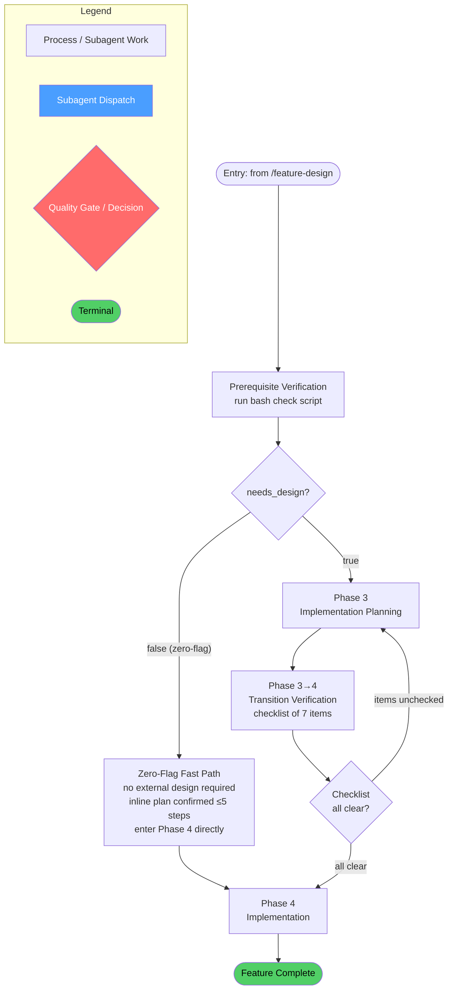
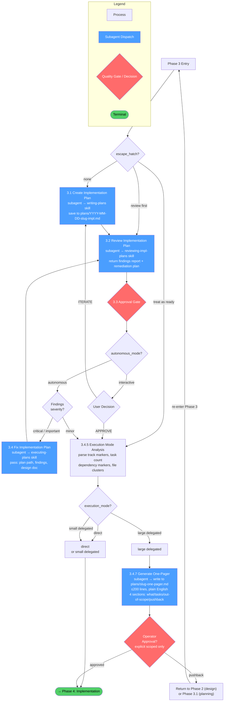

<!-- diagram-meta: {"source": "commands/feature-implement.md", "source_hash": "sha256:bdcf8f22d27cabed5f25072a8ab04a9b4a85b1481fb4906745d31a2f19a41802", "generated_at": "2026-05-25T01:38:59Z", "generator": "generate_diagrams.py"} -->
# Diagram: feature-implement

Now I'll generate the diagrams based on the full content of the file.

## Overview: `/feature-implement` (Phases 3–4)

```mermaid
flowchart TD
    entry(["Entry: from /feature-design"])
    prereq["Prerequisite Verification\nrun bash check script"]
    nd{"needs_design?"}
    zero["Zero-Flag Fast Path\nno external design required\ninline plan confirmed ≤5 steps\nenter Phase 4 directly"]
    ph3["Phase 3\nImplementation Planning"]
    trans["Phase 3→4\nTransition Verification\nchecklist of 7 items"]
    transok{"Checklist\nall clear?"}
    ph4["Phase 4\nImplementation"]
    done(["Feature Complete"])

    entry --> prereq
    prereq --> nd
    nd -->|true| ph3
    nd -->|"false (zero-flag)"| zero
    zero --> ph4
    ph3 --> trans
    trans --> transok
    transok -->|"items unchecked"| ph3
    transok -->|"all clear"| ph4
    ph4 --> done

    style done fill:#51cf66,color:#000

    subgraph LEGEND[" Legend"]
        la["Process / Subagent Work"]
        lb["Subagent Dispatch"]
        lc{"Quality Gate / Decision"}
        ld(["Terminal"])
    end
    style lb fill:#4a9eff,color:#fff
    style lc fill:#ff6b6b,color:#fff
    style ld fill:#51cf66,color:#000
```

---

## Phase 3: Implementation Planning (Detail)

```mermaid
flowchart TD
    entry3["Phase 3 Entry"]
    eh{"escape_hatch?"}

    s31["3.1 Create Implementation Plan\nsubagent → writing-plans skill\nsave to plans/YYYY-MM-DD-slug-impl.md"]
    s32["3.2 Review Implementation Plan\nsubagent → reviewing-impl-plans skill\nreturn findings report + remediation plan"]
    s33{"3.3 Approval Gate"}
    imode{"autonomous_mode?"}
    ugate{"User Decision"}
    autogate{"Findings\nseverity?"}
    s34["3.4 Fix Implementation Plan\nsubagent → executing-plans skill\npass: plan path, findings, design doc"]
    s345["3.4.5 Execution Mode Analysis\nparse track markers, task count\ndependency markers, file clusters"]
    emode{"execution_mode?"}
    small["direct\nor small delegated"]
    large["large delegated"]
    s347["3.4.7 Generate One-Pager\nsubagent → write to plans/slug-one-pager.md\n≤200 lines, plain English\n4 sections: what/tasks/out-of-scope/pushback"]
    opgate{"Operator\nApproval?\nexplicit scoped only"}
    retdesign["Return to Phase 2 (design)\nor Phase 3.1 (planning)"]
    done3(["→ Phase 4: Implementation"])

    entry3 --> eh
    eh -->|"none"| s31
    eh -->|"review first"| s32
    eh -->|"treat as ready"| s345

    s31 --> s32
    s32 --> s33
    s33 --> imode
    imode -->|interactive| ugate
    imode -->|autonomous| autogate

    ugate -->|"APPROVE"| s345
    ugate -->|"ITERATE"| s31
    autogate -->|"critical / important"| s34
    autogate -->|"minor"| s345
    s34 --> s32

    s345 --> emode
    emode -->|"direct"| small
    emode -->|"small delegated"| small
    emode -->|"large delegated"| large
    small --> done3
    large --> s347

    s347 --> opgate
    opgate -->|"approved"| done3
    opgate -->|"pushback"| retdesign
    retdesign -->|"re-enter Phase 3"| entry3

    style s31 fill:#4a9eff,color:#fff
    style s32 fill:#4a9eff,color:#fff
    style s34 fill:#4a9eff,color:#fff
    style s347 fill:#4a9eff,color:#fff
    style s33 fill:#ff6b6b,color:#fff
    style opgate fill:#ff6b6b,color:#fff
    style done3 fill:#51cf66,color:#000

    subgraph LEGEND3[" Legend"]
        la3["Process"]
        lb3["Subagent Dispatch"]
        lc3{"Quality Gate / Decision"}
        ld3(["Terminal"])
    end
    style lb3 fill:#4a9eff,color:#fff
    style lc3 fill:#ff6b6b,color:#fff
    style ld3 fill:#51cf66,color:#000
```

---

## Phase 4: Implementation — Worktree Setup & Task Execution (Detail)

```mermaid
flowchart TD
    entry4["Phase 4 Entry\nORCHESTRATION ONLY in main context"]

    wt{"worktree\nstrategy?"}
    wt_single["4.1 Create Single Worktree\nsubagent → using-git-worktrees skill"]
    wt_para["4.1 Parallel Worktree Setup\nsetup/skeleton tasks first\ncommit before creating worktrees\nsubagent → using-git-worktrees per track"]
    wt_none["4.1 No Worktree\nwork in current directory"]

    para{"parallelization\nstrategy?"}
    exec_ppt["4.2 Parallel Track Execution\none background Task per worktree\nsubagent → executing-plans skill\nverify branch before any work"]
    exec_max["4.2 Maximize Parallel Groups\nsubagent → dispatching-parallel-agents skill\ngroup tasks by Parallel Group field"]
    exec_seq["4.2 Sequential Execution\nsubagent → executing-plans skill"]

    smartmerge["4.2.5 Smart Merge\nsubagent → merging-worktrees skill\ndelete worktrees after merge\nverify all tests pass\nverify interface contracts"]

    taskloop{"More tasks\nin plan?"}

    tdd["4.3 Implement Task N\nsubagent → test-driven-development skill\nread assertion-quality-standard.md first\nFULL ASSERTION PRINCIPLE: assert == only\nno substring / len / mock.ANY assertions\ncommit when done"]

    dialect{"dialectic_mode?"}
    roundtable["4.3.1 Dialectic Overlay\nforge_roundtable_convene at IMPLEMENT stage\nplanning_and_gates: 3 archetypes\nfull: all 10 archetypes"]

    verify["4.4 Completion Verification\nauditor subagent: acceptance criteria check\nexpected outputs, interface contracts\nbehavior verification, dead code paths\noutput: COMPLETE / INCOMPLETE / PARTIAL"]
    vgate{"Blocking\nissues?"}

    review["4.5 Code Review\nsubagent → requesting-code-review skill"]
    rgate{"Issue\nseverity?"}

    factcheck["4.5.1 Claim Validation\nsubagent → fact-checking skill\nscope: files for Task N only\ndocstrings, comments, test names, type hints"]
    fcgate{"False\nclaims?"}

    nexttask["Mark task complete\nadvance to next task"]

    qgates["→ Phase 4 Quality Gates\n(all tasks complete)"]

    entry4 --> wt
    wt -->|"single"| wt_single
    wt -->|"per_parallel_track"| wt_para
    wt -->|"none"| wt_none

    wt_single --> para
    wt_para --> para
    wt_none --> para

    para -->|"per_parallel_track"| exec_ppt
    para -->|"maximize"| exec_max
    para -->|"conservative"| exec_seq

    exec_ppt --> smartmerge
    smartmerge --> taskloop
    exec_max --> taskloop
    exec_seq --> taskloop

    taskloop -->|"yes"| tdd
    tdd --> dialect
    dialect -->|"roundtable or full"| roundtable
    dialect -->|"planning_only or none"| verify
    roundtable --> verify

    verify --> vgate
    vgate -->|"YES: fix and re-verify"| tdd
    vgate -->|"NO: all complete"| review

    review --> rgate
    rgate -->|"critical: fix immediately"| tdd
    rgate -->|"important / minor"| factcheck

    factcheck --> fcgate
    fcgate -->|"YES: fix immediately"| tdd
    fcgate -->|"NO: clean"| nexttask
    nexttask --> taskloop

    taskloop -->|"no more tasks"| qgates

    style wt_single fill:#4a9eff,color:#fff
    style wt_para fill:#4a9eff,color:#fff
    style exec_ppt fill:#4a9eff,color:#fff
    style exec_max fill:#4a9eff,color:#fff
    style exec_seq fill:#4a9eff,color:#fff
    style smartmerge fill:#4a9eff,color:#fff
    style tdd fill:#4a9eff,color:#fff
    style roundtable fill:#4a9eff,color:#fff
    style review fill:#4a9eff,color:#fff
    style factcheck fill:#4a9eff,color:#fff
    style vgate fill:#ff6b6b,color:#fff
    style rgate fill:#ff6b6b,color:#fff
    style fcgate fill:#ff6b6b,color:#fff
    style qgates fill:#51cf66,color:#000

    subgraph LEGEND4[" Legend"]
        la4["Process"]
        lb4["Subagent Dispatch"]
        lc4{"Quality Gate / Decision"}
        ld4(["Terminal"])
    end
    style lb4 fill:#4a9eff,color:#fff
    style lc4 fill:#ff6b6b,color:#fff
    style ld4 fill:#51cf66,color:#000
```

---

## Phase 4: Quality Gates & Completion (Detail)

```mermaid
flowchart TD
    qentry["Phase 4 Quality Gates Entry\n(all tasks complete)"]

    audit["4.6.1 Comprehensive Implementation Audit\nauditor subagent: plan item sweep\ncross-task integration verification\ndesign doc traceability\nfeature completeness end-to-end"]
    auditgate{"Blocking\nissues?"}

    testsuite["4.6.2 Run Full Test Suite\npytest / npm test / cargo test"]
    testgate{"Tests\npassing?"}
    debug["subagent → systematic-debugging skill\nfix issues, then re-run"]

    mirage["4.6.3 Green Mirage Audit\nsubagent → audit-green-mirage skill\nread assertion-quality-standard.md first\nfocus: new code from this feature\nFULL ASSERTION PRINCIPLE enforced"]
    mirgate{"Issues\nfound?"}

    compfact["4.6.4 Comprehensive Claim Validation\nsubagent → fact-checking skill\nscope: ALL files for this feature\ncross-reference design doc + impl plan"]
    cfgate{"Issues\nfound?"}

    prepr["4.6.5 Pre-PR Claim Validation\nsubagent → fact-checking skill\nscope: branch diff since merge-base\nlast line of defense before PR"]
    ppgate{"Issues\nfound?"}

    postmode{"post_impl?"}
    finish_opts["4.7 Offer Options\nsubagent → finishing-a-development-branch skill\npresent: merge / create PR / cleanup"]
    finish_pr["4.7 Auto PR\npush branch\ngh pr create\nreturn URL"]
    finish_stop["4.7 Stop\nannounce complete\nsummarize work\nlist remaining TODOs"]
    done4(["Feature Complete"])

    qentry --> audit
    audit --> auditgate
    auditgate -->|"YES: fix and re-audit"| audit
    auditgate -->|"NO: clean"| testsuite

    testsuite --> testgate
    testgate -->|"FAIL"| debug
    debug --> testsuite
    testgate -->|"PASS"| mirage

    mirage --> mirgate
    mirgate -->|"YES: fix and re-audit"| mirage
    mirgate -->|"NO: clean"| compfact

    compfact --> cfgate
    cfgate -->|"YES: fix immediately"| compfact
    cfgate -->|"NO: clean"| prepr

    prepr --> ppgate
    ppgate -->|"YES: fix immediately"| prepr
    ppgate -->|"NO: clean"| postmode

    postmode -->|"offer_options"| finish_opts
    postmode -->|"auto_pr"| finish_pr
    postmode -->|"stop"| finish_stop

    finish_opts --> done4
    finish_pr --> done4
    finish_stop --> done4

    style audit fill:#4a9eff,color:#fff
    style debug fill:#4a9eff,color:#fff
    style mirage fill:#4a9eff,color:#fff
    style compfact fill:#4a9eff,color:#fff
    style prepr fill:#4a9eff,color:#fff
    style finish_opts fill:#4a9eff,color:#fff
    style finish_pr fill:#4a9eff,color:#fff
    style auditgate fill:#ff6b6b,color:#fff
    style testgate fill:#ff6b6b,color:#fff
    style mirgate fill:#ff6b6b,color:#fff
    style cfgate fill:#ff6b6b,color:#fff
    style ppgate fill:#ff6b6b,color:#fff
    style done4 fill:#51cf66,color:#000

    subgraph LEGEND5[" Legend"]
        la5["Process"]
        lb5["Subagent Dispatch"]
        lc5{"Quality Gate / Decision"}
        ld5(["Terminal"])
    end
    style lb5 fill:#4a9eff,color:#fff
    style lc5 fill:#ff6b6b,color:#fff
    style ld5 fill:#51cf66,color:#000
```

---

## Cross-Reference: Overview Nodes → Detail Diagrams

| Overview Node | Detail Diagram |
|---|---|
| Prerequisite Verification | Phase 3 Detail (entry condition) |
| Zero-Flag Fast Path | Phase 3 Detail (`escape_hatch = treat as ready`) |
| Phase 3: Implementation Planning | Phase 3 Detail diagram |
| Phase 4: Implementation | Phase 4 Task Execution + Phase 4 Quality Gates diagrams |

## Skills Invoked by Phase

| Step | Skill | Trigger |
|---|---|---|
| 3.1 | `writing-plans` | Create impl plan |
| 3.2 | `reviewing-impl-plans` | Review impl plan |
| 3.4 | `executing-plans` | Fix plan findings |
| 4.1 | `using-git-worktrees` | Create workspace(s) |
| 4.2 | `dispatching-parallel-agents` | Maximize parallelization |
| 4.2.5 | `merging-worktrees` | Merge parallel tracks |
| 4.3 | `test-driven-development` | TDD per task |
| 4.3.1 | `forge_roundtable_convene` (MCP) | Dialectic overlay (if enabled) |
| 4.5 | `requesting-code-review` | Per-task code review |
| 4.5.1, 4.6.4, 4.6.5 | `fact-checking` | Claim validation (3×) |
| 4.6.2 | `systematic-debugging` | Debug test failures |
| 4.6.3 | `audit-green-mirage` | Test quality audit |
| 4.7 | `finishing-a-development-branch` | Branch completion |
