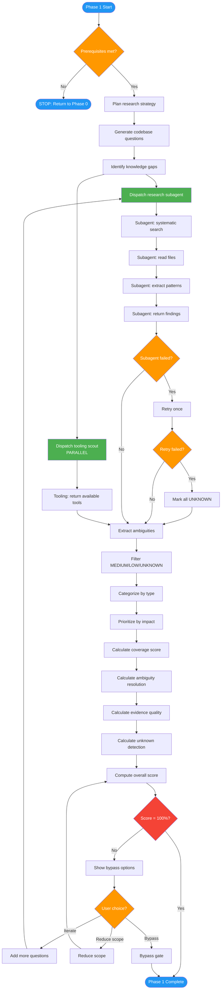

<!-- diagram-meta: {"source": "commands/feature-research.md","source_hash": "sha256:3d9a2ed12d04d6af44574664a7736d6b50ab44a0c2ad826e1ba010b62a8c947f","generated_at": "2026-03-23T00:00:00Z","generator": "generate_diagrams.py"} -->
# Diagram: feature-research

Phase 1 of develop: Research strategy planning, codebase exploration via subagent, parallel tooling discovery, ambiguity extraction, and quality scoring with a 100% threshold gate.

```mermaid
flowchart TD
    Start([Phase 1 Start])
    PrereqCheck{Prerequisites met?}
    PrereqFail([STOP: Return to Phase 0])

    PlanStrategy[Plan research strategy]
    GenQuestions[Generate codebase questions]
    IdentifyGaps[Identify knowledge gaps]

    DispatchAgent[Dispatch research subagent]
    DispatchTooling[Dispatch tooling scout<br>PARALLEL]
    AgentSearch[Subagent: systematic search]
    AgentRead[Subagent: read files]
    AgentExtract[Subagent: extract patterns]
    AgentReturn[Subagent: return findings]
    ToolingReturn[Tooling: return available tools]
    AgentFail{Subagent failed?}
    RetryAgent[Retry once]
    RetryFail{Retry failed?}
    MarkUnknown[Mark all UNKNOWN]

    ExtractAmb[Extract ambiguities]
    FilterLow[Filter MEDIUM/LOW/UNKNOWN]
    Categorize[Categorize by type]
    Prioritize[Prioritize by impact]

    CalcCoverage[Calculate coverage score]
    CalcAmbRes[Calculate ambiguity resolution]
    CalcEvidence[Calculate evidence quality]
    CalcUnknown[Calculate unknown detection]
    CalcOverall[Compute overall score]

    QualityGate{Score = 100%?}
    ShowOptions[Show bypass options]
    UserChoice{User choice?}
    Iterate[Add more questions]
    ReduceScope[Reduce scope]
    Bypass[Bypass gate]

    Phase1Done([Phase 1 Complete])

    Start --> PrereqCheck
    PrereqCheck -->|No| PrereqFail
    PrereqCheck -->|Yes| PlanStrategy

    PlanStrategy --> GenQuestions
    GenQuestions --> IdentifyGaps
    IdentifyGaps --> DispatchAgent
    IdentifyGaps --> DispatchTooling

    DispatchAgent --> AgentSearch
    AgentSearch --> AgentRead
    AgentRead --> AgentExtract
    AgentExtract --> AgentReturn
    AgentReturn --> AgentFail

    AgentFail -->|Yes| RetryAgent
    RetryAgent --> RetryFail
    RetryFail -->|Yes| MarkUnknown
    MarkUnknown --> ExtractAmb
    RetryFail -->|No| ExtractAmb
    AgentFail -->|No| ExtractAmb
    DispatchTooling --> ToolingReturn
    ToolingReturn --> ExtractAmb

    ExtractAmb --> FilterLow
    FilterLow --> Categorize
    Categorize --> Prioritize

    Prioritize --> CalcCoverage
    CalcCoverage --> CalcAmbRes
    CalcAmbRes --> CalcEvidence
    CalcEvidence --> CalcUnknown
    CalcUnknown --> CalcOverall

    CalcOverall --> QualityGate
    QualityGate -->|Yes| Phase1Done
    QualityGate -->|No| ShowOptions
    ShowOptions --> UserChoice
    UserChoice -->|Iterate| Iterate
    Iterate --> DispatchAgent
    UserChoice -->|Reduce scope| ReduceScope
    ReduceScope --> CalcOverall
    UserChoice -->|Bypass| Bypass
    Bypass --> Phase1Done

    style Start fill:#2196F3,color:#fff
    style Phase1Done fill:#2196F3,color:#fff
    style PrereqFail fill:#2196F3,color:#fff
    style DispatchAgent fill:#4CAF50,color:#fff
    style DispatchTooling fill:#4CAF50,color:#fff
    style PrereqCheck fill:#FF9800,color:#fff
    style AgentFail fill:#FF9800,color:#fff
    style RetryFail fill:#FF9800,color:#fff
    style QualityGate fill:#f44336,color:#fff
    style UserChoice fill:#FF9800,color:#fff
```

## Legend

| Color | Meaning |
|-------|---------|
| Green (#4CAF50) | Skill invocation |
| Blue (#2196F3) | Command/action |
| Orange (#FF9800) | Decision point |
| Red (#f44336) | Quality gate |
