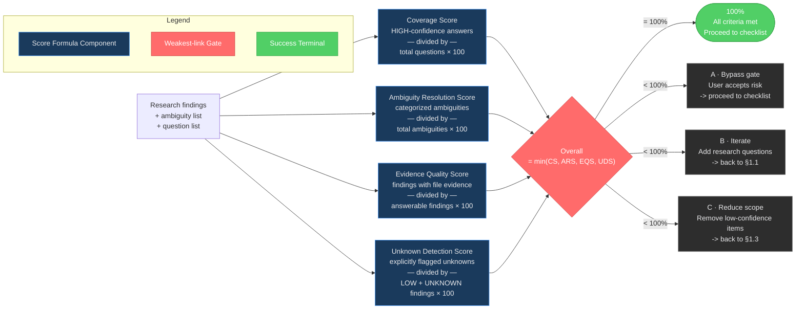

<!-- diagram-meta: {"source": "commands/feature-research.md", "source_hash": "sha256:b1bac746ab7937a4031bf9454a1196ce2df0f843df4a14fb35cdbfda7b84255b", "generated_at": "2026-06-11T01:24:14Z", "generator": "generate_diagrams.py"} -->
# Diagram: feature-research

## Overview: feature-research — Phase 1 of /develop

```mermaid
flowchart TD
    classDef subagent fill:#4a9eff,stroke:#2e7acc,color:#fff
    classDef gate fill:#ff6b6b,stroke:#cc4444,color:#fff
    classDef terminal fill:#51cf66,stroke:#3ba84e,color:#fff
    classDef process fill:#2d2d2d,stroke:#555,color:#e8e8ea
    classDef stop fill:#c62828,stroke:#b71c1c,color:#fff

    START(["START: /feature-research\nPhase 1 of /develop"]):::terminal

    PREREQ["Prerequisite Check\n(1) SESSION_PREFERENCES.need_flags.needs_research == true\n(2) Phase 0 checklist 100% complete\n(3) escape_hatch.type != impl_plan"]:::gate
    STOP_P(["STOP — return to\nappropriate phase"]):::stop

    S11["§1.1  Research Strategy Planning\nAnalyze feature domains\nGenerate codebase questions\nIdentify knowledge gaps"]:::process

    SA1["§1.2  Subagent Dispatch\nResearch Agent — Codebase Patterns\nAnswers each question: HIGH / MEDIUM / LOW / UNKNOWN\nTimeout: 120s"]:::subagent
    SA1_OK{"Subagent\nsucceeded?"}
    SA1_R["Retry once\n(same instructions)"]:::process
    SA1_F["Return all findings as UNKNOWN\n— do NOT block"]:::process

    SA2["§1.2.5  Subagent Dispatch\nGovernance Doc Discovery\nLayer 1: conventional glob net\nLayer 2: content classification\nCap: 40 candidates"]:::subagent
    SA2_OK{"Subagent\nsucceeded?"}
    SA2_R["Retry once\n(same instructions)"]:::process
    SA2_F["Record none_found: true\nForce operator cross-check\n— do NOT block"]:::process

    BRIDGE["Bridge — write onto design_context carrier\nSESSION_CONTEXT.design_context\n  .project_standards  &lt;— §1.2.5 result"]:::process

    S13["§1.3  Ambiguity Extraction\nExtract MEDIUM / LOW / UNKNOWN items\nExtract all flagged ambiguities\nCategorize: Technical · Scope · Integration · Terminology\nPrioritize by design impact: HIGH / MEDIUM / LOW"]:::process

    S14["§1.4  Compute Research Quality Scores\nCoverage · Ambiguity Resolution\nEvidence Quality · Unknown Detection\nOverall = min of all four scores\n[see detail diagram below]"]:::process

    QG{"Overall\n= 100%?"}:::gate

    BYPASS["A · Bypass gate\n(accept risk, proceed)"]:::process
    ITERATE["B · Iterate\n(add questions, re-run §1.1)"]:::process
    REDUCE["C · Reduce scope\n(remove low-confidence items)"]:::process

    CHECKLIST["Phase 1 Completion Checklist\n[ ] Subagent dispatched — not main-context work\n[ ] Quality score = 100% or user bypassed\n[ ] All ambiguities extracted and categorized\n[ ] Findings stored in SESSION_CONTEXT.research_findings\n[ ] design_context.project_standards populated"]:::process
    INCOMPLETE(["STOP — complete Phase 1\nDo NOT proceed"]):::stop
    DONE(["Phase 1 Complete\nNext: /feature-discover (Phase 1.5)"]):::terminal

    START --> PREREQ
    PREREQ -->|"any check fails"| STOP_P
    PREREQ -->|"all pass"| S11
    S11 --> SA1
    SA1 --> SA1_OK
    SA1_OK -->|"yes"| SA2
    SA1_OK -->|"no — first failure"| SA1_R
    SA1_R -->|"retry succeeds"| SA2
    SA1_R -->|"retry fails"| SA1_F
    SA1_F --> SA2
    SA2 --> SA2_OK
    SA2_OK -->|"yes"| BRIDGE
    SA2_OK -->|"no — first failure"| SA2_R
    SA2_R -->|"retry succeeds"| BRIDGE
    SA2_R -->|"retry fails"| SA2_F
    SA2_F --> S13
    BRIDGE --> S13
    S13 --> S14
    S14 --> QG
    QG -->|"= 100%"| CHECKLIST
    QG -->|"< 100%"| BYPASS
    QG -->|"< 100%"| ITERATE
    QG -->|"< 100%"| REDUCE
    BYPASS --> CHECKLIST
    ITERATE -->|"re-plan questions"| S11
    REDUCE -->|"re-extract"| S13
    CHECKLIST -->|"all items checked"| DONE
    CHECKLIST -->|"any item unchecked"| INCOMPLETE

    subgraph LEGEND["Legend"]
        direction LR
        LA["Subagent Dispatch"]:::subagent
        LB["Quality Gate / Decision"]:::gate
        LC["Success Terminal"]:::terminal
        LD["Process Step"]:::process
        LE(["Stop Terminal"]):::stop
    end
```

---

## Detail: §1.4 Research Quality Scoring

The overall score is the **weakest link** — all four component scores must reach 100% to pass the gate.

```mermaid
flowchart LR
    classDef score fill:#1a3a5c,stroke:#4a9eff,color:#e8e8ea
    classDef gate fill:#ff6b6b,stroke:#cc4444,color:#fff
    classDef terminal fill:#51cf66,stroke:#3ba84e,color:#fff
    classDef option fill:#2d2d2d,stroke:#666,color:#e8e8ea

    INPUTS["Research findings\n+ ambiguity list\n+ question list"]

    CS["Coverage Score\nHIGH-confidence answers\n— divided by —\ntotal questions × 100"]:::score

    ARS["Ambiguity Resolution Score\ncategorized ambiguities\n— divided by —\ntotal ambiguities × 100"]:::score

    EQS["Evidence Quality Score\nfindings with file evidence\n— divided by —\nanswerable findings × 100"]:::score

    UDS["Unknown Detection Score\nexplicitly flagged unknowns\n— divided by —\nLOW + UNKNOWN findings × 100"]:::score

    MIN{"Overall\n= min(CS, ARS, EQS, UDS)"}:::gate

    PASS(["100%\nAll criteria met\nProceed to checklist"]):::terminal

    OA["A · Bypass gate\nUser accepts risk\n-> proceed to checklist"]:::option
    OB["B · Iterate\nAdd research questions\n-> back to §1.1"]:::option
    OC["C · Reduce scope\nRemove low-confidence items\n-> back to §1.3"]:::option

    INPUTS --> CS & ARS & EQS & UDS
    CS & ARS & EQS & UDS --> MIN
    MIN -->|"= 100%"| PASS
    MIN -->|"< 100%"| OA
    MIN -->|"< 100%"| OB
    MIN -->|"< 100%"| OC

    subgraph LEGEND["Legend"]
        direction TB
        LS["Score Formula Component"]:::score
        LG["Weakest-link Gate"]:::gate
        LT["Success Terminal"]:::terminal
    end
```

---

## Cross-Reference: Overview → Detail

| Overview Node | Expands In |
|---|---|
| §1.4 Compute Research Quality Scores | Detail: §1.4 Research Quality Scoring |
| §1.2 Subagent Dispatch — Codebase Patterns | Overview (full error-handling path shown inline) |
| §1.2.5 Subagent Dispatch — Governance Docs | Overview (full error-handling + bridge path shown inline) |
