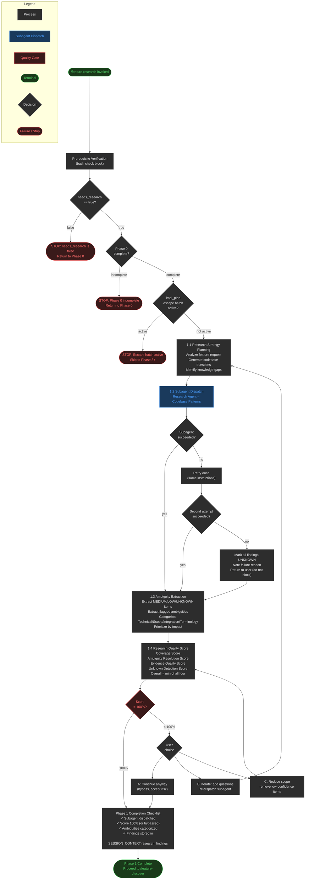

<!-- diagram-meta: {"source": "commands/feature-research.md", "source_hash": "sha256:2a203683983c78ebdb250868449f6776fd214cdb09e68befaf880d7cc051d1d9", "generated_at": "2026-05-25T01:39:27Z", "generator": "generate_diagrams.py"} -->
# Diagram: feature-research

```mermaid
flowchart TD
    START(["/feature-research invoked"]):::terminal

    PRE["Prerequisite Verification\n(bash check block)"]:::process

    C1{"needs_research\n== true?"}:::decision
    C2{"Phase 0\ncomplete?"}:::decision
    C3{"impl_plan\nescape hatch\nactive?"}:::decision

    STOP_NEEDS(["STOP: needs_research is false\nReturn to Phase 0"]):::fail
    STOP_P0(["STOP: Phase 0 incomplete\nReturn to Phase 0"]):::fail
    STOP_ESCAPE(["STOP: Escape hatch active\nSkip to Phase 3+"]):::fail

    S11["1.1 Research Strategy Planning\nAnalyze feature request\nGenerate codebase questions\nIdentify knowledge gaps"]:::process

    DISPATCH["1.2 Subagent Dispatch\nResearch Agent – Codebase Patterns"]:::subagent

    SF{"Subagent\nsucceeded?"}:::decision
    RETRY["Retry once\n(same instructions)"]:::process
    SF2{"Second attempt\nsucceeded?"}:::decision
    UNKNOWN["Mark all findings UNKNOWN\nNote failure reason\nReturn to user (do not block)"]:::process

    S13["1.3 Ambiguity Extraction\nExtract MEDIUM/LOW/UNKNOWN items\nExtract flagged ambiguities\nCategorize: Technical/Scope/Integration/Terminology\nPrioritize by impact"]:::process

    S14["1.4 Research Quality Score\nCoverage Score\nAmbiguity Resolution Score\nEvidence Quality Score\nUnknown Detection Score\nOverall = min of all four"]:::process

    QG{"Score\n= 100%?"}:::gate

    OPT{"User\nchoice"}:::decision
    OPT_A["A: Continue anyway\n(bypass, accept risk)"]:::process
    OPT_B["B: Iterate: add questions\nre-dispatch subagent"]:::process
    OPT_C["C: Reduce scope\nremove low-confidence items"]:::process

    CHECKLIST["Phase 1 Completion Checklist\n✓ Subagent dispatched\n✓ Score 100% (or bypassed)\n✓ Ambiguities categorized\n✓ Findings stored in\n  SESSION_CONTEXT.research_findings"]:::process

    DONE(["Phase 1 Complete\nProceed to /feature-discover"]):::terminal

    START --> PRE
    PRE --> C1
    C1 -->|"false"| STOP_NEEDS
    C1 -->|"true"| C2
    C2 -->|"incomplete"| STOP_P0
    C2 -->|"complete"| C3
    C3 -->|"active"| STOP_ESCAPE
    C3 -->|"not active"| S11

    S11 --> DISPATCH
    DISPATCH --> SF
    SF -->|"yes"| S13
    SF -->|"no"| RETRY
    RETRY --> SF2
    SF2 -->|"yes"| S13
    SF2 -->|"no"| UNKNOWN
    UNKNOWN --> S13

    S13 --> S14
    S14 --> QG
    QG -->|"100%"| CHECKLIST
    QG -->|"< 100%"| OPT
    OPT --> OPT_A
    OPT --> OPT_B
    OPT --> OPT_C
    OPT_A --> CHECKLIST
    OPT_B --> S11
    OPT_C --> S14

    CHECKLIST --> DONE

    subgraph LEGEND["Legend"]
        L1["Process"]:::process
        L2["Subagent Dispatch"]:::subagent
        L3["Quality Gate"]:::gate
        L4(["Terminal"]):::terminal
        L5{"Decision"}:::decision
        L6(["Failure / Stop"]):::fail
    end

    classDef process fill:#2d2d2d,stroke:#888,color:#e8e8ea
    classDef subagent fill:#1a3a5c,stroke:#4a9eff,color:#4a9eff
    classDef gate fill:#3a1a1a,stroke:#ff6b6b,color:#ff6b6b
    classDef terminal fill:#1a3a1a,stroke:#51cf66,color:#51cf66
    classDef decision fill:#2d2d2d,stroke:#aaa,color:#e8e8ea
    classDef fail fill:#3a1a1a,stroke:#ff6b6b,color:#ff6b6b
```

**Overview:** `/feature-research` is Phase 1 of the develop skill. It runs only when `needs_research` is true, dispatches a codebase-exploration subagent, extracts and categorizes ambiguities from the findings, computes a four-component quality score, and requires 100% (or explicit user bypass) before handing off to `/feature-discover`.

**Quality Gate components** (all must be 100%; overall = minimum):
| Component | Formula |
|---|---|
| Coverage | HIGH-confidence answers ÷ total questions |
| Ambiguity Resolution | Categorized ambiguities ÷ total ambiguities |
| Evidence Quality | Findings with file refs ÷ answerable findings |
| Unknown Detection | Flagged unknowns ÷ LOW/UNKNOWN findings |
