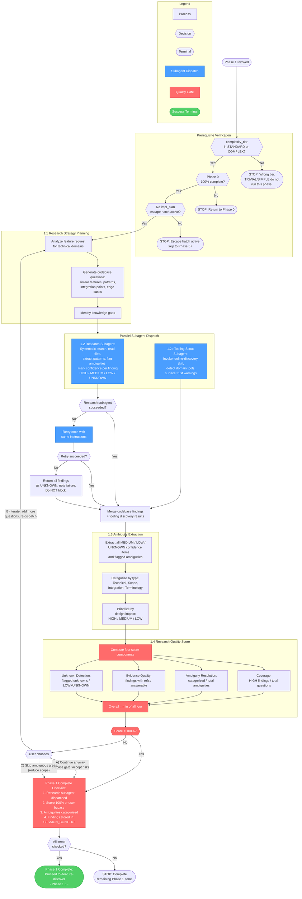

<!-- diagram-meta: {"source": "commands/feature-research.md","source_hash": "sha256:26b944ed9044b4500b7aa4af6b3b60d9604582fc7f4ad9ec22227dc97c189f4f","generated_at": "2026-04-06T00:00:00Z","generator": "generate_diagrams.py"} -->
# Feature Research (Phase 1) - Flow Diagram

Phase 1 of develop: prerequisite verification, parallel subagent dispatch for codebase research and tooling discovery, ambiguity extraction, quality scoring with a 100% threshold gate, and completion checklist.

```mermaid
flowchart TD
    subgraph Legend [Legend]
        direction LR
        L1[Process]
        L2{{Decision}}
        L3([Terminal])
        L4[Subagent Dispatch]:::subagent
        L5[Quality Gate]:::gate
        L6([Success Terminal]):::success
    end

    START([Phase 1 Invoked]) --> PREREQ

    %% ── Prerequisite Verification ──────────────────────────────
    subgraph PREREQ_GROUP [Prerequisite Verification]
        PREREQ{{complexity_tier<br>in STANDARD or COMPLEX?}}
        PREREQ -- No --> HALT_TIER([STOP: Wrong tier.<br>TRIVIAL/SIMPLE do not<br>run this phase.])
        PREREQ -- Yes --> CHK_P0{{Phase 0<br>100% complete?}}
        CHK_P0 -- No --> HALT_P0([STOP: Return to Phase 0])
        CHK_P0 -- Yes --> CHK_ESC{{No impl_plan<br>escape hatch active?}}
        CHK_ESC -- No --> HALT_ESC([STOP: Escape hatch active,<br>skip to Phase 3+])
    end

    CHK_ESC -- Yes --> STRAT

    %% ── 1.1 Research Strategy Planning ─────────────────────────
    subgraph STRAT_GROUP [1.1 Research Strategy Planning]
        STRAT[Analyze feature request<br>for technical domains]
        STRAT --> GEN_Q[Generate codebase questions:<br>similar features, patterns,<br>integration points, edge cases]
        GEN_Q --> ID_GAPS[Identify knowledge gaps]
    end

    ID_GAPS --> DISPATCH_BOTH

    %% ── 1.2 + 1.2b Parallel Subagent Dispatch ─────────────────
    subgraph DISPATCH_BOTH [Parallel Subagent Dispatch]
        direction LR
        SA_RESEARCH[1.2 Research Subagent:<br>Systematic search, read files,<br>extract patterns, flag ambiguities,<br>mark confidence per finding<br>HIGH / MEDIUM / LOW / UNKNOWN]:::subagent
        SA_TOOLING[1.2b Tooling Scout Subagent:<br>Invoke tooling-discovery skill,<br>detect domain tools,<br>surface trust warnings]:::subagent
    end

    %% ── Error Handling for 1.2 ─────────────────────────────────
    SA_RESEARCH --> SA_OK{{Research subagent<br>succeeded?}}
    SA_OK -- Yes --> MERGE
    SA_OK -- No --> RETRY[Retry once with<br>same instructions]:::subagent
    RETRY --> RETRY_OK{{Retry succeeded?}}
    RETRY_OK -- Yes --> MERGE
    RETRY_OK -- No --> FALLBACK[Return all findings<br>as UNKNOWN, note failure.<br>Do NOT block.]

    SA_TOOLING --> MERGE
    FALLBACK --> MERGE

    MERGE[Merge codebase findings<br>+ tooling discovery results]

    %% ── 1.3 Ambiguity Extraction ──────────────────────────────
    MERGE --> AMBIG_EXTRACT

    subgraph AMBIG_GROUP [1.3 Ambiguity Extraction]
        AMBIG_EXTRACT[Extract all MEDIUM / LOW /<br>UNKNOWN confidence items<br>and flagged ambiguities]
        AMBIG_EXTRACT --> CATEGORIZE[Categorize by type:<br>Technical, Scope,<br>Integration, Terminology]
        CATEGORIZE --> PRIORITIZE[Prioritize by<br>design impact:<br>HIGH / MEDIUM / LOW]
    end

    PRIORITIZE --> SCORE

    %% ── 1.4 Research Quality Score ────────────────────────────
    subgraph SCORE_GROUP [1.4 Research Quality Score]
        SCORE[Compute four score components]:::gate
        SCORE --> S1[Coverage:<br>HIGH findings / total questions]
        SCORE --> S2[Ambiguity Resolution:<br>categorized / total ambiguities]
        SCORE --> S3[Evidence Quality:<br>findings with refs / answerable]
        SCORE --> S4[Unknown Detection:<br>flagged unknowns / LOW+UNKNOWN]
        S1 --> OVERALL[Overall = min of all four]:::gate
        S2 --> OVERALL
        S3 --> OVERALL
        S4 --> OVERALL
    end

    OVERALL --> GATE

    %% ── Gate Decision ─────────────────────────────────────────
    GATE{{Score = 100%?}}:::gate
    GATE -- Yes --> CHECKLIST
    GATE -- No --> USER_CHOICE

    USER_CHOICE{{User chooses}}
    USER_CHOICE -- "A) Continue anyway<br>(bypass gate, accept risk)" --> CHECKLIST
    USER_CHOICE -- "B) Iterate: add more<br>questions, re-dispatch" --> STRAT
    USER_CHOICE -- "C) Skip ambiguous areas<br>(reduce scope)" --> CHECKLIST

    %% ── Phase Complete Checklist ──────────────────────────────
    CHECKLIST[Phase 1 Complete Checklist:<br>1. Research subagent dispatched<br>2. Score 100% or user bypass<br>3. Ambiguities categorized<br>4. Findings stored in SESSION_CONTEXT]:::gate

    CHECKLIST --> COMPLETE_OK{{All items<br>checked?}}
    COMPLETE_OK -- No --> INCOMPLETE([STOP: Complete<br>remaining Phase 1 items])
    COMPLETE_OK -- Yes --> DONE([Phase 1 Complete:<br>Proceed to /feature-discover<br>- Phase 1.5 -]):::success

    %% ── Styles ────────────────────────────────────────────────
    classDef subagent fill:#4a9eff,stroke:#2d7cd6,color:#fff
    classDef gate fill:#ff6b6b,stroke:#d94f4f,color:#fff
    classDef success fill:#51cf66,stroke:#3aad4e,color:#fff
```

## Cross-References

| Diagram Node | Source Section | Lines |
|---|---|---|
| Prerequisite Verification (3 checks) | Prerequisite Verification | 11-40 |
| 1.1 Research Strategy Planning | 1.1 Research Strategy Planning | 53-77 |
| 1.2 Research Subagent | 1.2 Execute Research (Subagent) | 79-127 |
| Error Handling / Retry / Fallback | Error Handling | 128-132 |
| 1.2b Tooling Scout Subagent | 1.2b Parallel Tooling Discovery | 134-153 |
| 1.3 Ambiguity Extraction | 1.3 Ambiguity Extraction | 155-181 |
| 1.4 Quality Score (4 components) | 1.4 Research Quality Score | 183-237 |
| Gate Decision (A/B/C) | Gate Behavior | 239-257 |
| Phase 1 Complete Checklist | Phase 1 Complete | 269-278 |
| Proceed to /feature-discover | Next | 280 |

## External References

| Reference | Type | Description |
|---|---|---|
| `/feature-discover` | Command | Phase 1.5 of develop; invoked after this phase completes |
| `tooling-discovery` | Skill | Invoked by the 1.2b Tooling Scout subagent |
| `develop` | Skill | Parent skill; this command is Phase 1 |
