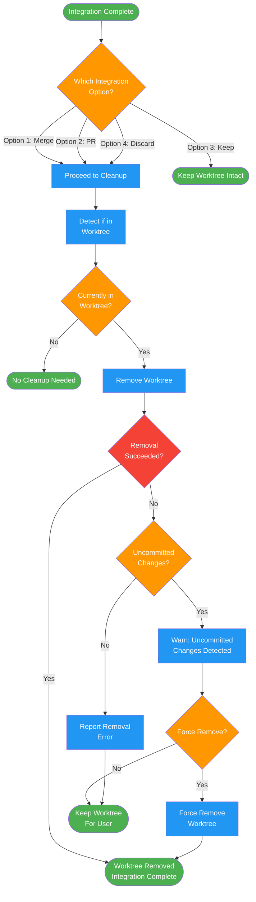

<!-- diagram-meta: {"source": "commands/finish-branch-cleanup.md", "source_hash": "sha256:557a08b1c3bc542f64b1d7864f6567e804dc5a6cdee78a35111c375ab3f8bc5e", "generated_at": "2026-02-19T00:00:00Z", "generator": "generate_diagrams.py"} -->
# Diagram: finish-branch-cleanup

Worktree cleanup after branch integration. Applies to merge, PR, and discard options. Keeps worktree intact for keep-as-is option.

## Legend

| Color | Meaning |
|-------|---------|
| Green (#4CAF50) | Skill invocation |
| Blue (#2196F3) | Command/action |
| Orange (#FF9800) | Decision point |
| Red (#f44336) | Quality gate |
