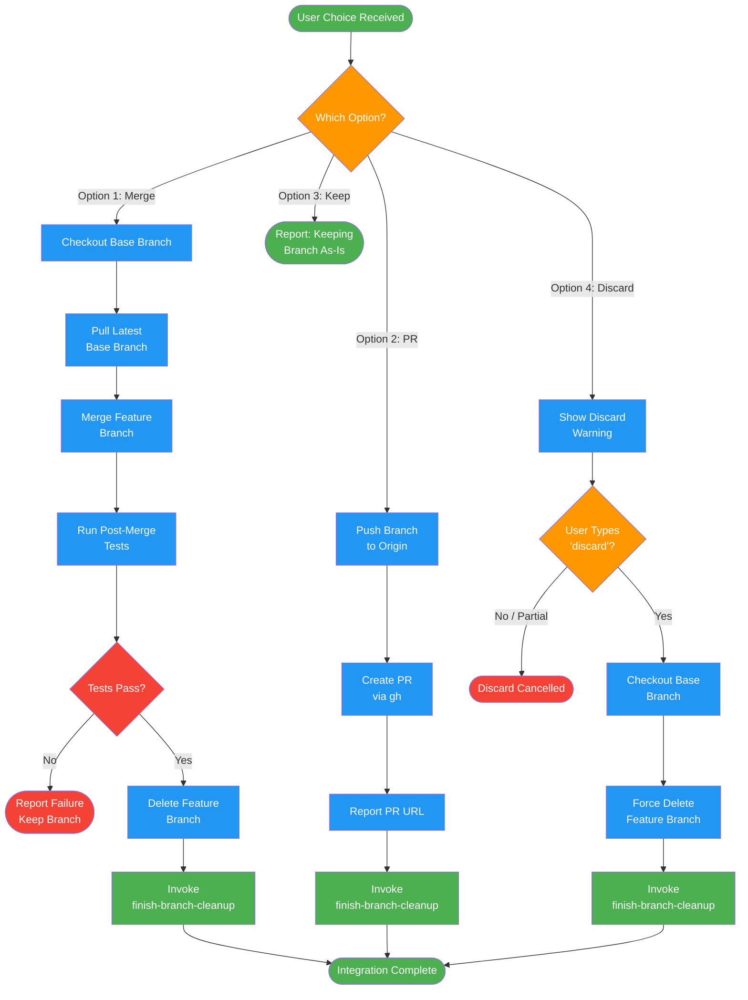

<!-- diagram-meta: {"source": "commands/finish-branch-execute.md", "source_hash": "sha256:111e4887fa1179a0753135f8d77d08db026c3f3e6fb083dbdf002edece3c0a3a", "generated_at": "2026-02-19T00:00:00Z", "generator": "generate_diagrams.py"} -->
# Diagram: finish-branch-execute

Execute the user's chosen integration option: local merge, PR creation, keep as-is, or discard with explicit confirmation.

## Legend

| Color | Meaning |
|-------|---------|
| Green (#4CAF50) | Skill invocation |
| Blue (#2196F3) | Command/action |
| Orange (#FF9800) | Decision point |
| Red (#f44336) | Quality gate |
