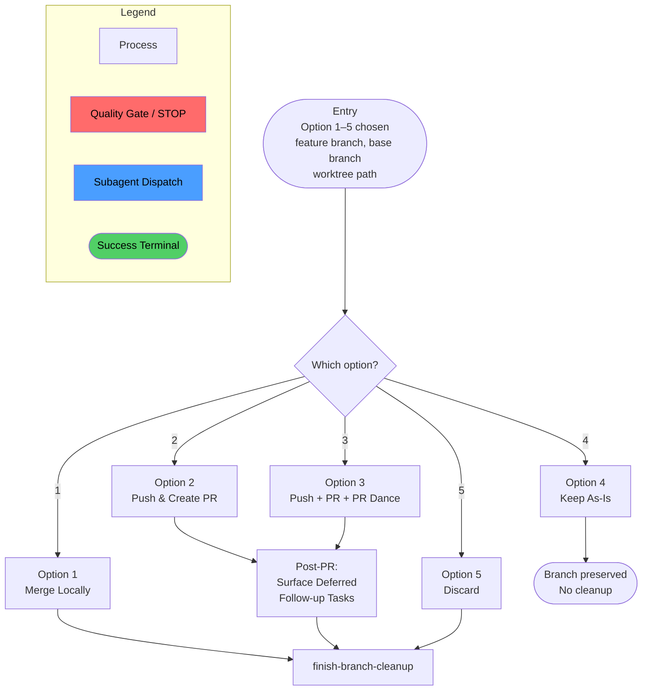
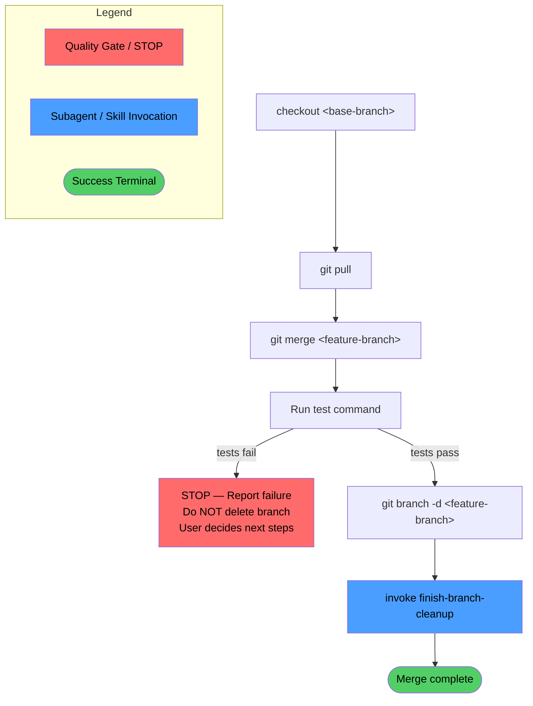
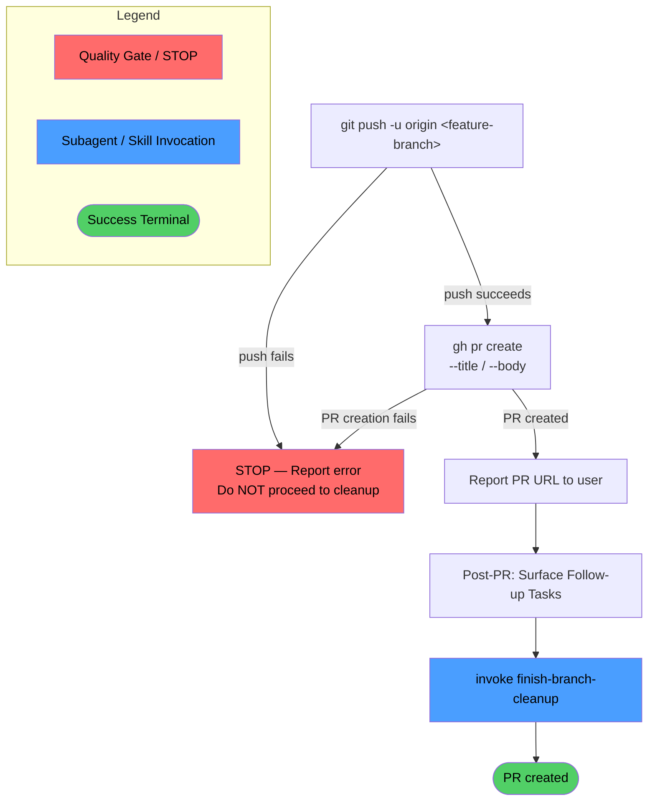
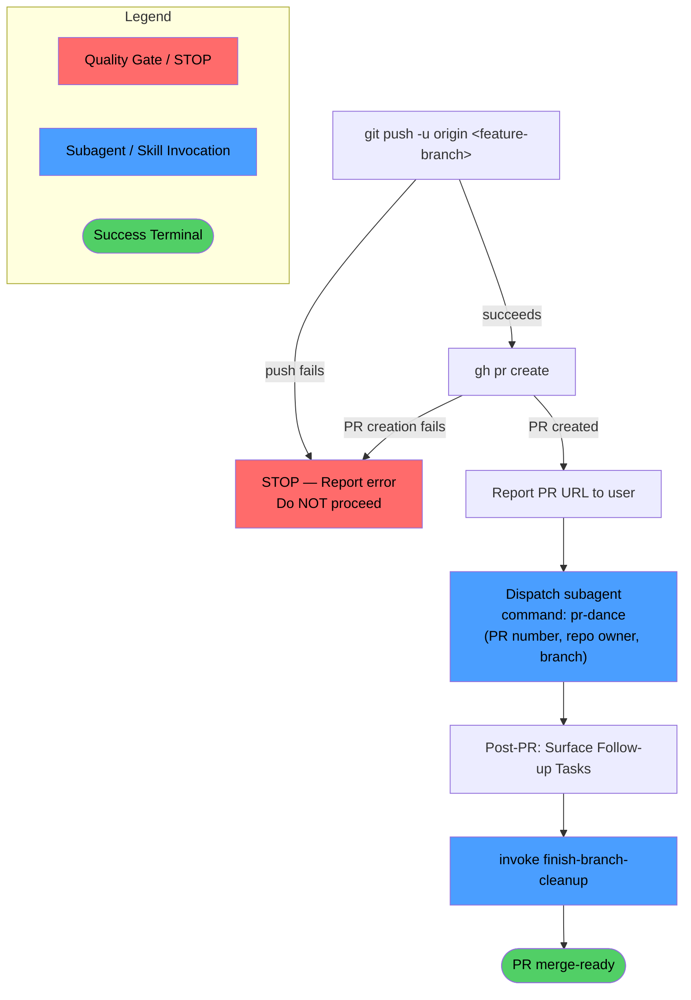
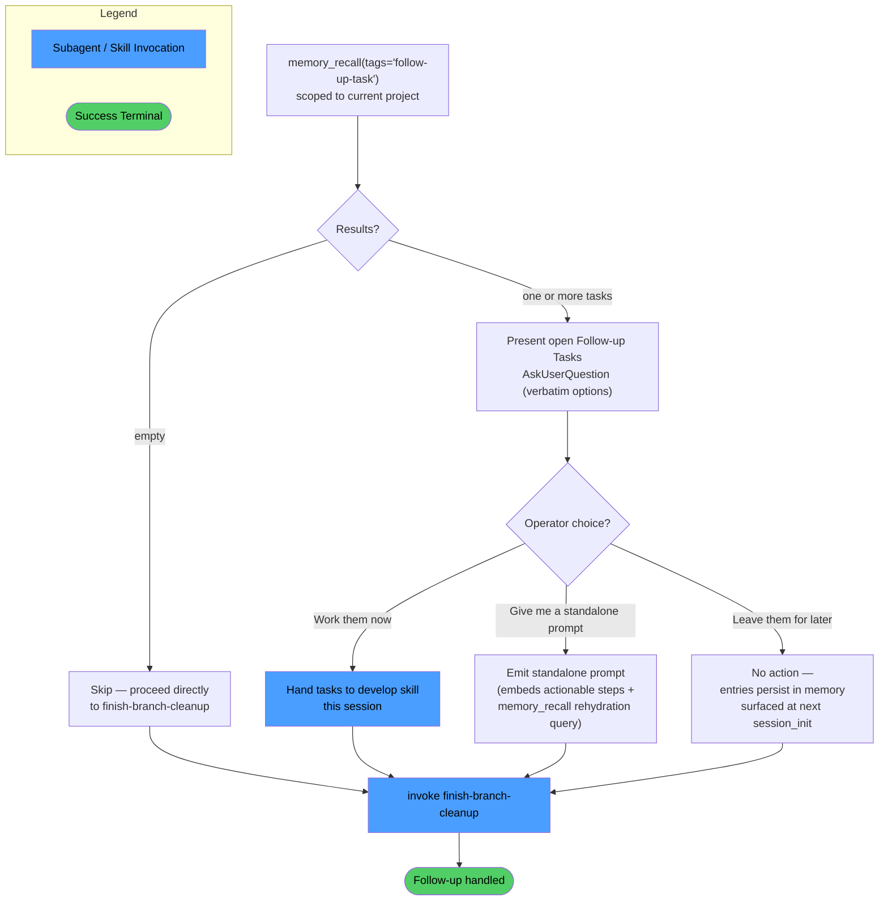
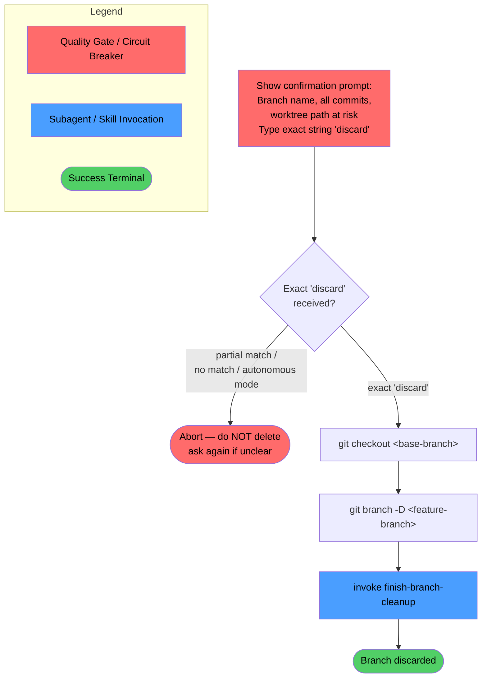

<!-- diagram-meta: {"source": "commands/finish-branch-execute.md", "source_hash": "sha256:7bd7dac6bb58b543ff159ca313488a81c42cb52fa859f1564c888d1a9ba356bc", "generated_at": "2026-05-25T01:40:09Z", "generator": "generate_diagrams.py"} -->
# Diagram: finish-branch-execute

Now I'll generate the diagrams based on the command's workflow.

## Overview Diagram

```mermaid
flowchart TD
    START(["Entry\nOption 1–5 chosen\nfeature branch, base branch\nworktree path"])

    DECIDE{Which option?}

    OPT1["Option 1\nMerge Locally"]
    OPT2["Option 2\nPush & Create PR"]
    OPT3["Option 3\nPush + PR + PR Dance"]
    OPT4["Option 4\nKeep As-Is"]
    OPT5["Option 5\nDiscard"]

    POST_PR["Post-PR:\nSurface Deferred\nFollow-up Tasks"]

    CLEANUP["finish-branch-cleanup"]

    KEEP_END(["Branch preserved\nNo cleanup"])

    START --> DECIDE
    DECIDE -->|"1"| OPT1
    DECIDE -->|"2"| OPT2
    DECIDE -->|"3"| OPT3
    DECIDE -->|"4"| OPT4
    DECIDE -->|"5"| OPT5

    OPT1 --> CLEANUP
    OPT2 --> POST_PR
    OPT3 --> POST_PR
    POST_PR --> CLEANUP
    OPT4 --> KEEP_END
    OPT5 --> CLEANUP

    subgraph LEGEND["Legend"]
        L_PROC["Process"]
        L_GATE["Quality Gate / STOP"]:::gate
        L_SUB["Subagent Dispatch"]:::subagent
        L_OK(["Success Terminal"]):::success
    end

    classDef gate fill:#ff6b6b,color:#000
    classDef subagent fill:#4a9eff,color:#000
    classDef success fill:#51cf66,color:#000
```

---

## Detail: Option 1 — Merge Locally

```mermaid
flowchart TD
    A["checkout &lt;base-branch&gt;"]
    B["git pull"]
    C["git merge &lt;feature-branch&gt;"]
    D["Run test command"]
    FAIL_GATE["STOP — Report failure\nDo NOT delete branch\nUser decides next steps"]:::gate
    DEL["git branch -d &lt;feature-branch&gt;"]
    CLEANUP["invoke finish-branch-cleanup"]:::subagent
    DONE(["Merge complete"]):::success

    A --> B --> C --> D
    D -->|"tests fail"| FAIL_GATE
    D -->|"tests pass"| DEL --> CLEANUP --> DONE

    subgraph LEGEND["Legend"]
        L_GATE["Quality Gate / STOP"]:::gate
        L_SUB["Subagent / Skill Invocation"]:::subagent
        L_OK(["Success Terminal"]):::success
    end

    classDef gate fill:#ff6b6b,color:#000
    classDef subagent fill:#4a9eff,color:#000
    classDef success fill:#51cf66,color:#000
```

---

## Detail: Option 2 — Push & Create PR

```mermaid
flowchart TD
    PUSH["git push -u origin &lt;feature-branch&gt;"]
    PR["gh pr create\n--title / --body"]
    FAIL_GATE["STOP — Report error\nDo NOT proceed to cleanup"]:::gate
    REPORT["Report PR URL to user"]
    POST["Post-PR: Surface Follow-up Tasks"]
    CLEANUP["invoke finish-branch-cleanup"]:::subagent
    DONE(["PR created"]):::success

    PUSH -->|"push fails"| FAIL_GATE
    PUSH -->|"push succeeds"| PR
    PR -->|"PR creation fails"| FAIL_GATE
    PR -->|"PR created"| REPORT --> POST --> CLEANUP --> DONE

    subgraph LEGEND["Legend"]
        L_GATE["Quality Gate / STOP"]:::gate
        L_SUB["Subagent / Skill Invocation"]:::subagent
        L_OK(["Success Terminal"]):::success
    end

    classDef gate fill:#ff6b6b,color:#000
    classDef subagent fill:#4a9eff,color:#000
    classDef success fill:#51cf66,color:#000
```

---

## Detail: Option 3 — Push + PR + PR Dance

```mermaid
flowchart TD
    PUSH["git push -u origin &lt;feature-branch&gt;"]
    PR["gh pr create"]
    FAIL_GATE["STOP — Report error\nDo NOT proceed"]:::gate
    REPORT["Report PR URL to user"]
    DANCE["Dispatch subagent\ncommand: pr-dance\n(PR number, repo owner, branch)"]:::subagent
    POST["Post-PR: Surface Follow-up Tasks"]
    CLEANUP["invoke finish-branch-cleanup"]:::subagent
    DONE(["PR merge-ready"]):::success

    PUSH -->|"push fails"| FAIL_GATE
    PUSH -->|"succeeds"| PR
    PR -->|"PR creation fails"| FAIL_GATE
    PR -->|"PR created"| REPORT --> DANCE --> POST --> CLEANUP --> DONE

    subgraph LEGEND["Legend"]
        L_GATE["Quality Gate / STOP"]:::gate
        L_SUB["Subagent / Skill Invocation"]:::subagent
        L_OK(["Success Terminal"]):::success
    end

    classDef gate fill:#ff6b6b,color:#000
    classDef subagent fill:#4a9eff,color:#000
    classDef success fill:#51cf66,color:#000
```

---

## Detail: Post-PR — Surface Deferred Follow-up Tasks

```mermaid
flowchart TD
    QUERY["memory_recall(tags='follow-up-task')\nscoped to current project"]
    EMPTY{Results?}
    SKIP["Skip — proceed directly\nto finish-branch-cleanup"]
    PRESENT["Present open Follow-up Tasks\nAskUserQuestion (verbatim options)"]
    CHOICE{Operator choice?}
    WORK["Hand tasks to develop skill\nthis session"]:::subagent
    PROMPT["Emit standalone prompt\n(embeds actionable steps +\nmemory_recall rehydration query)"]
    LATER["No action —\nentries persist in memory\nsurfaced at next session_init"]
    CLEANUP["invoke finish-branch-cleanup"]:::subagent
    DONE(["Follow-up handled"]):::success

    QUERY --> EMPTY
    EMPTY -->|"empty"| SKIP --> CLEANUP
    EMPTY -->|"one or more tasks"| PRESENT --> CHOICE
    CHOICE -->|"Work them now"| WORK --> CLEANUP
    CHOICE -->|"Give me a standalone prompt"| PROMPT --> CLEANUP
    CHOICE -->|"Leave them for later"| LATER --> CLEANUP
    CLEANUP --> DONE

    subgraph LEGEND["Legend"]
        L_SUB["Subagent / Skill Invocation"]:::subagent
        L_OK(["Success Terminal"]):::success
    end

    classDef subagent fill:#4a9eff,color:#000
    classDef success fill:#51cf66,color:#000
```

---

## Detail: Option 5 — Discard

```mermaid
flowchart TD
    CONFIRM_GATE["Show confirmation prompt:\nBranch name, all commits,\nworktree path at risk\nType exact string 'discard'"]:::gate
    WAIT{Exact 'discard'\nreceived?}
    ABORT(["Abort — do NOT delete\nask again if unclear"]):::gate
    CHECKOUT["git checkout &lt;base-branch&gt;"]
    DELETE["git branch -D &lt;feature-branch&gt;"]
    CLEANUP["invoke finish-branch-cleanup"]:::subagent
    DONE(["Branch discarded"]):::success

    CONFIRM_GATE --> WAIT
    WAIT -->|"partial match /\nno match / autonomous mode"| ABORT
    WAIT -->|"exact 'discard'"| CHECKOUT --> DELETE --> CLEANUP --> DONE

    subgraph LEGEND["Legend"]
        L_GATE["Quality Gate / Circuit Breaker"]:::gate
        L_SUB["Subagent / Skill Invocation"]:::subagent
        L_OK(["Success Terminal"]):::success
    end

    classDef gate fill:#ff6b6b,color:#000
    classDef subagent fill:#4a9eff,color:#000
    classDef success fill:#51cf66,color:#000
```

---

## Cross-Reference Table

| Overview Node | Detail Diagram |
|---|---|
| Option 1: Merge Locally | Detail: Option 1 — Merge Locally |
| Option 2: Push & Create PR | Detail: Option 2 — Push & Create PR |
| Option 3: Push + PR + PR Dance | Detail: Option 3 — Push + PR + PR Dance |
| Post-PR: Surface Deferred Follow-up Tasks | Detail: Post-PR — Surface Deferred Follow-up Tasks |
| Option 5: Discard | Detail: Option 5 — Discard |
| Option 4: Keep As-Is | Trivial — report and stop; no cleanup invoked |
