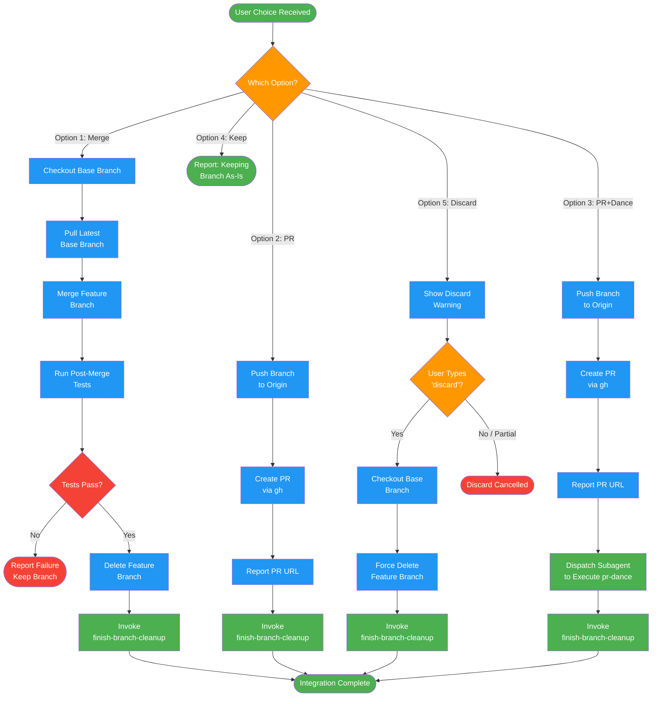

<!-- diagram-meta: {"source": "commands/finish-branch-execute.md", "source_hash": "sha256:482a38279f11fd1e3927b9c9eb6d1e30f2c1e6f8f5ccdd7a77b380d868e9ae81", "generated_at": "2026-04-05T00:11:30Z", "generator": "generate_diagrams.py", "method": "patch", "provider": "claude", "model": "haiku"} -->
# Diagram: finish-branch-execute

```mermaid
flowchart TD
    Start([User Choice Received]) --> OptionSwitch{"Which Option?"}
    OptionSwitch -->|Option 1: Merge| CheckoutBase["Checkout Base Branch"]
    OptionSwitch -->|Option 2: PR| PushBranch["Push Branch\nto Origin"]
    OptionSwitch -->|Option 3: PR+Dance| PushBranch2["Push Branch\nto Origin"]
    OptionSwitch -->|Option 4: Keep| ReportKeep([Report: Keeping\nBranch As-Is])
    OptionSwitch -->|Option 5: Discard| ShowWarning["Show Discard\nWarning"]
    CheckoutBase --> PullLatest["Pull Latest\nBase Branch"]
    PullLatest --> MergeBranch["Merge Feature\nBranch"]
    MergeBranch --> PostMergeTest["Run Post-Merge\nTests"]
    PostMergeTest --> MergeTestGate{"Tests Pass?"}
    MergeTestGate -->|No| MergeFail([Report Failure\nKeep Branch])
    MergeTestGate -->|Yes| DeleteBranch["Delete Feature\nBranch"]
    DeleteBranch --> ToCleanup1["Invoke\nfinish-branch-cleanup"]
    PushBranch --> CreatePR["Create PR\nvia gh"]
    CreatePR --> ReportURL["Report PR URL"]
    ReportURL --> ToCleanup2["Invoke\nfinish-branch-cleanup"]
    PushBranch2 --> CreatePR2["Create PR\nvia gh"]
    CreatePR2 --> ReportURL2["Report PR URL"]
    ReportURL2 --> ExecutePRDance["Dispatch Subagent\nto Execute pr-dance"]
    ExecutePRDance --> ToCleanup4["Invoke\nfinish-branch-cleanup"]
    ShowWarning --> TypeConfirm{"User Types\n'discard'?"}
    TypeConfirm -->|No / Partial| RejectDiscard([Discard Cancelled])
    TypeConfirm -->|Yes| CheckoutDiscard["Checkout Base\nBranch"]
    CheckoutDiscard --> ForceDelete["Force Delete\nFeature Branch"]
    ForceDelete --> ToCleanup3["Invoke\nfinish-branch-cleanup"]
    ToCleanup1 --> Done([Integration Complete])
    ToCleanup2 --> Done
    ToCleanup3 --> Done
    ToCleanup4 --> Done

    style Start fill:#4CAF50,color:#fff
    style Done fill:#4CAF50,color:#fff
    style ReportKeep fill:#4CAF50,color:#fff
    style MergeFail fill:#f44336,color:#fff
    style RejectDiscard fill:#f44336,color:#fff
    style CheckoutBase fill:#2196F3,color:#fff
    style PullLatest fill:#2196F3,color:#fff
    style MergeBranch fill:#2196F3,color:#fff
    style PostMergeTest fill:#2196F3,color:#fff
    style DeleteBranch fill:#2196F3,color:#fff
    style PushBranch fill:#2196F3,color:#fff
    style CreatePR fill:#2196F3,color:#fff
    style ReportURL fill:#2196F3,color:#fff
    style PushBranch2 fill:#2196F3,color:#fff
    style CreatePR2 fill:#2196F3,color:#fff
    style ReportURL2 fill:#2196F3,color:#fff
    style ExecutePRDance fill:#4CAF50,color:#fff
    style ShowWarning fill:#2196F3,color:#fff
    style CheckoutDiscard fill:#2196F3,color:#fff
    style ForceDelete fill:#2196F3,color:#fff
    style ToCleanup1 fill:#4CAF50,color:#fff
    style ToCleanup2 fill:#4CAF50,color:#fff
    style ToCleanup3 fill:#4CAF50,color:#fff
    style ToCleanup4 fill:#4CAF50,color:#fff
    style OptionSwitch fill:#FF9800,color:#fff
    style TypeConfirm fill:#FF9800,color:#fff
    style MergeTestGate fill:#f44336,color:#fff
```

**Changes made:**
- Added Option 3 branch (PR+Dance): `OptionSwitch -->|Option 3: PR+Dance| PushBranch2`
- Created separate PR+Dance path: PushBranch2 → CreatePR2 → ReportURL2 → ExecutePRDance → ToCleanup4
- Renumbered Option 3 (Keep) → Option 4, Option 4 (Discard) → Option 5
- Styled ExecutePRDance as green (skill invocation) with ToCleanup4 convergence to Done
