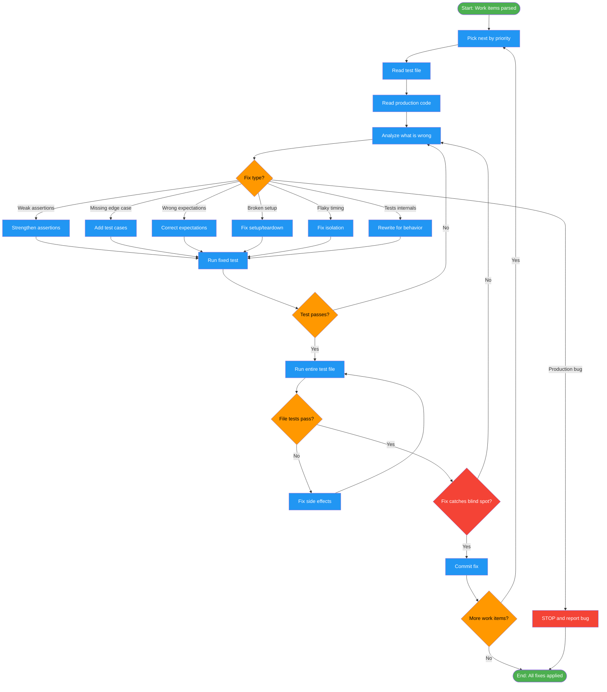

<!-- diagram-meta: {"source": "commands/fix-tests-execute.md", "source_hash": "sha256:aa194f2d3ce068e2929357bf1828d6e42dd6d8b35cd46d62b3c2ca1ae8cd454d", "generated_at": "2026-02-19T00:00:00Z", "generator": "generate_diagrams.py"} -->
# Diagram: fix-tests-execute

Execute test fixes by priority: investigate each work item, classify the fix type, apply the fix, verify it catches the original blind spot, and commit independently.

## Legend

| Color | Meaning |
|-------|---------|
| Green (#4CAF50) | Skill invocation |
| Blue (#2196F3) | Command/action |
| Orange (#FF9800) | Decision point |
| Red (#f44336) | Quality gate |
