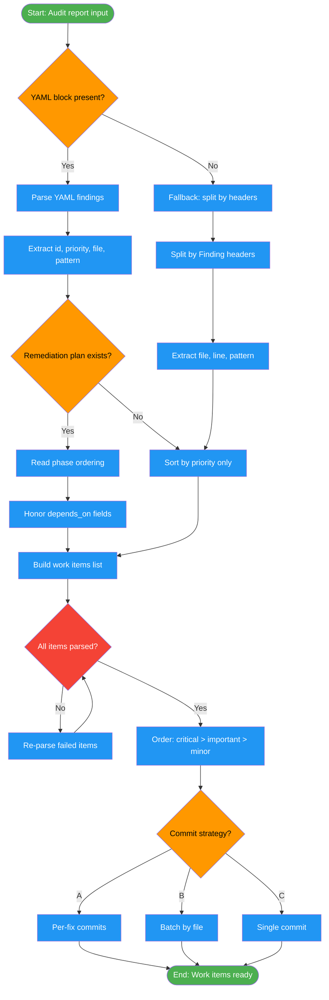

<!-- diagram-meta: {"source": "commands/fix-tests-parse.md", "source_hash": "sha256:0f039b2b7d0d28db226c75822a72cb0f784f8f44c53bd60a58cf7d2bcacdebeb", "generated_at": "2026-02-19T00:00:00Z", "generator": "generate_diagrams.py"} -->
# Diagram: fix-tests-parse

Parse audit reports or test failure output into structured work items, honor dependency ordering from remediation plans, and select a commit strategy before execution begins.

## Legend

| Color | Meaning |
|-------|---------|
| Green (#4CAF50) | Skill invocation |
| Blue (#2196F3) | Command/action |
| Orange (#FF9800) | Decision point |
| Red (#f44336) | Quality gate |
