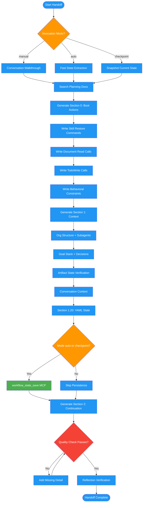

<!-- diagram-meta: {"source": "commands/handoff.md", "source_hash": "sha256:45eb6e030e42aa92ebe3d1ecbdd59f31b583fd6d90af0454c464d775eac29829", "generated_at": "2026-02-19T00:00:00Z", "generator": "generate_diagrams.py"} -->
# Diagram: handoff

Session state transfer command that produces a structured handoff document enabling a successor instance to resume mid-stride with zero context loss. Supports manual, auto, and checkpoint invocation modes.

## Legend

| Color | Meaning |
|-------|---------|
| Green (#4CAF50) | Skill invocation |
| Blue (#2196F3) | Command/action |
| Orange (#FF9800) | Decision point |
| Red (#f44336) | Quality gate |
