<!-- diagram-meta: {"source": "commands/ie-techniques.md", "source_hash": "sha256:7215744d9e00598c09d847cafce684adfb49d41b9ce42df9854634bd6d082ee9", "generated_at": "2026-02-19T00:00:00Z", "generator": "generate_diagrams.py"} -->
# Diagram: ie-techniques

Reference command providing 16 research-backed instruction engineering techniques for effective prompt crafting. Covers emotional stimuli, XML tags, repetition, personas, chain-of-thought, and subagent design.

```mermaid
flowchart TD
    Start([Invoke /ie-techniques]) --> EmotionPrompt[1. EmotionPrompt: Positive Stimuli]
    EmotionPrompt --> NegPrompt[2. NegativePrompt: Negative Stimuli]
    NegPrompt --> ReadyStimuli[3. Ready-to-Use Stimuli]
    ReadyStimuli --> PosWeighting[4. Positive Word Weighting]
    PosWeighting --> TempRobust[5. High-Temp Robustness]
    TempRobust --> LengthGuide[6. Length Guidance]
    LengthGuide --> LengthCheck{Under 200 lines?}

    LengthCheck -->|Yes| XMLTags[7. XML Tags]
    LengthCheck -->|Extended| JustifyLength[Requires Justification]
    JustifyLength --> XMLTags

    XMLTags --> Repetition[8. Strategic Repetition]
    Repetition --> BeginEnd[9. Begin/End Emphasis]
    BeginEnd --> Negations[10. Explicit Negations]
    Negations --> Persona[11. Role-Playing Persona]
    Persona --> PersonaCheck{Persona + Stimulus?}

    PersonaCheck -->|Yes| CoT[12. Chain-of-Thought]
    PersonaCheck -->|No| AddStimulus[Add Emotional Stimulus]
    AddStimulus --> CoT

    CoT --> FewShot[13. Few-Shot Optimization]
    FewShot --> SelfCheck[14. Self-Check Protocol]
    SelfCheck --> SkillInvoke[15. Explicit Skill Invocation]
    SkillInvoke --> SubagentAssign[16. Subagent Responsibility]
    SubagentAssign --> PersonaMap[Task-to-Persona Mapping]
    PersonaMap --> Done([Techniques Reference Complete])

    style Start fill:#2196F3,color:#fff
    style Done fill:#2196F3,color:#fff
    style LengthCheck fill:#FF9800,color:#fff
    style PersonaCheck fill:#FF9800,color:#fff
    style EmotionPrompt fill:#2196F3,color:#fff
    style NegPrompt fill:#2196F3,color:#fff
    style ReadyStimuli fill:#2196F3,color:#fff
    style PosWeighting fill:#2196F3,color:#fff
    style TempRobust fill:#2196F3,color:#fff
    style LengthGuide fill:#2196F3,color:#fff
    style JustifyLength fill:#2196F3,color:#fff
    style XMLTags fill:#2196F3,color:#fff
    style Repetition fill:#2196F3,color:#fff
    style BeginEnd fill:#2196F3,color:#fff
    style Negations fill:#2196F3,color:#fff
    style Persona fill:#2196F3,color:#fff
    style AddStimulus fill:#2196F3,color:#fff
    style CoT fill:#2196F3,color:#fff
    style FewShot fill:#2196F3,color:#fff
    style SelfCheck fill:#2196F3,color:#fff
    style SkillInvoke fill:#4CAF50,color:#fff
    style SubagentAssign fill:#2196F3,color:#fff
    style PersonaMap fill:#2196F3,color:#fff
```

## Legend

| Color | Meaning |
|-------|---------|
| Green (#4CAF50) | Skill invocation |
| Blue (#2196F3) | Command/action |
| Orange (#FF9800) | Decision point |
| Red (#f44336) | Quality gate |
