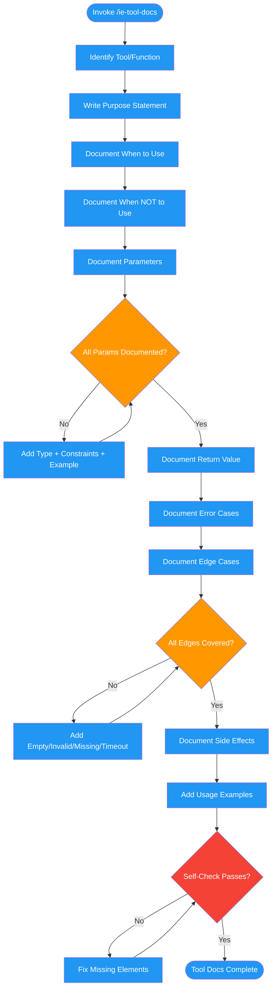

<!-- diagram-meta: {"source": "commands/ie-tool-docs.md", "source_hash": "sha256:afc7c195d8181468525c8f700f548485f7d9fc93c1b04ab380bb154f501c0606", "generated_at": "2026-02-19T00:00:00Z", "generator": "generate_diagrams.py"} -->
# Diagram: ie-tool-docs

Guidance for writing MCP tool, API, and CLI documentation that LLMs can reliably interpret. Covers purpose, parameters, errors, edge cases, and anti-patterns.

## Legend

| Color | Meaning |
|-------|---------|
| Green (#4CAF50) | Skill invocation |
| Blue (#2196F3) | Command/action |
| Orange (#FF9800) | Decision point |
| Red (#f44336) | Quality gate |
