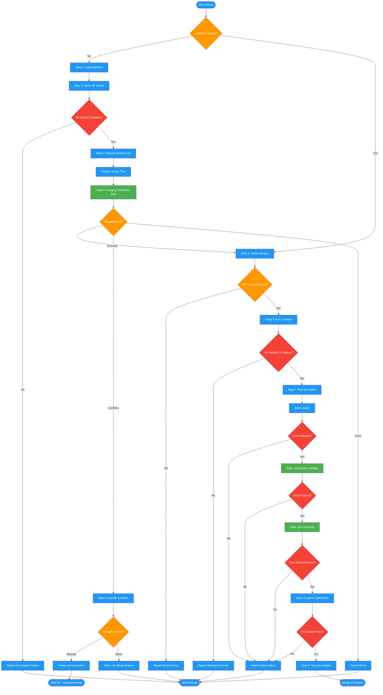

<!-- diagram-meta: {"source": "commands/merge-work-packets.md", "source_hash": "sha256:083184aa5b4860bb3eaebfd7c15f0b6103481ca2981cd32e33a419e8cf4adeb2", "generated_at": "2026-02-19T00:00:00Z", "generator": "generate_diagrams.py"} -->
# Diagram: merge-work-packets

Integrates completed work packets by verifying all tracks, invoking the merging-worktrees skill, handling conflicts, running QA gates, and reporting final integration status.

## Legend

| Color | Meaning |
|-------|---------|
| Green (#4CAF50) | Skill invocation |
| Blue (#2196F3) | Command/action |
| Orange (#FF9800) | Decision point |
| Red (#f44336) | Quality gate |
