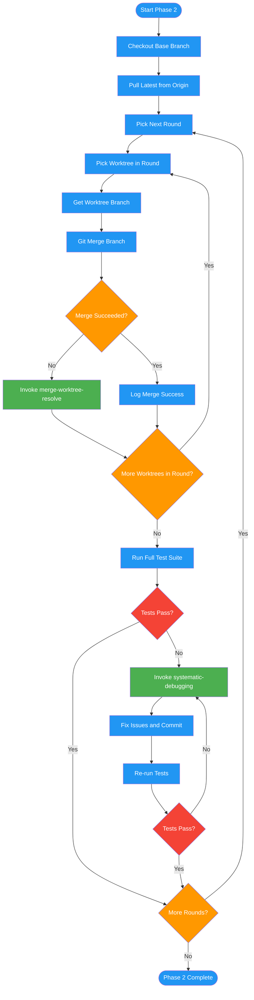

<!-- diagram-meta: {"source": "commands/merge-worktree-execute.md", "source_hash": "sha256:9e604dd546024b715eb36bf80de9354ca3a0f3608dd01dda7588b4342da45c09", "generated_at": "2026-02-19T00:00:00Z", "generator": "generate_diagrams.py"} -->
# Diagram: merge-worktree-execute

Phase 2 of merging-worktrees: merges worktrees sequentially in dependency order, running the full test suite after each round, escalating conflicts to the resolution phase and test failures to the systematic-debugging skill.

## Legend

| Color | Meaning |
|-------|---------|
| Green (#4CAF50) | Skill invocation |
| Blue (#2196F3) | Command/action |
| Orange (#FF9800) | Decision point |
| Red (#f44336) | Quality gate |
