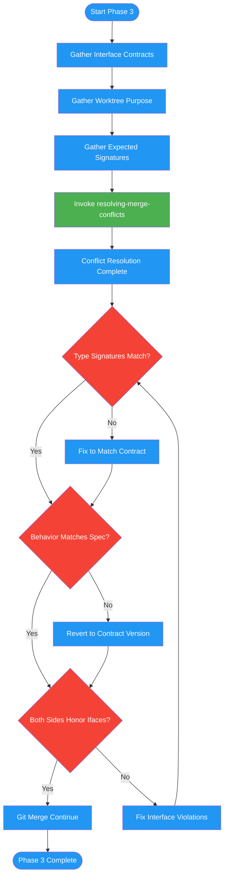

<!-- diagram-meta: {"source": "commands/merge-worktree-resolve.md", "source_hash": "sha256:8ed240638a694c3c718f9e1e7abe302b549b76145a6553179d2f5c81a9214cad", "generated_at": "2026-02-19T00:00:00Z", "generator": "generate_diagrams.py"} -->
# Diagram: merge-worktree-resolve

Phase 3 of merging-worktrees: delegates merge conflicts to the resolving-merge-conflicts skill with interface contract context, then verifies that resolved code matches contract specifications for type signatures and function behavior before continuing.

## Legend

| Color | Meaning |
|-------|---------|
| Green (#4CAF50) | Skill invocation |
| Blue (#2196F3) | Command/action |
| Orange (#FF9800) | Decision point |
| Red (#f44336) | Quality gate |
