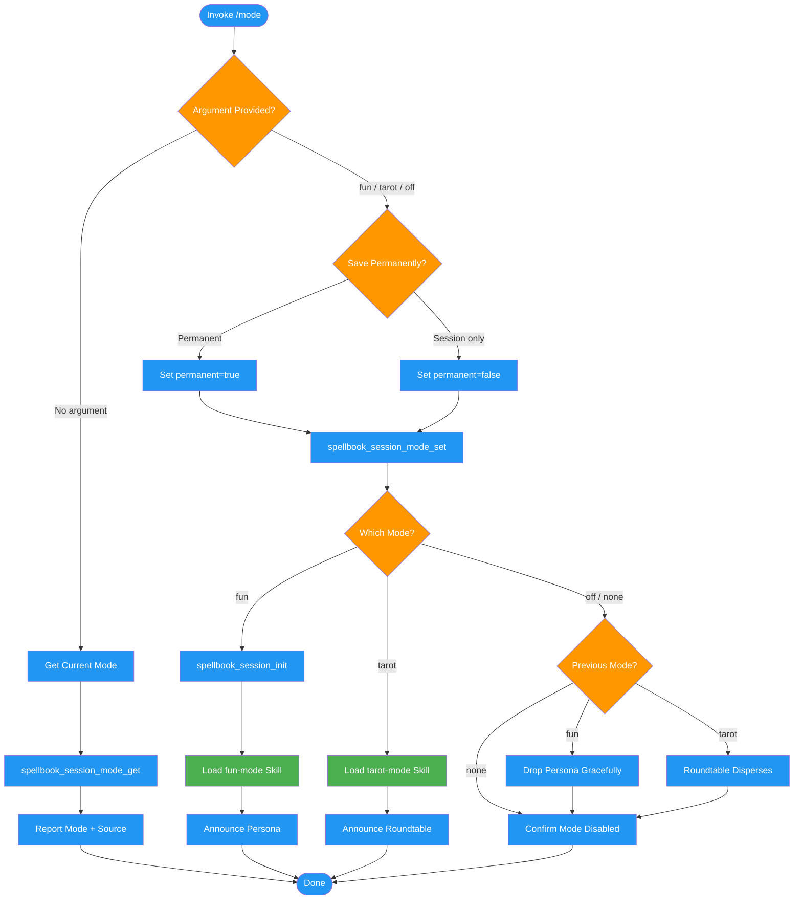

<!-- diagram-meta: {"source": "commands/mode.md", "source_hash": "sha256:a4cd6b75b6e037d40cd99912bc0ac529a44a686130bb2b8ad71f064dc41d06c7", "generated_at": "2026-02-19T00:00:00Z", "generator": "generate_diagrams.py"} -->
# Diagram: mode

Manages spellbook session modes (fun, tarot, off). Handles status queries, mode switching with permanence preference, and skill loading for creative dialogue modes.

## Legend

| Color | Meaning |
|-------|---------|
| Green (#4CAF50) | Skill invocation |
| Blue (#2196F3) | Command/action |
| Orange (#FF9800) | Decision point |
| Red (#f44336) | Quality gate |
