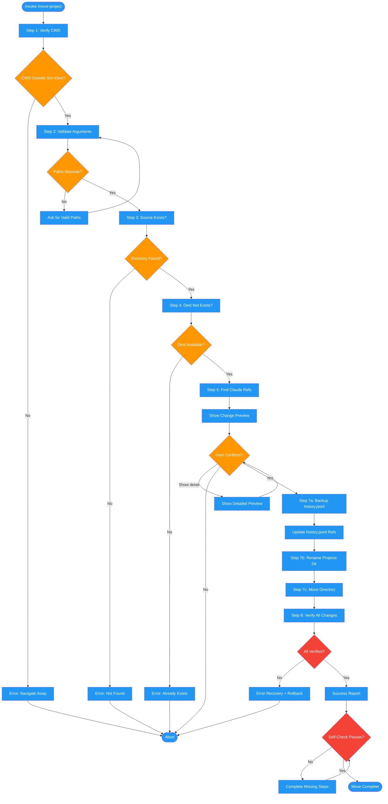

<!-- diagram-meta: {"source": "commands/move-project.md", "source_hash": "sha256:90808f4af1397bbe698819e34fcb2e72b9bebbd07fa378c1f07b7e2e80b497fa", "generated_at": "2026-02-19T00:00:00Z", "generator": "generate_diagrams.py"} -->
# Diagram: move-project

Safely relocates a project directory and updates all Claude Code session references (history.jsonl, projects directory) with mandatory safety checks, backups, and user confirmation.

## Legend

| Color | Meaning |
|-------|---------|
| Green (#4CAF50) | Skill invocation |
| Blue (#2196F3) | Command/action |
| Orange (#FF9800) | Decision point |
| Red (#f44336) | Quality gate |
