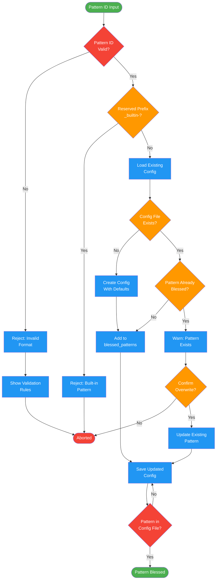

<!-- diagram-meta: {"source": "commands/pr-distill-bless.md", "source_hash": "sha256:30e7904b7c6ab190b0dbf76c351a761be0bc58f237a9f2947d9f0a8678214a6a", "generated_at": "2026-02-19T00:00:00Z", "generator": "generate_diagrams.py"} -->
# Diagram: pr-distill-bless

Save a discovered pattern for future PR distillation. Validates pattern ID, checks for duplicates, and persists to project config.

## Legend

| Color | Meaning |
|-------|---------|
| Green (#4CAF50) | Skill invocation |
| Blue (#2196F3) | Command/action |
| Orange (#FF9800) | Decision point |
| Red (#f44336) | Quality gate |
