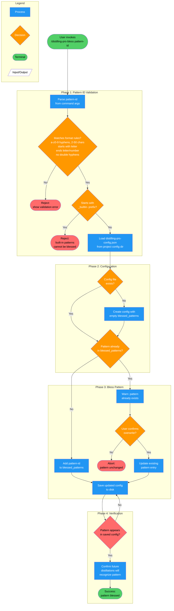

<!-- diagram-meta: {"source": "commands/pr-distill-bless.md","source_hash": "sha256:dfa0284e2214620aa4b70e8c4e8611f7caee19ac76e9fd766f68bbb40526c87c","generator": "stamp"} -->
# PR Distill Bless - Command Diagram

## Process Flow

```mermaid
flowchart TD
    subgraph Legend
        direction LR
        L1[Process]
        L2{Decision}
        L3([Terminal])
        L4[/"Input/Output"/]
        style L1 fill:#2196F3,color:#fff
        style L2 fill:#FF9800,color:#fff
        style L3 fill:#51cf66,color:#000
        style L4 fill:#fff,color:#000
    end

    Start([User invokes<br>/distilling-prs-bless pattern-id]) --> Validate

    subgraph Validation ["Phase 1: Pattern ID Validation"]
        Validate[Parse pattern-id<br>from command args]
        Validate --> CheckFormat{Matches format rules?<br>a-z0-9 hyphens, 2-50 chars<br>starts with letter<br>ends letter/number<br>no double hyphens}
        CheckFormat -->|No| RejectInvalid([Reject:<br>show validation error])
        CheckFormat -->|Yes| CheckReserved{Starts with<br>_builtin- prefix?}
        CheckReserved -->|Yes| RejectBuiltin([Reject:<br>built-in patterns<br>cannot be blessed])
        CheckReserved -->|No| LoadConfig
    end

    subgraph ConfigLoad ["Phase 2: Configuration"]
        LoadConfig[Load distilling-prs-config.json<br>from project config dir]
        LoadConfig --> ConfigExists{Config file<br>exists?}
        ConfigExists -->|No| CreateDefaults[Create config with<br>empty blessed_patterns]
        ConfigExists -->|Yes| CheckExisting
        CreateDefaults --> CheckExisting
    end

    subgraph Blessing ["Phase 3: Bless Pattern"]
        CheckExisting{Pattern already<br>in blessed_patterns?}
        CheckExisting -->|No| AddPattern[Add pattern-id<br>to blessed_patterns]
        CheckExisting -->|Yes| WarnOverwrite[Warn: pattern<br>already exists]
        WarnOverwrite --> ConfirmOverwrite{User confirms<br>overwrite?}
        ConfirmOverwrite -->|No| Abort([Abort:<br>pattern unchanged])
        ConfirmOverwrite -->|Yes| UpdatePattern[Update existing<br>pattern entry]
        AddPattern --> SaveConfig
        UpdatePattern --> SaveConfig
        SaveConfig[Save updated config<br>to disk]
    end

    subgraph Verify ["Phase 4: Verification"]
        SaveConfig --> VerifyPresent{Pattern appears<br>in saved config?}
        VerifyPresent -->|No| SaveConfig
        VerifyPresent -->|Yes| ConfirmFuture[Confirm future<br>distillations will<br>recognize pattern]
        ConfirmFuture --> Success([Success:<br>pattern blessed])
    end

    style Start fill:#51cf66,color:#000
    style Success fill:#51cf66,color:#000
    style RejectInvalid fill:#ff6b6b,color:#000
    style RejectBuiltin fill:#ff6b6b,color:#000
    style Abort fill:#ff6b6b,color:#000

    style Validate fill:#2196F3,color:#fff
    style LoadConfig fill:#2196F3,color:#fff
    style CreateDefaults fill:#2196F3,color:#fff
    style AddPattern fill:#2196F3,color:#fff
    style WarnOverwrite fill:#2196F3,color:#fff
    style UpdatePattern fill:#2196F3,color:#fff
    style SaveConfig fill:#2196F3,color:#fff
    style ConfirmFuture fill:#2196F3,color:#fff

    style CheckFormat fill:#FF9800,color:#fff
    style CheckReserved fill:#FF9800,color:#fff
    style ConfigExists fill:#FF9800,color:#fff
    style CheckExisting fill:#FF9800,color:#fff
    style ConfirmOverwrite fill:#FF9800,color:#fff

    style VerifyPresent fill:#ff6b6b,color:#000
```

## Legend

| Color | Meaning |
|-------|---------|
| Green (#51cf66) | Terminal nodes (start/success) |
| Blue (#2196F3) | Process/action steps |
| Orange (#FF9800) | Decision points |
| Red (#ff6b6b) | Quality gates / rejection terminals |

## Node Reference

| Node | Source Section |
|------|---------------|
| Validate, CheckFormat, CheckReserved | Pattern ID Rules table, Invariant 2 |
| LoadConfig, ConfigExists, CreateDefaults | Execution steps 2-3, Configuration section |
| CheckExisting, WarnOverwrite, ConfirmOverwrite | Execution steps 3-5, Invariant 3 |
| AddPattern, UpdatePattern, SaveConfig | Execution step 6, Invariant 4 |
| VerifyPresent, ConfirmFuture | Reflection section |
| RejectInvalid, RejectBuiltin | FORBIDDEN rules, Pattern ID Rules |
| Abort | Invariant 3 (overwrite confirmation) |
