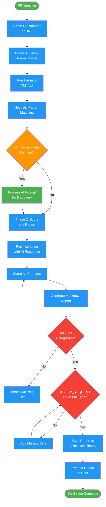

<!-- diagram-meta: {"source": "commands/pr-distill.md", "source_hash": "sha256:4698c598d62fe2b0e6b6913a6c51943d5615a44131231cc13bf14aa560858555", "generated_at": "2026-02-19T00:00:00Z", "generator": "generate_diagrams.py"} -->
# Diagram: pr-distill

Analyze a PR and generate a review distillation report. Runs heuristic pattern matching first, then AI analysis for unmatched files.

## Legend

| Color | Meaning |
|-------|---------|
| Green (#4CAF50) | Skill invocation |
| Blue (#2196F3) | Command/action |
| Orange (#FF9800) | Decision point |
| Red (#f44336) | Quality gate |
