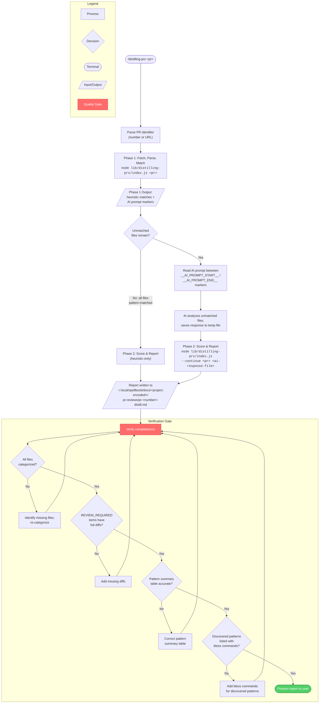
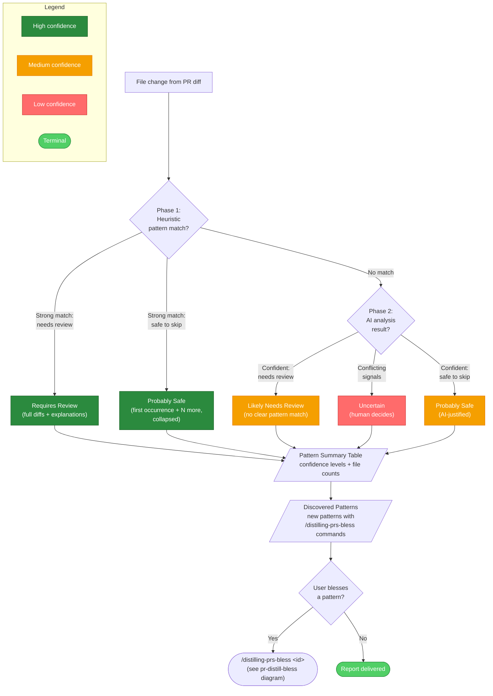

<!-- diagram-meta: {"source": "commands/pr-distill.md","source_hash": "sha256:3101a28b1b7f91092dc167c86281a14cb096cbb91a5fb22bdeac982ce89440ef","generator": "stamp"} -->
# PR Distill Command - Diagrams

Analyze a PR and generate a categorized review distillation report. Two-phase pipeline: deterministic heuristic matching first, then AI analysis for unmatched files.

## Command Flow

```mermaid
flowchart TD
    subgraph Legend
        direction LR
        L1[Process]
        L2{Decision}
        L3([Terminal])
        L4[/"Input/Output"/]
        L5[Quality Gate]:::gate
    end

    Start(["/distilling-prs &lt;pr&gt;"]) --> Parse["Parse PR identifier<br>(number or URL)"]

    Parse --> P1["Phase 1: Fetch, Parse, Match<br><code>node lib/distilling-prs/index.js &lt;pr&gt;</code>"]
    P1 --> P1Out[/"Phase 1 Output:<br>heuristic matches +<br>AI prompt markers"/]
    P1Out --> Unmatched{Unmatched<br>files remain?}

    Unmatched -->|"No: all files<br>pattern-matched"| P2Direct["Phase 2: Score & Report<br>(heuristic-only)"]
    Unmatched -->|Yes| ReadPrompt["Read AI prompt between<br>__AI_PROMPT_START__ /<br>__AI_PROMPT_END__ markers"]
    ReadPrompt --> AIAnalyze["AI analyzes unmatched files,<br>saves response to temp file"]
    AIAnalyze --> P2AI["Phase 2: Score & Report<br><code>node lib/distilling-prs/index.js<br>--continue &lt;pr&gt; &lt;ai-response-file&gt;</code>"]

    P2Direct --> Report
    P2AI --> Report[/"Report written to<br>~/.local/spellbook/docs/&lt;project-encoded&gt;/<br>pr-reviews/pr-&lt;number&gt;-distill.md"/]

    Report --> Verify

    subgraph VerifyGate ["Verification Gate"]
        Verify["Verify completeness"]:::gate
        Verify --> CheckAll{All files<br>categorized?}
        CheckAll -->|No| FixMissing["Identify missing files,<br>re-categorize"]
        FixMissing --> Verify
        CheckAll -->|Yes| CheckDiffs{REVIEW_REQUIRED<br>items have<br>full diffs?}
        CheckDiffs -->|No| FixDiffs["Add missing diffs"]
        FixDiffs --> Verify
        CheckDiffs -->|Yes| CheckPatterns{Pattern summary<br>table accurate?}
        CheckPatterns -->|No| FixPatterns["Correct pattern<br>summary table"]
        FixPatterns --> Verify
        CheckPatterns -->|Yes| CheckBless{Discovered patterns<br>listed with<br>bless commands?}
        CheckBless -->|No| FixBless["Add bless commands<br>for discovered patterns"]
        FixBless --> Verify
        CheckBless -->|Yes| GatePass
    end

    GatePass(["Present report to user"]):::success

    classDef gate fill:#ff6b6b,stroke:#c92a2a,color:#fff
    classDef success fill:#51cf66,stroke:#2b8a3e,color:#fff
```

## Report Category Classification

How each file change gets categorized in the output report.

```mermaid
flowchart TD
    subgraph Legend
        direction LR
        L1["High confidence"]:::high
        L2["Medium confidence"]:::medium
        L3["Low confidence"]:::low
        L4([Terminal]):::success
    end

    Change["File change from PR diff"] --> Heuristic{Phase 1:<br>Heuristic<br>pattern match?}

    Heuristic -->|"Strong match:<br>needs review"| Required["Requires Review<br>(full diffs + explanations)"]:::high
    Heuristic -->|"Strong match:<br>safe to skip"| SafeH["Probably Safe<br>(first occurrence + N more,<br>collapsed)"]:::high
    Heuristic -->|No match| AI{Phase 2:<br>AI analysis<br>result?}

    AI -->|"Confident:<br>needs review"| Likely["Likely Needs Review<br>(no clear pattern match)"]:::medium
    AI -->|"Conflicting<br>signals"| Uncertain["Uncertain<br>(human decides)"]:::low
    AI -->|"Confident:<br>safe to skip"| SafeAI["Probably Safe<br>(AI-justified)"]:::medium

    Required --> Summary
    Likely --> Summary
    Uncertain --> Summary
    SafeH --> Summary
    SafeAI --> Summary

    Summary[/"Pattern Summary Table<br>confidence levels + file counts"/]
    Summary --> Discovered[/"Discovered Patterns<br>new patterns with<br>/distilling-prs-bless commands"/]
    Discovered --> UserBless{User blesses<br>a pattern?}
    UserBless -->|Yes| Bless(["/distilling-prs-bless &lt;id&gt;<br>(see pr-distill-bless diagram)"])
    UserBless -->|No| Done(["Report delivered"]):::success

    classDef high fill:#2b8a3e,stroke:#1b5e25,color:#fff
    classDef medium fill:#f59f00,stroke:#e67700,color:#fff
    classDef low fill:#ff6b6b,stroke:#c92a2a,color:#fff
    classDef success fill:#51cf66,stroke:#2b8a3e,color:#fff
```

## Legend

| Color | Meaning |
|-------|---------|
| Green (#51cf66) | Success terminals |
| Red (#ff6b6b) | Quality gates |
| Dark green (#2b8a3e) | High-confidence classification |
| Yellow (#f59f00) | Medium-confidence classification |
| Light red (#ff6b6b) | Low-confidence classification |

## Report Sections

| Section | Content | Source |
|---------|---------|--------|
| Requires Review | Full diffs with explanations | Heuristic or AI: high confidence, needs review |
| Likely Needs Review | Changes without clear pattern match | AI: medium confidence, needs review |
| Uncertain | Conflicting signals, needs human decision | AI: low confidence |
| Probably Safe | First occurrence + N more (collapsed) | Heuristic or AI: safe to skip |
| Pattern Summary | Confidence levels and file counts | Aggregation of all categories |
| Discovered Patterns | New patterns with bless commands | Novel patterns found during analysis |

## Invariant Rules

| Rule | Enforcement Point |
|------|-------------------|
| Heuristics before AI | Phase 1 CLI must complete before AI prompt is read |
| Confidence requires evidence | No "safe to skip" without pattern match or AI justification |
| Surface uncertainty | Low-confidence cases go to "Uncertain" category |
| No collapsing REVIEW_REQUIRED | Full diffs always shown for review-required items |
| Report completeness | Verification gate checks all 4 conditions before presenting |

## Cross-Reference

| Diagram | Covers |
|---------|--------|
| Command Flow | End-to-end execution: parse, Phase 1, AI bridge, Phase 2, verification |
| Report Category Classification | How individual file changes map to report sections |
| [pr-distill-bless](pr-distill-bless.md) | Pattern blessing subprocess (validation, config, overwrite) |
