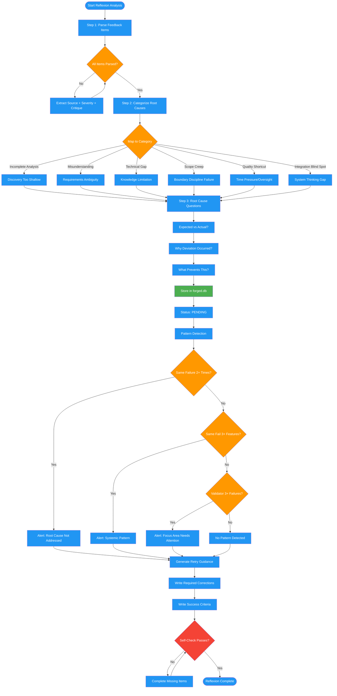

<!-- diagram-meta: {"source": "commands/reflexion-analyze.md", "source_hash": "sha256:a02477f094b82bb46b236597d356dae595bae609ba31c48433f43790a087c4ca", "generated_at": "2026-02-19T00:00:00Z", "generator": "generate_diagrams.py"} -->
# Diagram: reflexion-analyze

Analyzes ITERATE feedback from roundtable validation: parses feedback items, categorizes root causes, stores reflections in forged.db, detects failure patterns, and generates retry guidance.

## Legend

| Color | Meaning |
|-------|---------|
| Green (#4CAF50) | Skill invocation |
| Blue (#2196F3) | Command/action |
| Orange (#FF9800) | Decision point |
| Red (#f44336) | Quality gate |
