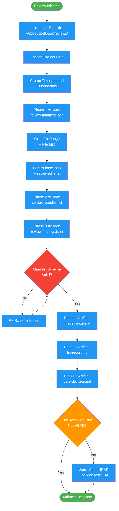

<!-- diagram-meta: {"source": "commands/request-review-artifacts.md", "source_hash": "sha256:92ac85f8dbd4e1c8032736181c1c6ffaafb60f75dc7864e97087a53e98c02e78", "generated_at": "2026-02-19T00:00:00Z", "generator": "generate_diagrams.py"} -->
# Diagram: request-review-artifacts

Artifact contract for code review workflow. Defines directory structure, phase outputs, manifest schema, and SHA persistence for traceability.

## Legend

| Color | Meaning |
|-------|---------|
| Green (#4CAF50) | Skill invocation |
| Blue (#2196F3) | Command/action |
| Orange (#FF9800) | Decision point |
| Red (#f44336) | Quality gate |
