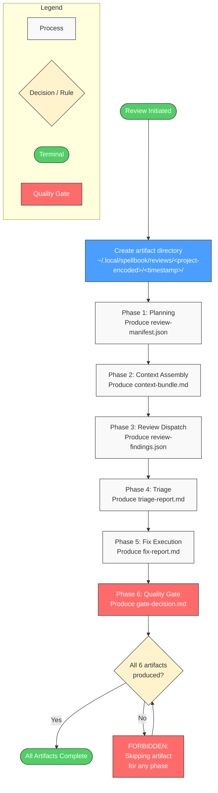
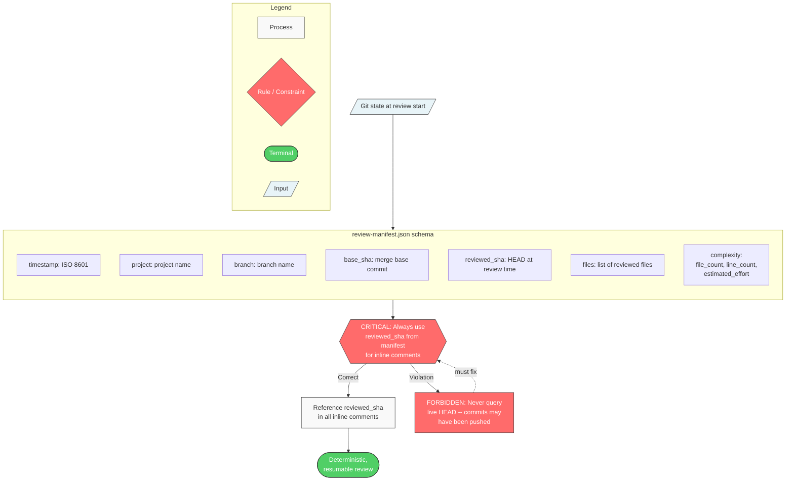
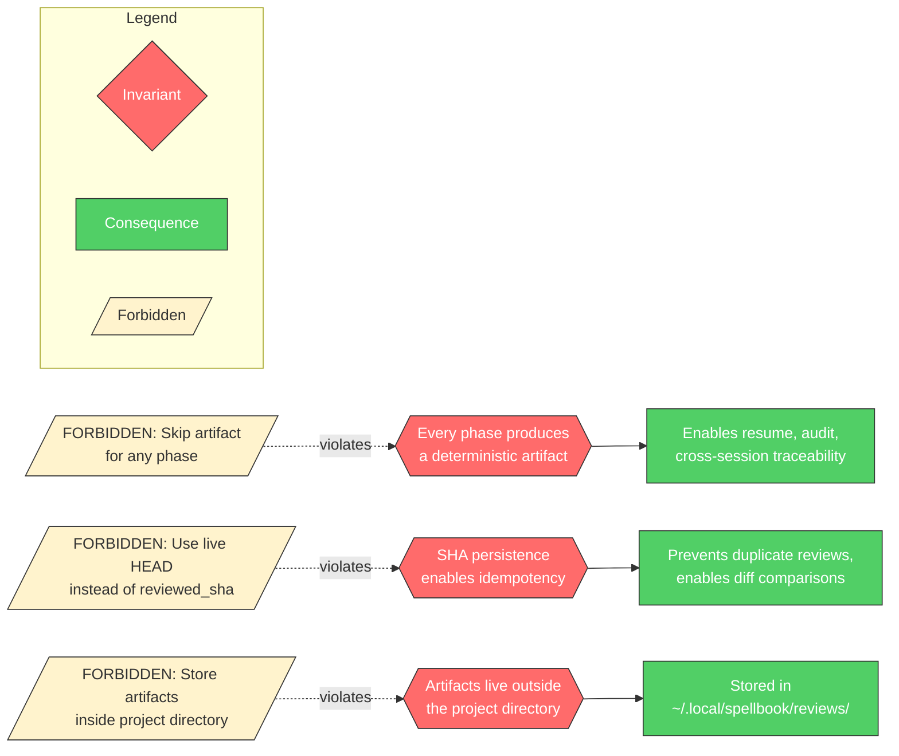

<!-- diagram-meta: {"source": "commands/request-review-artifacts.md","source_hash": "sha256:d896edafe73c33a591a32f3a895c5c465c27a2ae5960b4194cb958734647089c","generator": "stamp"} -->
# Diagram: request-review-artifacts

Artifact contract for the request-review workflow. Defines deterministic directory structure, phase-to-artifact mapping, manifest schema, and SHA persistence rules for traceability and resume capability.

## Artifact Lifecycle Overview

```mermaid
flowchart TD
    subgraph Legend
        direction LR
        Lp[Process]
        Ld{Decision / Rule}
        Lt([Terminal])
        Lg["Quality Gate"]
        style Lp fill:#f9f9f9,stroke:#333
        style Ld fill:#fff3cd,stroke:#333
        style Lt fill:#51cf66,stroke:#333,color:#fff
        style Lg fill:#ff6b6b,stroke:#333,color:#fff
    end

    Start([Review Initiated]) --> DirCreate["Create artifact directory<br>~/.local/spellbook/reviews/&lt;project-encoded&gt;/&lt;timestamp&gt;/"]

    DirCreate --> P1["Phase 1: Planning<br>Produce review-manifest.json"]
    P1 --> P2["Phase 2: Context Assembly<br>Produce context-bundle.md"]
    P2 --> P3["Phase 3: Review Dispatch<br>Produce review-findings.json"]
    P3 --> P4["Phase 4: Triage<br>Produce triage-report.md"]
    P4 --> P5["Phase 5: Fix Execution<br>Produce fix-report.md"]
    P5 --> P6["Phase 6: Quality Gate<br>Produce gate-decision.md"]

    P6 --> ArtifactCheck{"All 6 artifacts<br>produced?"}
    ArtifactCheck -->|Yes| Complete([All Artifacts Complete])
    ArtifactCheck -->|No| Violation["FORBIDDEN:<br>Skipping artifact<br>for any phase"]
    Violation --> ArtifactCheck

    style Start fill:#51cf66,stroke:#333,color:#fff
    style Complete fill:#51cf66,stroke:#333,color:#fff
    style DirCreate fill:#4a9eff,stroke:#333,color:#fff
    style P1 fill:#f9f9f9,stroke:#333
    style P2 fill:#f9f9f9,stroke:#333
    style P3 fill:#f9f9f9,stroke:#333
    style P4 fill:#f9f9f9,stroke:#333
    style P5 fill:#f9f9f9,stroke:#333
    style P6 fill:#ff6b6b,stroke:#333,color:#fff
    style ArtifactCheck fill:#fff3cd,stroke:#333
    style Violation fill:#ff6b6b,stroke:#333,color:#fff
```

## Manifest Schema and SHA Persistence

```mermaid
flowchart TD
    subgraph Legend
        direction LR
        Lp[Process]
        Ld{Rule / Constraint}
        Lt([Terminal])
        Lf[/"Input"/]
        style Lp fill:#f9f9f9,stroke:#333
        style Ld fill:#ff6b6b,stroke:#333,color:#fff
        style Lt fill:#51cf66,stroke:#333,color:#fff
        style Lf fill:#e8f4f8,stroke:#333
    end

    GitState[/"Git state at review start"/] --> Manifest

    subgraph Manifest ["review-manifest.json schema"]
        direction TB
        F1["timestamp: ISO 8601"]
        F2["project: project name"]
        F3["branch: branch name"]
        F4["base_sha: merge base commit"]
        F5["reviewed_sha: HEAD at review time"]
        F6["files: list of reviewed files"]
        F7["complexity:<br>file_count, line_count,<br>estimated_effort"]
    end

    Manifest --> SHARule{{"CRITICAL: Always use<br>reviewed_sha from manifest<br>for inline comments"}}

    SHARule -->|Correct| UseManifestSHA["Reference reviewed_sha<br>in all inline comments"]
    SHARule -->|Violation| Forbidden["FORBIDDEN: Never query<br>live HEAD -- commits may<br>have been pushed"]

    UseManifestSHA --> Idempotent(["Deterministic,<br>resumable review"])
    Forbidden -.->|must fix| SHARule

    style GitState fill:#e8f4f8,stroke:#333
    style SHARule fill:#ff6b6b,stroke:#333,color:#fff
    style Forbidden fill:#ff6b6b,stroke:#333,color:#fff
    style Idempotent fill:#51cf66,stroke:#333,color:#fff
    style UseManifestSHA fill:#f9f9f9,stroke:#333
```

## Invariant Rules

```mermaid
flowchart LR
    subgraph Legend
        direction LR
        Lr{Invariant}
        Lc["Consequence"]
        Lf[/"Forbidden"/]
        style Lr fill:#ff6b6b,stroke:#333,color:#fff
        style Lc fill:#51cf66,stroke:#333,color:#fff
        style Lf fill:#fff3cd,stroke:#333
    end

    I1{{"Every phase produces<br>a deterministic artifact"}} --> C1["Enables resume, audit,<br>cross-session traceability"]
    I2{{"SHA persistence<br>enables idempotency"}} --> C2["Prevents duplicate reviews,<br>enables diff comparisons"]
    I3{{"Artifacts live outside<br>the project directory"}} --> C3["Stored in<br>~/.local/spellbook/reviews/"]

    F1[/"FORBIDDEN: Skip artifact<br>for any phase"/] -.->|violates| I1
    F2[/"FORBIDDEN: Use live HEAD<br>instead of reviewed_sha"/] -.->|violates| I2
    F3[/"FORBIDDEN: Store artifacts<br>inside project directory"/] -.->|violates| I3

    style I1 fill:#ff6b6b,stroke:#333,color:#fff
    style I2 fill:#ff6b6b,stroke:#333,color:#fff
    style I3 fill:#ff6b6b,stroke:#333,color:#fff
    style C1 fill:#51cf66,stroke:#333,color:#fff
    style C2 fill:#51cf66,stroke:#333,color:#fff
    style C3 fill:#51cf66,stroke:#333,color:#fff
    style F1 fill:#fff3cd,stroke:#333
    style F2 fill:#fff3cd,stroke:#333
    style F3 fill:#fff3cd,stroke:#333
```

## Cross-Reference Table

| Overview Node | Detail Diagram | Source Lines |
|---------------|----------------|--------------|
| Create artifact directory | Invariant Rules (I3) | L15, L19-21 |
| Phase 1: Planning | Manifest Schema diagram | L29, L38-52 |
| Phase 2: Context Assembly | -- | L30 |
| Phase 3: Review Dispatch | -- | L31 |
| Phase 4: Triage | -- | L32 |
| Phase 5: Fix Execution | -- | L33 |
| Phase 6: Quality Gate | -- | L34 |
| SHA Persistence | Manifest Schema diagram | L56-58 |
| Invariant Rules | Invariant Rules diagram | L13-15 |
| Forbidden actions | Invariant Rules diagram | L60-64 |
