<!-- diagram-meta: {"source": "commands/request-review-execute.md", "source_hash": "sha256:084b0c1aea8fd2e6d2f9b5f8c0b8605fe2de0ca8d1cea1b98ade57130d50db2b", "generated_at": "2026-02-19T00:00:00Z", "generator": "generate_diagrams.py"} -->
# Diagram: request-review-execute

Dispatch, triage, execute, and gate phases for code review. Invokes code-reviewer agent, triages findings by severity, applies fixes, and enforces quality gate.

```mermaid
flowchart TD
    Start([Context Bundle]) --> P3["Phase 3: Dispatch"]
    P3 --> InvokeAgent["Invoke Code-Reviewer\nAgent"]
    InvokeAgent --> WaitFindings["Block Until\nFindings Returned"]
    WaitFindings --> ValidateFields{"Findings Have\nRequired Fields?"}
    ValidateFields -->|No| DiscardFinding["Discard Invalid"]
    ValidateFields -->|Yes| Gate3{"Valid Findings\nReceived?"}
    DiscardFinding --> Gate3
    Gate3 -->|No| InvokeAgent
    Gate3 -->|Yes| P4["Phase 4: Triage"]
    P4 --> SortSeverity["Sort by Severity"]
    SortSeverity --> GroupFile["Group by File"]
    GroupFile --> IdentifyQuickWins["Identify Quick Wins"]
    IdentifyQuickWins --> FlagClarify["Flag Needing\nClarification"]
    FlagClarify --> Gate4{"Findings Triaged?"}
    Gate4 -->|No| P4
    Gate4 -->|Yes| P5["Phase 5: Execute"]
    P5 --> FixCritical["Fix Critical First"]
    FixCritical --> FixHigh["Fix High Findings"]
    FixHigh --> FixMedLow["Fix Medium/Low\nAs Time Permits"]
    FixMedLow --> DocDeferred["Document Deferred\nItems"]
    DocDeferred --> Gate5{"Blocking Findings\nAddressed?"}
    Gate5 -->|No| FixCritical
    Gate5 -->|Yes| P6["Phase 6: Gate"]
    P6 --> ApplyRules["Apply Severity\nGate Rules"]
    ApplyRules --> ReReview{"Re-Review\nNeeded?"}
    ReReview -->|Yes| InvokeAgent
    ReReview -->|No| FinalVerdict["Report Final Verdict"]
    FinalVerdict --> Approve{"Verdict?"}
    Approve -->|Proceed| Done([Review Passed])
    Approve -->|Block| Blocked([Review Blocked])

    style Start fill:#4CAF50,color:#fff
    style Done fill:#4CAF50,color:#fff
    style Blocked fill:#f44336,color:#fff
    style InvokeAgent fill:#4CAF50,color:#fff
    style P3 fill:#2196F3,color:#fff
    style P4 fill:#2196F3,color:#fff
    style P5 fill:#2196F3,color:#fff
    style P6 fill:#2196F3,color:#fff
    style WaitFindings fill:#2196F3,color:#fff
    style DiscardFinding fill:#2196F3,color:#fff
    style SortSeverity fill:#2196F3,color:#fff
    style GroupFile fill:#2196F3,color:#fff
    style IdentifyQuickWins fill:#2196F3,color:#fff
    style FlagClarify fill:#2196F3,color:#fff
    style FixCritical fill:#2196F3,color:#fff
    style FixHigh fill:#2196F3,color:#fff
    style FixMedLow fill:#2196F3,color:#fff
    style DocDeferred fill:#2196F3,color:#fff
    style ApplyRules fill:#2196F3,color:#fff
    style FinalVerdict fill:#2196F3,color:#fff
    style ValidateFields fill:#FF9800,color:#fff
    style ReReview fill:#FF9800,color:#fff
    style Approve fill:#FF9800,color:#fff
    style Gate3 fill:#f44336,color:#fff
    style Gate4 fill:#f44336,color:#fff
    style Gate5 fill:#f44336,color:#fff
```

## Legend

| Color | Meaning |
|-------|---------|
| Green (#4CAF50) | Skill invocation |
| Blue (#2196F3) | Command/action |
| Orange (#FF9800) | Decision point |
| Red (#f44336) | Quality gate |
