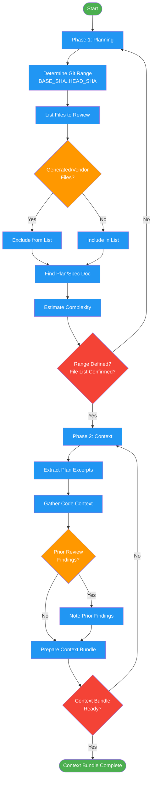

<!-- diagram-meta: {"source": "commands/request-review-plan.md", "source_hash": "sha256:b961ea96e889f7dfee8174183f7dc7fac41d2230ea141c4d98266e773f7fdebf", "generated_at": "2026-02-19T00:00:00Z", "generator": "generate_diagrams.py"} -->
# Diagram: request-review-plan

Planning and context assembly phases for code review requests. Determines git range, builds file list, and assembles reviewer context bundle.

## Legend

| Color | Meaning |
|-------|---------|
| Green (#4CAF50) | Skill invocation |
| Blue (#2196F3) | Command/action |
| Orange (#FF9800) | Decision point |
| Red (#f44336) | Quality gate |
