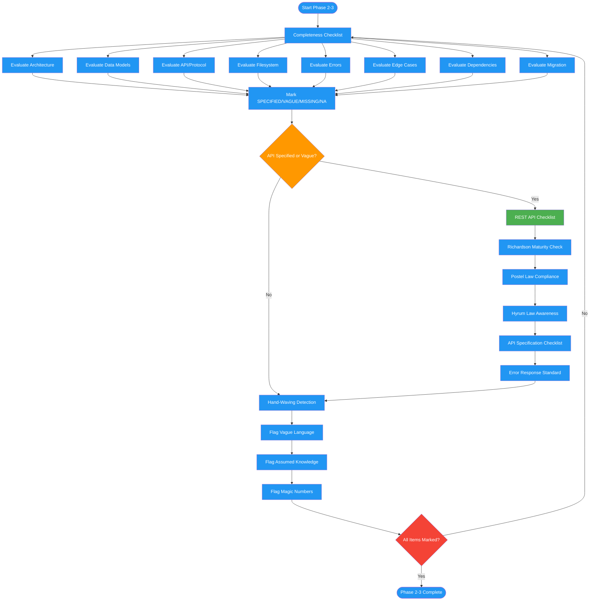

<!-- diagram-meta: {"source": "commands/review-design-checklist.md", "source_hash": "sha256:0b01c80f76a98070240ce3ad0224355aea90bddadc872b7ba13fc6e2e66fea55", "generated_at": "2026-02-19T00:00:00Z", "generator": "generate_diagrams.py"} -->
# Diagram: review-design-checklist

Phases 2-3 of reviewing-design-docs: runs a completeness checklist across eight architecture categories, applies REST API design checks, then detects hand-waving language and unjustified magic numbers.

## Legend

| Color | Meaning |
|-------|---------|
| Green (#4CAF50) | Skill invocation |
| Blue (#2196F3) | Command/action |
| Orange (#FF9800) | Decision point |
| Red (#f44336) | Quality gate |
