<!-- diagram-meta: {"source": "commands/review-design-report.md", "source_hash": "sha256:f26e5e33434f128de6b185450ba37f7b4c78f7eae10e346e71b750fff1bec4bc", "generated_at": "2026-02-19T00:00:00Z", "generator": "generate_diagrams.py"} -->
# Diagram: review-design-report

Phases 6-7 of reviewing-design-docs: compiles a scored findings report with reproducible category counts, then generates a prioritized remediation plan with P1/P2/P3 items and factcheck verification tasks.

```mermaid
flowchart TD
    Start([Start Phase 6-7]) --> Tally[Tally Category Scores]

    Tally --> ScoreTable[Build Score Table]
    ScoreTable --> CountHW[Count Hand-Waving]
    CountHW --> CountA[Count Assumed]
    CountA --> CountMN[Count Magic Numbers]
    CountMN --> CountE[Count Escalated]

    CountE --> Findings[Compile Findings]
    Findings --> ForEach[For Each Finding]
    ForEach --> Loc[Record Location]
    Loc --> Current[Record Current Text]
    Current --> Problem[Describe Problem]
    Problem --> WouldGuess[What Implementer Guesses]
    WouldGuess --> Required[Specify Exact Fix]

    Required --> MoreF{More Findings?}
    MoreF -->|Yes| ForEach
    MoreF -->|No| Reproducible{Scores Reproducible?}

    Reproducible -->|No| Tally
    Reproducible -->|Yes| Remediation[Build Remediation Plan]

    Remediation --> P1[P1 Critical Blockers]
    P1 --> P2[P2 Important Items]
    P2 --> P3[P3 Minor Items]
    P3 --> FactV[Factcheck Verification]
    FactV --> Additions[Diagrams/Tables/Sections]

    Additions --> Complete{Report Complete?}
    Complete -->|Yes| Done([Phase 6-7 Complete])
    Complete -->|No| Findings

    style Start fill:#2196F3,color:#fff
    style Done fill:#2196F3,color:#fff
    style Tally fill:#2196F3,color:#fff
    style ScoreTable fill:#2196F3,color:#fff
    style CountHW fill:#2196F3,color:#fff
    style CountA fill:#2196F3,color:#fff
    style CountMN fill:#2196F3,color:#fff
    style CountE fill:#2196F3,color:#fff
    style Findings fill:#2196F3,color:#fff
    style ForEach fill:#2196F3,color:#fff
    style Loc fill:#2196F3,color:#fff
    style Current fill:#2196F3,color:#fff
    style Problem fill:#2196F3,color:#fff
    style WouldGuess fill:#2196F3,color:#fff
    style Required fill:#2196F3,color:#fff
    style Remediation fill:#2196F3,color:#fff
    style P1 fill:#f44336,color:#fff
    style P2 fill:#2196F3,color:#fff
    style P3 fill:#2196F3,color:#fff
    style FactV fill:#4CAF50,color:#fff
    style Additions fill:#2196F3,color:#fff
    style MoreF fill:#FF9800,color:#fff
    style Reproducible fill:#f44336,color:#fff
    style Complete fill:#FF9800,color:#fff
```

## Legend

| Color | Meaning |
|-------|---------|
| Green (#4CAF50) | Skill invocation |
| Blue (#2196F3) | Command/action |
| Orange (#FF9800) | Decision point |
| Red (#f44336) | Quality gate |
