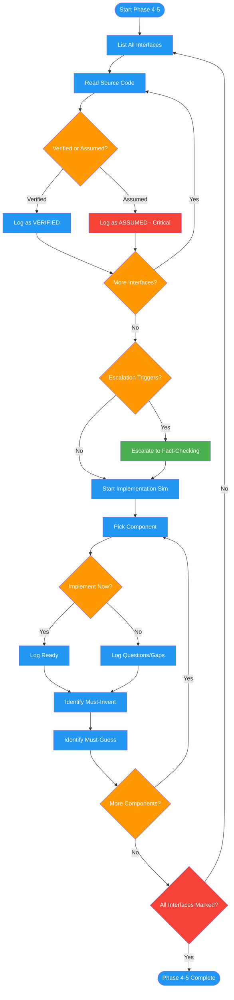

<!-- diagram-meta: {"source": "commands/review-design-verify.md", "source_hash": "sha256:5bd7f5286fc8a291f0c419d644297a0e09fd63c6fd2d5b912239b26ad9a751d0", "generated_at": "2026-02-19T00:00:00Z", "generator": "generate_diagrams.py"} -->
# Diagram: review-design-verify

Phases 4-5 of reviewing-design-docs: verifies all interface claims against actual source code, escalates unverifiable claims to fact-checking, then simulates implementation per component to surface specification gaps.

## Legend

| Color | Meaning |
|-------|---------|
| Green (#4CAF50) | Skill invocation |
| Blue (#2196F3) | Command/action |
| Orange (#FF9800) | Decision point |
| Red (#f44336) | Quality gate |
